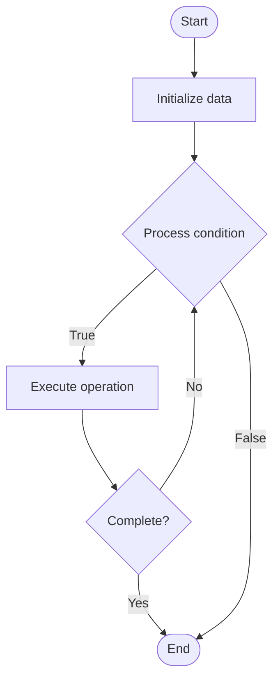

# Version Control Documentation

1. **Name of Algorithm**  

## Code Files


## Algorithm Visualization

### Flowchart (ASCII)


```
Version Control Documentation Flowchart:

┌─────────────┐
│   Start     │
└──────┬──────┘
       │
       ▼
┌─────────────┐
│  Initialize │
│   data      │
└──────┬──────┘
       │
       ▼
┌─────────────┐      Yes
│  Process   ├──────┐
│  condition?│      │
└──────┬──────┘      │
       │ No          │
       ▼             │
┌─────────────┐      │
│  Execute   │      │
│  operation │      │
└──────┬──────┘      │
       │             │
       └─────────────┘
       │
       ▼
┌─────────────┐
│    End      │
└─────────────┘
```


### Step-by-Step Execution


```
Version Control Documentation Step-by-Step Execution:

Input: [example data]

Step 1: Initialize
State: [initial state]

Step 2: Process
State: [intermediate state]

Step 3: Finalize
State: [final state]

Result: [output]
```


### Interactive Flowchart (Mermaid)





> **Note**: Mermaid diagrams are rendered automatically on GitHub. For local viewing, use a Mermaid-compatible Markdown viewer.
- [Python Implementation](semester_08/lecture_48_documentation/version_control_docs/algorithm.py)
- [Java Implementation](semester_08/lecture_48_documentation/version_control_docs/Algorithm.java)
- [Python Tests](semester_08/lecture_48_documentation/version_control_docs/test_algorithm.py)


   Version Control Documentation

2. **What problem does it solve? (1 sentence)**  
   Manages documentation changes using version control systems, enabling collaboration, tracking history, and maintaining documentation alongside code in a unified workflow.

3. **Intuition (plain-language explanation)**  
   Like version control for code, but for documentation: just as code is stored in Git with history and collaboration (like a shared document with change tracking), version control docs stores documentation in Git - you can see who changed what, when, and why, and collaborate on docs just like code.

4. **Inputs & Outputs**  
   - Input: Documentation files (Markdown, reStructuredText, etc.), version control system (Git), collaboration workflow.  
   - Output: Version-controlled documentation, change history, collaborative editing, documentation branches.

5. **Step-by-step description (5–10 lines max)**  
1. Store in repository: place documentation files in version control repository.
2. Track changes: use version control to track all documentation changes.
3. Collaborate: enable multiple authors to edit documentation simultaneously.
4. Review: use pull requests to review documentation changes.
5. Branch: create branches for major documentation updates.
6. Merge: merge documentation changes after review.
7. Version: tag documentation versions to match code releases.
8. Deploy: automatically deploy documentation from repository.
9. Maintain: keep documentation in sync with code versions.

6. **Tiny example (hand-simulated)**  
   Documentation in Git repo → writer creates branch 'update-api-docs' → edits README.md → commits changes → creates pull request → reviewer checks changes → approves → merges to main → documentation deployed → version tagged v2.0 → docs match code version.

7. **Time & Space Complexity**  
   - Time: O(1) for version control operations, O(n) for merge conflicts where n is conflict size.  
   - Space: O(d) where d is documentation size plus version history.

8. **Strengths**  
- Collaboration: enables multiple authors to work together.
- History: tracks all changes and allows rollback.
- Integration: keeps documentation with code in same workflow.

9. **Weaknesses / limitations**  
- Learning curve: requires understanding version control.
- Merge conflicts: can have conflicts when multiple people edit.
- Tool dependency: requires version control system and workflow.

10. **Compare with alternatives**  
    Alternatives: Wiki Systems, Google Docs, Confluence, Documentation Sites, Shared Drives

11. **30-second explanation (your own words)**  
    Manages documentation changes using version control systems, enabling collaboration, tracking history, and maintaining documentation alongside code in a unified workflow.

*Sources: Adapted from standard university textbooks and Wikipedia summaries.*
