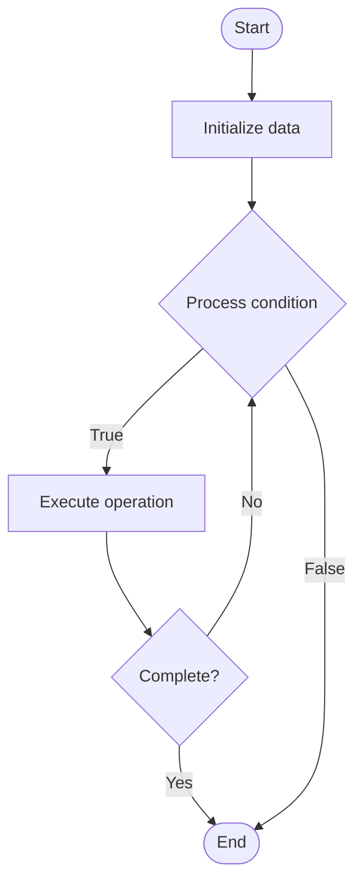

# Database Indexes

## Учебные материалы

- [Школьный уровень](school.ru.md)
- [Университетский уровень](univer.ru.md)

## Algorithm Visualization

### Flowchart (ASCII)

```
Database Indexes Flowchart:

┌─────────────┐
│   Start     │
└──────┬──────┘
       │
       ▼
┌─────────────┐
│  Initialize │
│   data      │
└──────┬──────┘
       │
       ▼
┌─────────────┐      Yes
│  Process   ├──────┐
│  condition?│      │
└──────┬──────┘      │
       │ No          │
       ▼             │
┌─────────────┐      │
│  Execute   │      │
│  operation │      │
└──────┬──────┘      │
       │             │
       └─────────────┘
       │
       ▼
┌─────────────┐
│    End      │
└─────────────┘
```

### Step-by-Step Execution

```
Database Indexes Step-by-Step Execution:

Input: [example data]

Step 1: Initialize
State: [initial state]

Step 2: Process
State: [intermediate state]

Step 3: Finalize
State: [final state]

Result: [output]
```

### Interactive Flowchart (Mermaid)



> **Note**: Mermaid diagrams are rendered automatically on GitHub. For local viewing, use a Mermaid-compatible Markdown viewer.

- [Python Implementation](/code/semester_08/lecture_49_sql_fundamentals/indexes/algorithm.py)
- [Java Implementation](/code/semester_08/lecture_49_sql_fundamentals/indexes/Algorithm.java)
- [Python Tests](/code/semester_08/lecture_49_sql_fundamentals/indexes/test_algorithm.py)

What problem does it solve? (1 sentence)  
   Accelerates data retrieval by creating ordered data structures that map column values to row locations, enabling fast lookups without scanning entire tables.

Intuition (plain-language explanation)  
   Like a book index: instead of reading every page to find a topic (full table scan), an index lists topics with page numbers (column values with row pointers) - you look up the topic in the index (fast) and jump directly to the right page (row), making searches much faster.

Inputs & Outputs  

  - Input: Table columns, index type (B-tree, hash, bitmap, etc.), index definition.  
  - Output: Index structure, faster query performance, additional storage overhead.

Step-by-step description (5–10 lines max)  
Choose columns: identify columns frequently used in WHERE, JOIN, ORDER BY clauses.
Select index type: choose appropriate index type (B-tree for range queries, hash for equality, etc.).
Create index: build index structure mapping column values to row locations.
Store index: save index data structure alongside table data.
Update index: maintain index when table data is inserted, updated, or deleted.
Use in queries: query optimizer uses index to speed up data retrieval.
Monitor: track index usage and performance impact.
Maintain: periodically rebuild or reorganize indexes to optimize performance.

Tiny example (hand-simulated)  
   Table: users (1M rows) → query: SELECT * FROM users WHERE email = 'user@example.com' → without index: scans 1M rows (slow) → create index on email → with index: lookup email in index → find row pointer → retrieve row directly → query time: 0.001s vs 1s (1000x faster).

Time & Space Complexity  

  - Time: O(log n) for B-tree index lookups, O(1) for hash indexes, O(n) for full table scan without index.  
  - Space: O(n) where n is number of indexed rows (additional storage for index structure).

Strengths  

- Fast lookups: dramatically speeds up SELECT queries with WHERE clauses.
- Efficient sorting: enables fast ORDER BY operations.
- Join optimization: speeds up JOIN operations on indexed columns.

Weaknesses / limitations  

- Storage overhead: indexes require additional disk space.
- Write overhead: INSERT/UPDATE/DELETE operations must update indexes.
- Maintenance: indexes need periodic maintenance and optimization.

Compare with alternatives  
    Alternatives: Full Table Scans, Materialized Views, Partitioning, Caching

30-second explanation (your own words)  
    Accelerates data retrieval by creating ordered data structures that map column values to row locations, enabling fast lookups without scanning entire tables.

*Sources: Adapted from standard university textbooks and Wikipedia summaries.*


## References

- [Index](https://en.wikipedia.org/wiki/Index) - Wikipedia
