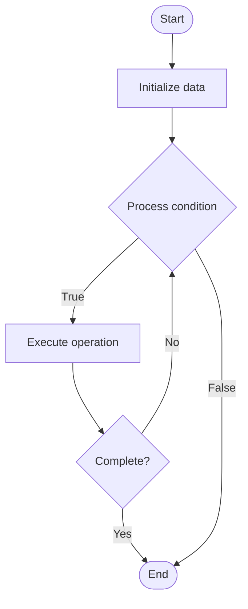

# SQL Joins

1. **Name of Algorithm**  

## Code Files


## Algorithm Visualization

### Flowchart (ASCII)


```
SQL Joins Flowchart:

┌─────────────┐
│   Start     │
└──────┬──────┘
       │
       ▼
┌─────────────┐
│  Initialize │
│   data      │
└──────┬──────┘
       │
       ▼
┌─────────────┐      Yes
│  Process   ├──────┐
│  condition?│      │
└──────┬──────┘      │
       │ No          │
       ▼             │
┌─────────────┐      │
│  Execute   │      │
│  operation │      │
└──────┬──────┘      │
       │             │
       └─────────────┘
       │
       ▼
┌─────────────┐
│    End      │
└─────────────┘
```


### Step-by-Step Execution


```
SQL Joins Step-by-Step Execution:

Input: [example data]

Step 1: Initialize
State: [initial state]

Step 2: Process
State: [intermediate state]

Step 3: Finalize
State: [final state]

Result: [output]
```


### Interactive Flowchart (Mermaid)





> **Note**: Mermaid diagrams are rendered automatically on GitHub. For local viewing, use a Mermaid-compatible Markdown viewer.
- [Python Implementation](semester_08/lecture_49_sql_fundamentals/joins/algorithm.py)
- [Java Implementation](semester_08/lecture_49_sql_fundamentals/joins/Algorithm.java)
- [Python Tests](semester_08/lecture_49_sql_fundamentals/joins/test_algorithm.py)


   SQL Joins

2. **What problem does it solve? (1 sentence)**  
   Combine rows from related tables based on matching keys.

3. **Intuition (plain-language explanation)**  
   Treat tables like sets and match rows where keys agree or complement each other.

4. **Inputs & Outputs**  
   - Input: Two or more tables plus join condition.  
   - Output: Composite rows containing columns from each source table.

5. **Step-by-step description (5–10 lines max)**  
1. Choose join type (INNER, LEFT, RIGHT, FULL, CROSS).
2. Identify join keys/conditions.
3. Relational engine decides join algorithm (nested loop, hash, merge).
4. Execute join, producing combined tuples.
5. Apply downstream filters or projections.

6. **Tiny example (hand-simulated)**  
   SELECT orders.id, customers.name FROM orders INNER JOIN customers ON orders.customer_id = customers.id;

7. **Time & Space Complexity**  
   - Time: Depends on join algorithm; hash join ~O(n + m), nested loop ~O(n·m) without indexes.  
   - Space: May require hash tables or sort buffers.

8. **Strengths**  
- Expressive way to relate normalized tables.
- Optimizers pick efficient algorithms automatically.

9. **Weaknesses / limitations**  
- Expensive if keys lack indexes.
- Incorrect join types can duplicate or drop rows.

10. **Compare with alternatives**  
    Alternatives: Denormalization, Materialized views, Application-level joins

11. **30-second explanation (your own words)**  
    Map matching keys across tables so related data can be viewed as a single combined set.

*Sources: Adapted from standard university textbooks and Wikipedia summaries.*
