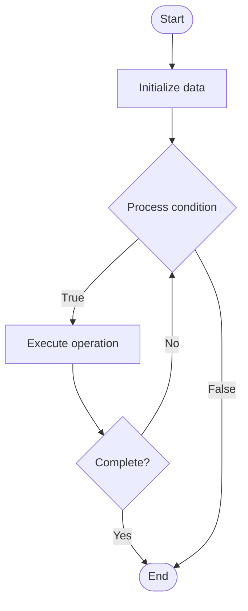

# SQL Queries

Name of Algorithm  

## Code Files


## Algorithm Visualization

### Flowchart (ASCII)


```
SQL Queries Flowchart:

┌─────────────┐
│   Start     │
└──────┬──────┘
       │
       ▼
┌─────────────┐
│  Initialize │
│   data      │
└──────┬──────┘
       │
       ▼
┌─────────────┐      Yes
│  Process   ├──────┐
│  condition?│      │
└──────┬──────┘      │
       │ No          │
       ▼             │
┌─────────────┐      │
│  Execute   │      │
│  operation │      │
└──────┬──────┘      │
       │             │
       └─────────────┘
       │
       ▼
┌─────────────┐
│    End      │
└─────────────┘
```


### Step-by-Step Execution


```
SQL Queries Step-by-Step Execution:

Input: [example data]

Step 1: Initialize
State: [initial state]

Step 2: Process
State: [intermediate state]

Step 3: Finalize
State: [final state]

Result: [output]
```


### Interactive Flowchart (Mermaid)





> **Note**: Mermaid diagrams are rendered automatically on GitHub. For local viewing, use a Mermaid-compatible Markdown viewer.
- [Python Implementation](/code/semester_08/lecture_49_sql_fundamentals/sql_queries/algorithm.py)
- [Java Implementation](/code/semester_08/lecture_49_sql_fundamentals/sql_queries/Algorithm.java)
- [Python Tests](/code/semester_08/lecture_49_sql_fundamentals/sql_queries/test_algorithm.py)


   SQL Queries

What problem does it solve? (1 sentence)  
   Retrieve, filter, and manipulate relational data using declarative statements.

Intuition (plain-language explanation)  
   Describe the desired result set while the optimizer chooses an execution plan.

Inputs & Outputs  
   - Input: SQL statement (SELECT/INSERT/UPDATE/DELETE) plus database schema/data.  
   - Output: Result set, affected row count, or updated storage state.

Step-by-step description (5–10 lines max)  
Parse the SQL statement.
Validate against schema and permissions.
Generate a logical plan (joins, filters, projections).
Optimize into a physical plan using indexes and statistics.
Execute the plan and stream results back to the client.

Tiny example (hand-simulated)  
   SELECT name FROM customers WHERE country='Canada'; returns matching customer names.

Time & Space Complexity  
   - Time: Varies; indexed lookups approach O(log n), full scans O(n).  
   - Space: Driven by execution plan (temporary joins, sorting buffers).

Strengths  
- Declarative syntax hides implementation details.
- Mature optimizers leverage indexes and caches.

Weaknesses / limitations  
- Poorly written queries can degrade to full scans.
- Requires understanding of indexes and statistics for tuning.

Compare with alternatives  
    Alternatives: NoSQL query APIs, ORM-generated queries, Stored procedures

30-second explanation (your own words)  
    State what data you want, let the relational engine decide how to fetch it efficiently.

*Sources: Adapted from standard university textbooks and Wikipedia summaries.*
