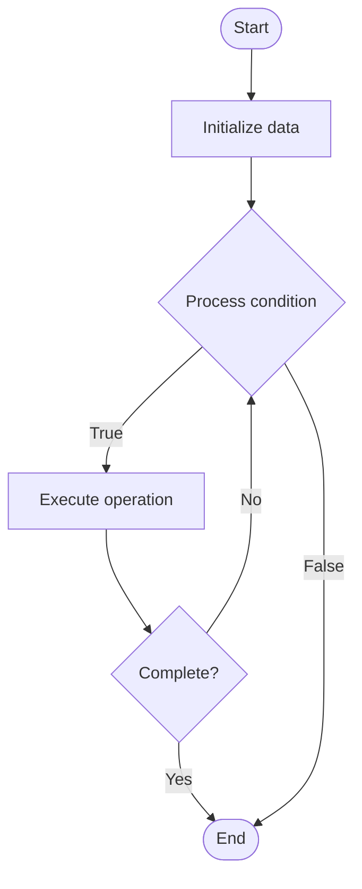

# Stored Procedures

1. **Name of Algorithm**  

## Code Files


## Algorithm Visualization

### Flowchart (ASCII)


```
Stored Procedures Flowchart:

┌─────────────┐
│   Start     │
└──────┬──────┘
       │
       ▼
┌─────────────┐
│  Initialize │
│   data      │
└──────┬──────┘
       │
       ▼
┌─────────────┐      Yes
│  Process   ├──────┐
│  condition?│      │
└──────┬──────┘      │
       │ No          │
       ▼             │
┌─────────────┐      │
│  Execute   │      │
│  operation │      │
└──────┬──────┘      │
       │             │
       └─────────────┘
       │
       ▼
┌─────────────┐
│    End      │
└─────────────┘
```


### Step-by-Step Execution


```
Stored Procedures Step-by-Step Execution:

Input: [example data]

Step 1: Initialize
State: [initial state]

Step 2: Process
State: [intermediate state]

Step 3: Finalize
State: [final state]

Result: [output]
```


### Interactive Flowchart (Mermaid)





> **Note**: Mermaid diagrams are rendered automatically on GitHub. For local viewing, use a Mermaid-compatible Markdown viewer.
- [Python Implementation](semester_08/lecture_49_sql_fundamentals/stored_procedures/algorithm.py)
- [Java Implementation](semester_08/lecture_49_sql_fundamentals/stored_procedures/Algorithm.java)
- [Python Tests](semester_08/lecture_49_sql_fundamentals/stored_procedures/test_algorithm.py)


   Stored Procedures

2. **What problem does it solve? (1 sentence)**  
   Pre-compiles and stores SQL code on the database server, enabling reusable business logic, improved performance, and centralized data access control.

3. **Intuition (plain-language explanation)**  
   Like a function library on the database: instead of sending SQL code from application every time (like calling a function repeatedly), stored procedures are pre-written SQL functions stored on the database server - you call them by name (like calling a function), and they execute faster because they're pre-compiled and optimized.

4. **Inputs & Outputs**  
   - Input: SQL statements, parameters, business logic, procedure name.  
   - Output: Stored procedure, execution results, improved performance, centralized logic.

5. **Step-by-step description (5–10 lines max)**  
1. Define procedure: write SQL code with procedure name and parameters.
2. Compile: database compiles and validates procedure syntax.
3. Store: save compiled procedure on database server.
4. Call: application calls procedure by name with parameters.
5. Execute: database executes pre-compiled procedure.
6. Return results: procedure returns result set or output parameters.
7. Reuse: procedure can be called multiple times by different applications.
8. Maintain: update procedure logic as business requirements change.

6. **Tiny example (hand-simulated)**  
   Create procedure: CREATE PROCEDURE GetUserOrders(@userId INT) AS SELECT * FROM orders WHERE user_id = @userId → compile and store → application calls: EXEC GetUserOrders(123) → database executes → returns orders for user 123 → faster than sending raw SQL each time.

7. **Time & Space Complexity**  
   - Time: O(1) for procedure call overhead, execution time depends on procedure logic.  
   - Space: O(p) where p is procedure code size (stored on database server).

8. **Strengths**  
- Performance: pre-compiled code executes faster than ad-hoc SQL.
- Reusability: same procedure can be used by multiple applications.
- Security: centralizes business logic and reduces SQL injection risks.

9. **Weaknesses / limitations**  
- Vendor lock-in: procedures are database-specific (not portable).
- Debugging: harder to debug than application code.
- Version control: requires separate versioning from application code.

10. **Compare with alternatives**  
    Alternatives: Ad-hoc SQL, ORM Queries, Application Logic, Database Functions

11. **30-second explanation (your own words)**  

*Sources: Adapted from standard university textbooks and Wikipedia summaries.*
