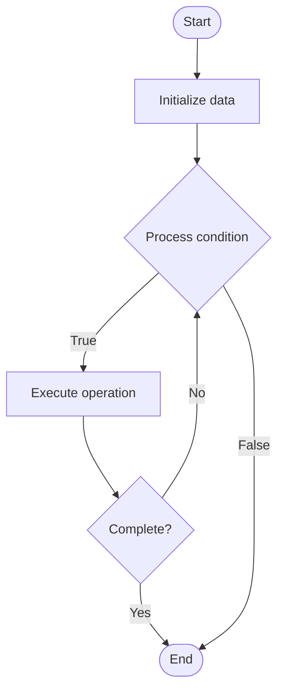

# SQL Transactions

1. **Name of Algorithm**  

## Code Files


## Algorithm Visualization

### Flowchart (ASCII)


```
SQL Transactions Flowchart:

┌─────────────┐
│   Start     │
└──────┬──────┘
       │
       ▼
┌─────────────┐
│  Initialize │
│   data      │
└──────┬──────┘
       │
       ▼
┌─────────────┐      Yes
│  Process   ├──────┐
│  condition?│      │
└──────┬──────┘      │
       │ No          │
       ▼             │
┌─────────────┐      │
│  Execute   │      │
│  operation │      │
└──────┬──────┘      │
       │             │
       └─────────────┘
       │
       ▼
┌─────────────┐
│    End      │
└─────────────┘
```


### Step-by-Step Execution


```
SQL Transactions Step-by-Step Execution:

Input: [example data]

Step 1: Initialize
State: [initial state]

Step 2: Process
State: [intermediate state]

Step 3: Finalize
State: [final state]

Result: [output]
```


### Interactive Flowchart (Mermaid)





> **Note**: Mermaid diagrams are rendered automatically on GitHub. For local viewing, use a Mermaid-compatible Markdown viewer.
- [Python Implementation](semester_08/lecture_49_sql_fundamentals/transactions/algorithm.py)
- [Java Implementation](semester_08/lecture_49_sql_fundamentals/transactions/Algorithm.java)
- [Python Tests](semester_08/lecture_49_sql_fundamentals/transactions/test_algorithm.py)


   SQL Transactions

2. **What problem does it solve? (1 sentence)**  
   Bundle multiple statements into an atomic, consistent, isolated, durable unit of work.

3. **Intuition (plain-language explanation)**  
   Either all operations succeed together or none do, safeguarding integrity even under failures.

4. **Inputs & Outputs**  
   - Input: BEGIN/COMMIT/ROLLBACK directives plus SQL statements.  
   - Output: Committed data changes or a rollback to the previous state.

5. **Step-by-step description (5–10 lines max)**  
1. BEGIN (implicit or explicit) starts a transaction context.
2. Execute one or more SQL statements.
3. If all succeed, issue COMMIT to persist changes.
4. On error or manual cancel, issue ROLLBACK to undo.
5. DBMS enforces ACID properties via logging and locking.

6. **Tiny example (hand-simulated)**  
   Transfer funds: debit one account, credit another, COMMIT only if both succeed; else ROLLBACK.

7. **Time & Space Complexity**  
   - Time: Depends on enclosed statements; logging adds small overhead.  
   - Space: Requires log space for redo/undo records.

8. **Strengths**  
- Protects data integrity under concurrency and crashes.
- Simplifies multi-step operations for developers.

9. **Weaknesses / limitations**  
- Excessive transaction scope can cause contention.
- Long transactions hold locks, reducing throughput.

10. **Compare with alternatives**  
    Alternatives: Eventual consistency workflows, Application-level compensation logic

11. **30-second explanation (your own words)**  
    Group related statements so they behave as a single all-or-nothing change, ensuring ACID guarantees.

*Sources: Adapted from standard university textbooks and Wikipedia summaries.*
