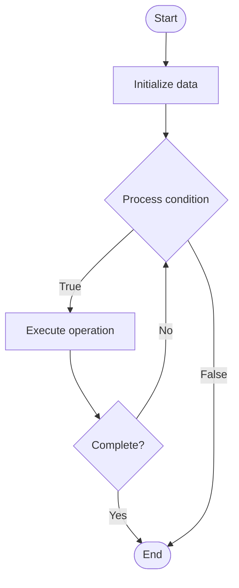

# Database Triggers

1. **Name of Algorithm**  

## Code Files


## Algorithm Visualization

### Flowchart (ASCII)


```
Database Triggers Flowchart:

┌─────────────┐
│   Start     │
└──────┬──────┘
       │
       ▼
┌─────────────┐
│  Initialize │
│   data      │
└──────┬──────┘
       │
       ▼
┌─────────────┐      Yes
│  Process   ├──────┐
│  condition?│      │
└──────┬──────┘      │
       │ No          │
       ▼             │
┌─────────────┐      │
│  Execute   │      │
│  operation │      │
└──────┬──────┘      │
       │             │
       └─────────────┘
       │
       ▼
┌─────────────┐
│    End      │
└─────────────┘
```


### Step-by-Step Execution


```
Database Triggers Step-by-Step Execution:

Input: [example data]

Step 1: Initialize
State: [initial state]

Step 2: Process
State: [intermediate state]

Step 3: Finalize
State: [final state]

Result: [output]
```


### Interactive Flowchart (Mermaid)





> **Note**: Mermaid diagrams are rendered automatically on GitHub. For local viewing, use a Mermaid-compatible Markdown viewer.
- [Python Implementation](semester_08/lecture_49_sql_fundamentals/triggers/algorithm.py)
- [Java Implementation](semester_08/lecture_49_sql_fundamentals/triggers/Algorithm.java)
- [Python Tests](semester_08/lecture_49_sql_fundamentals/triggers/test_algorithm.py)


   Database Triggers

2. **What problem does it solve? (1 sentence)**  
   Automatically executes SQL code in response to specific database events (INSERT, UPDATE, DELETE), enabling automatic data validation, auditing, and maintaining referential integrity.

3. **Intuition (plain-language explanation)**  
   Like automatic event handlers: triggers are like 'if this happens, then do that' rules - when you insert/update/delete data (event), the trigger automatically fires and executes predefined SQL code (action), like automatically updating a timestamp, logging changes, or validating data.

4. **Inputs & Outputs**  
   - Input: Trigger definition, event type (INSERT/UPDATE/DELETE), table, trigger code.  
   - Output: Automatic actions, data validation, audit logs, maintained data integrity.

5. **Step-by-step description (5–10 lines max)**  
1. Define trigger: specify trigger name, event (BEFORE/AFTER INSERT/UPDATE/DELETE), and table.
2. Write trigger code: create SQL code to execute when trigger fires.
3. Create trigger: register trigger with database.
4. Monitor events: database monitors specified table for trigger events.
5. Fire trigger: when event occurs, database automatically executes trigger code.
6. Execute actions: trigger performs defined actions (validate, log, update, etc.).
7. Commit/rollback: trigger can allow or prevent the triggering operation.
8. Maintain: update trigger logic as requirements change.

6. **Tiny example (hand-simulated)**  
   Table: orders → trigger: AFTER INSERT → code: UPDATE users SET total_orders = total_orders + 1 WHERE id = NEW.user_id → when order inserted → trigger fires automatically → updates user's order count → no application code needed → automatic data consistency.

7. **Time & Space Complexity**  
   - Time: O(1) for trigger invocation, execution time depends on trigger code complexity.  
   - Space: O(t) where t is trigger code size (stored on database server).

8. **Strengths**  
- Automatic: executes automatically without application intervention.
- Data integrity: enforces business rules at database level.
- Auditing: automatically logs changes for compliance and tracking.

9. **Weaknesses / limitations**  
- Hidden logic: triggers can make database behavior non-obvious.
- Performance: can slow down INSERT/UPDATE/DELETE operations.
- Debugging: difficult to trace and debug trigger execution.

10. **Compare with alternatives**  
    Alternatives: Application Logic, Constraints, Stored Procedures, Event Handlers

11. **30-second explanation (your own words)**  
    Automatically executes SQL code in response to specific database events (INSERT, UPDATE, DELETE), enabling automatic data validation, auditing, and maintaining referential integrity.

*Sources: Adapted from standard university textbooks and Wikipedia summaries.*
