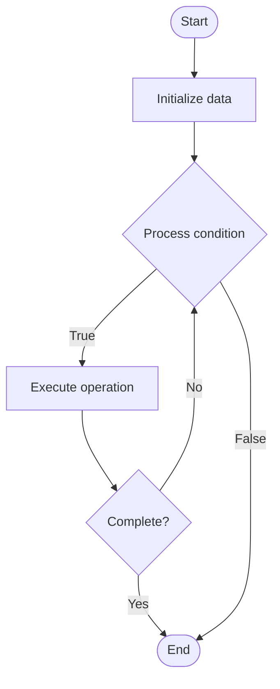

# Database Design

## Учебные материалы

- [Школьный уровень](school.ru.md)
- [Университетский уровень](univer.ru.md)

## Algorithm Visualization

### Flowchart (ASCII)

```
Database Design Flowchart:

┌─────────────┐
│   Start     │
└──────┬──────┘
       │
       ▼
┌─────────────┐
│  Initialize │
│   data      │
└──────┬──────┘
       │
       ▼
┌─────────────┐      Yes
│  Process   ├──────┐
│  condition?│      │
└──────┬──────┘      │
       │ No          │
       ▼             │
┌─────────────┐      │
│  Execute   │      │
│  operation │      │
└──────┬──────┘      │
       │             │
       └─────────────┘
       │
       ▼
┌─────────────┐
│    End      │
└─────────────┘
```

### Step-by-Step Execution

```
Database Design Step-by-Step Execution:

Input: [example data]

Step 1: Initialize
State: [initial state]

Step 2: Process
State: [intermediate state]

Step 3: Finalize
State: [final state]

Result: [output]
```

### Interactive Flowchart (Mermaid)



> **Note**: Mermaid diagrams are rendered automatically on GitHub. For local viewing, use a Mermaid-compatible Markdown viewer.

- [Python Implementation](/code/semester_08/lecture_50_sql_advanced/database_design/algorithm.py)
- [Java Implementation](/code/semester_08/lecture_50_sql_advanced/database_design/Algorithm.java)
- [Python Tests](/code/semester_08/lecture_50_sql_advanced/database_design/test_algorithm.py)

What problem does it solve? (1 sentence)  
Creates efficient, normalized database schemas that model real-world entities and relationships, ensuring data integrity, minimizing redundancy, and optimizing for query performance.

Intuition (plain-language explanation)  
Like designing a building blueprint: database design is like creating an architectural blueprint for data - you identify what entities exist (like rooms in a building), how they relate (like how rooms connect), and design the structure (like floor plan) to be efficient, organized, and easy to navigate - good design makes the database easy to use, maintain, and query.

Inputs & Outputs  

  - Input: Business requirements, entities, relationships, data constraints, access patterns.  
  - Output: Database schema, entity-relationship model, normalized tables, optimized design.

Step-by-step description (5–10 lines max)  
Gather requirements: understand business needs, data, and access patterns.
Identify entities: determine main entities (customers, orders, products, etc.).
Define relationships: establish relationships between entities (one-to-many, many-to-many, etc.).
Create ER model: build entity-relationship diagram showing entities and relationships.
Normalize: apply normalization rules to eliminate redundancy (1NF, 2NF, 3NF).
Design tables: create table structures with columns, data types, and constraints.
Define keys: establish primary keys, foreign keys, and indexes.
Optimize: denormalize selectively for performance if needed.
Validate: verify design meets requirements and supports queries efficiently.

Tiny example (hand-simulated)  
   E-commerce database design: entities: customers, orders, products, order_items → relationships: customer has many orders, order has many order_items, order_item belongs to product → normalize: separate tables for each entity → foreign keys link relationships → indexes on frequently queried fields → efficient, maintainable database design.

Time & Space Complexity  

  - Time: O(e·r) where e is number of entities, r is number of relationships (design phase).  
  - Space: O(t) where t is number of tables and their schema size.

Strengths  

- Data integrity: well-designed schema ensures data consistency.
- Efficiency: optimized design supports fast queries.
- Maintainability: clear structure makes database easy to maintain and extend.

Weaknesses / limitations  

- Complexity: good design requires careful analysis and planning.
- Trade-offs: may need to balance normalization with performance.
- Evolution: schema changes can be complex as requirements evolve.

Compare with alternatives  
    Alternatives: Ad-hoc Design, Denormalized Design, NoSQL Design, Schema-less Databases

30-second explanation (your own words)  
Creates efficient, normalized database schemas that model real-world entities and relationships, ensuring data integrity, minimizing redundancy, and optimizing for query performance.

*Sources: Adapted from standard university textbooks and Wikipedia summaries.*
