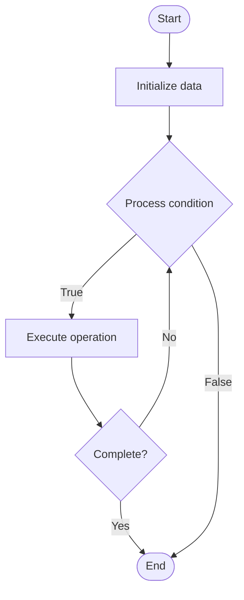

# Database Denormalization

Name of Algorithm  

## Code Files


## Algorithm Visualization

### Flowchart (ASCII)


```
Database Denormalization Flowchart:

┌─────────────┐
│   Start     │
└──────┬──────┘
       │
       ▼
┌─────────────┐
│  Initialize │
│   data      │
└──────┬──────┘
       │
       ▼
┌─────────────┐      Yes
│  Process   ├──────┐
│  condition?│      │
└──────┬──────┘      │
       │ No          │
       ▼             │
┌─────────────┐      │
│  Execute   │      │
│  operation │      │
└──────┬──────┘      │
       │             │
       └─────────────┘
       │
       ▼
┌─────────────┐
│    End      │
└─────────────┘
```


### Step-by-Step Execution


```
Database Denormalization Step-by-Step Execution:

Input: [example data]

Step 1: Initialize
State: [initial state]

Step 2: Process
State: [intermediate state]

Step 3: Finalize
State: [final state]

Result: [output]
```


### Interactive Flowchart (Mermaid)





> **Note**: Mermaid diagrams are rendered automatically on GitHub. For local viewing, use a Mermaid-compatible Markdown viewer.
- [Python Implementation](/code/semester_08/lecture_50_sql_advanced/denormalization/algorithm.py)
- [Java Implementation](/code/semester_08/lecture_50_sql_advanced/denormalization/Algorithm.java)
- [Python Tests](/code/semester_08/lecture_50_sql_advanced/denormalization/test_algorithm.py)


   Database Denormalization

What problem does it solve? (1 sentence)  
   Intentionally introduces data redundancy by storing duplicate data across tables to improve query performance, trading storage space and update complexity for faster reads.

Intuition (plain-language explanation)  
Like keeping copies for convenience: denormalization is like keeping a copy of important information in multiple places for quick access - instead of always looking it up (JOIN), you store it where you need it (like keeping a phone number in both your contacts and on a sticky note) - it uses more space and you must update multiple places, but it's faster to access.

Inputs & Outputs  
   - Input: Normalized database schema, query patterns, performance requirements, storage constraints.  
   - Output: Denormalized schema, improved query performance, increased storage, update complexity.

Step-by-step description (5–10 lines max)  
Analyze queries: identify frequently executed queries with multiple JOINs.
Identify redundancy: determine which data can be duplicated for performance.
Design denormalization: plan where to add redundant data (computed columns, duplicated fields).
Implement: add redundant columns or computed values to tables.
Update logic: modify application to update redundant data consistently.
Test performance: measure query performance improvements.
Monitor: track storage increase and update performance impact.
Balance: find optimal balance between normalization and denormalization.

Tiny example (hand-simulated)  
   Normalized: orders table references customers table → query orders with customer names requires JOIN → denormalize: add customer_name column to orders table → query orders with names: no JOIN needed → faster query → trade-off: must update customer_name in orders when customer name changes.

Time & Space Complexity  
   - Time: O(1) for reads (no JOINs), O(u) for updates where u is number of redundant copies to update.  
   - Space: O(d·r) where d is data size, r is redundancy factor (more storage for duplicates).

Strengths  
- Query performance: eliminates JOINs, dramatically improving read speed.
- Simpler queries: queries become simpler without complex JOINs.
- Reduced load: fewer JOINs reduce database load.

Weaknesses / limitations  
- Storage overhead: requires additional storage for duplicate data.
- Update complexity: must update redundant data in multiple places.
- Data inconsistency: risk of inconsistent data if updates fail.

Compare with alternatives  
    Alternatives: Normalization, Materialized Views, Caching, Read Replicas

30-second explanation (your own words)  
    Intentionally introduces data redundancy by storing duplicate data across tables to improve query performance, trading storage space and update complexity for faster reads.

*Sources: Adapted from standard university textbooks and Wikipedia summaries.*
