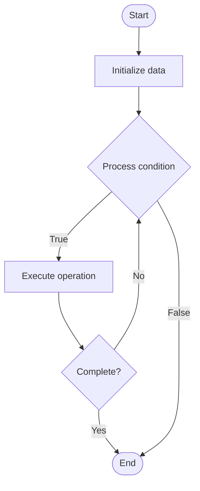

# Database Normalization

## Учебные материалы

- [Школьный уровень](school.ru.md)
- [Университетский уровень](univer.ru.md)

## Algorithm Visualization

### Flowchart (ASCII)

```
Database Normalization Flowchart:

┌─────────────┐
│   Start     │
└──────┬──────┘
       │
       ▼
┌─────────────┐
│  Initialize │
│   data      │
└──────┬──────┘
       │
       ▼
┌─────────────┐      Yes
│  Process   ├──────┐
│  condition?│      │
└──────┬──────┘      │
       │ No          │
       ▼             │
┌─────────────┐      │
│  Execute   │      │
│  operation │      │
└──────┬──────┘      │
       │             │
       └─────────────┘
       │
       ▼
┌─────────────┐
│    End      │
└─────────────┘
```

### Step-by-Step Execution

```
Database Normalization Step-by-Step Execution:

Input: [example data]

Step 1: Initialize
State: [initial state]

Step 2: Process
State: [intermediate state]

Step 3: Finalize
State: [final state]

Result: [output]
```

### Interactive Flowchart (Mermaid)



> **Note**: Mermaid diagrams are rendered automatically on GitHub. For local viewing, use a Mermaid-compatible Markdown viewer.

- [Python Implementation](/code/semester_08/lecture_50_sql_advanced/normalization/algorithm.py)
- [Java Implementation](/code/semester_08/lecture_50_sql_advanced/normalization/Algorithm.java)
- [Python Tests](/code/semester_08/lecture_50_sql_advanced/normalization/test_algorithm.py)

What problem does it solve? (1 sentence)  
   Organizes database tables to eliminate data redundancy and dependency issues, ensuring data integrity and reducing storage requirements through structured table design.

Intuition (plain-language explanation)  
   Like organizing a filing cabinet: normalization is like separating documents into different folders (tables) based on what they're about - instead of storing customer address in every order (redundant), you store it once in a customers table and reference it (like a folder reference) - this prevents inconsistencies and saves space.

Inputs & Outputs  

  - Input: Unnormalized database schema, business requirements, data relationships.  
  - Output: Normalized database schema, reduced redundancy, improved data integrity.

Step-by-step description (5–10 lines max)  
Identify entities: determine main entities (customers, orders, products, etc.).
First Normal Form (1NF): eliminate repeating groups, ensure atomic values.
Second Normal Form (2NF): remove partial dependencies (non-key attributes depend on full key).
Third Normal Form (3NF): remove transitive dependencies (non-key attributes depend on other non-key attributes).
Create relationships: establish foreign key relationships between tables.
Verify: ensure no data redundancy and all dependencies are properly handled.
Optimize: balance normalization with query performance needs.
Document: document normalized schema and relationships.

Tiny example (hand-simulated)  
   Unnormalized: orders table with customer_name, customer_address, product_name, product_price (redundant) → 1NF: separate repeating groups → 2NF: remove partial dependencies → 3NF: remove transitive dependencies → normalized: orders table references customers and products tables → customer data stored once → no redundancy → data integrity maintained.

Time & Space Complexity  

  - Time: O(n) where n is number of tables and relationships (design phase).  
  - Space: O(d) where d is data size (typically reduces storage due to eliminated redundancy).

Strengths  

- Data integrity: eliminates redundancy and prevents inconsistencies.
- Storage efficiency: reduces storage requirements.
- Maintainability: easier to update data (change once, affects all references).

Weaknesses / limitations  

- Query complexity: may require more JOINs to retrieve related data.
- Performance: over-normalization can slow down queries.
- Design complexity: requires careful analysis and design.

Compare with alternatives  
    Alternatives: Denormalization, Flat Tables, Document Databases, NoSQL

30-second explanation (your own words)  
    Organizes database tables to eliminate data redundancy and dependency issues, ensuring data integrity and reducing storage requirements through structured table design.

*Sources: Adapted from standard university textbooks and Wikipedia summaries.*


## References

- [Normalization](https://en.wikipedia.org/wiki/Normalization) - Wikipedia
