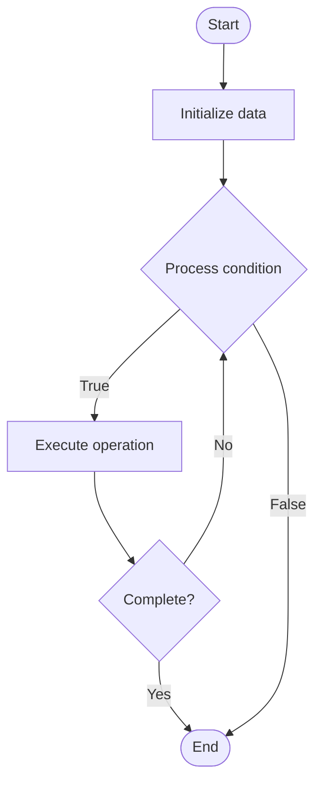

# Database Partitioning

Name of Algorithm  

## Code Files


## Algorithm Visualization

### Flowchart (ASCII)


```
Database Partitioning Flowchart:

┌─────────────┐
│   Start     │
└──────┬──────┘
       │
       ▼
┌─────────────┐
│  Initialize │
│   data      │
└──────┬──────┘
       │
       ▼
┌─────────────┐      Yes
│  Process   ├──────┐
│  condition?│      │
└──────┬──────┘      │
       │ No          │
       ▼             │
┌─────────────┐      │
│  Execute   │      │
│  operation │      │
└──────┬──────┘      │
       │             │
       └─────────────┘
       │
       ▼
┌─────────────┐
│    End      │
└─────────────┘
```


### Step-by-Step Execution


```
Database Partitioning Step-by-Step Execution:

Input: [example data]

Step 1: Initialize
State: [initial state]

Step 2: Process
State: [intermediate state]

Step 3: Finalize
State: [final state]

Result: [output]
```


### Interactive Flowchart (Mermaid)





> **Note**: Mermaid diagrams are rendered automatically on GitHub. For local viewing, use a Mermaid-compatible Markdown viewer.
- [Python Implementation](/code/semester_08/lecture_50_sql_advanced/partitioning/algorithm.py)
- [Java Implementation](/code/semester_08/lecture_50_sql_advanced/partitioning/Algorithm.java)
- [Python Tests](/code/semester_08/lecture_50_sql_advanced/partitioning/test_algorithm.py)


   Database Partitioning

What problem does it solve? (1 sentence)  
   Divides large tables into smaller, manageable partitions based on partition key, improving query performance, maintenance operations, and enabling partition pruning.

Intuition (plain-language explanation)  
   Like organizing files into folders: database partitioning is like organizing a huge filing cabinet into smaller drawers (partitions) - instead of searching through one massive drawer (table), you organize files by date or category (partition key) into separate drawers - when you need files from a specific date, you only open that drawer (partition), making searches much faster.

Inputs & Outputs  
   - Input: Large table, partition key, partition strategy (range, list, hash), partition boundaries.  
   - Output: Partitioned table, improved performance, easier maintenance, partition pruning.

Step-by-step description (5–10 lines max)  
Choose partition key: select column(s) for partitioning (e.g., date, region).
Select strategy: choose partitioning strategy (range, list, hash, composite).
Define partitions: create partition definitions with boundaries.
Partition table: split table data into partitions based on partition key.
Store partitions: store each partition separately (same table, different storage).
Query: database automatically routes queries to relevant partition(s).
Prune: query optimizer prunes irrelevant partitions (partition elimination).
Maintain: perform maintenance operations (backup, index rebuild) on individual partitions.

Tiny example (hand-simulated)  
   Orders table: 100M rows → partition by order_date → range partitions: 2023-Q1, 2023-Q2, 2023-Q3, 2023-Q4 → query: SELECT * FROM orders WHERE order_date = '2023-06-15' → optimizer prunes other partitions → only scans Q2 partition → query time: 0.1s vs 10s (100x faster).

Time & Space Complexity  
   - Time: O(1) for partition routing, O(n/p) for queries where n is data size, p is number of partitions (partition pruning).  
   - Space: O(d) where d is data size (same as unpartitioned, but organized into partitions).

Strengths  
- Query performance: partition pruning dramatically improves query speed.
- Maintenance: easier to maintain and manage smaller partitions.
- Scalability: enables managing very large tables efficiently.

Weaknesses / limitations  
- Partition key: poor partition key selection can limit benefits.
- Cross-partition queries: queries spanning partitions may be slower.
- Complexity: adds complexity to table design and management.

Compare with alternatives  
    Alternatives: Unpartitioned Tables, Sharding, Indexing, Materialized Views

30-second explanation (your own words)  
    Divides large tables into smaller, manageable partitions based on partition key, improving query performance, maintenance operations, and enabling partition pruning.

*Sources: Adapted from standard university textbooks and Wikipedia summaries.*
