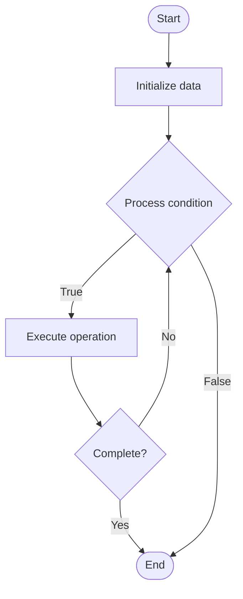

# Query Optimization

1. **Name of Algorithm**  

## Code Files


## Algorithm Visualization

### Flowchart (ASCII)


```
Query Optimization Flowchart:

┌─────────────┐
│   Start     │
└──────┬──────┘
       │
       ▼
┌─────────────┐
│  Initialize │
│   data      │
└──────┬──────┘
       │
       ▼
┌─────────────┐      Yes
│  Process   ├──────┐
│  condition?│      │
└──────┬──────┘      │
       │ No          │
       ▼             │
┌─────────────┐      │
│  Execute   │      │
│  operation │      │
└──────┬──────┘      │
       │             │
       └─────────────┘
       │
       ▼
┌─────────────┐
│    End      │
└─────────────┘
```


### Step-by-Step Execution


```
Query Optimization Step-by-Step Execution:

Input: [example data]

Step 1: Initialize
State: [initial state]

Step 2: Process
State: [intermediate state]

Step 3: Finalize
State: [final state]

Result: [output]
```


### Interactive Flowchart (Mermaid)





> **Note**: Mermaid diagrams are rendered automatically on GitHub. For local viewing, use a Mermaid-compatible Markdown viewer.
- [Python Implementation](semester_08/lecture_50_sql_advanced/query_optimization/algorithm.py)
- [Java Implementation](semester_08/lecture_50_sql_advanced/query_optimization/Algorithm.java)
- [Python Tests](semester_08/lecture_50_sql_advanced/query_optimization/test_algorithm.py)


   Query Optimization

2. **What problem does it solve? (1 sentence)**  
Improves SQL query performance by selecting efficient execution plans, using indexes, and rewriting queries to minimize execution time and resource usage.

3. **Intuition (plain-language explanation)**  
   Like GPS route optimization: query optimization is like a GPS finding the fastest route - instead of taking the first route (naive execution), the optimizer analyzes all possible routes (execution plans), considers traffic (indexes, statistics), and picks the fastest one (optimal plan) to get results quickly.

4. **Inputs & Outputs**  
   - Input: SQL query, database schema, indexes, table statistics, query optimizer.  
   - Output: Optimized execution plan, improved query performance, reduced resource usage.

5. **Step-by-step description (5–10 lines max)**  
1. Parse query: analyze SQL query structure and identify operations.
2. Generate plans: create multiple possible execution plans (different join orders, index usage, etc.).
3. Estimate costs: calculate cost for each plan based on statistics, indexes, and data distribution.
4. Select plan: choose execution plan with lowest estimated cost.
5. Use indexes: leverage indexes for WHERE, JOIN, and ORDER BY operations.
6. Apply heuristics: use optimization rules (push predicates down, eliminate unnecessary operations).
7. Execute: run optimized plan to retrieve results.
8. Monitor: track actual performance and update statistics for future optimizations.

6. **Tiny example (hand-simulated)**  
   Query: SELECT * FROM orders o JOIN customers c ON o.customer_id = c.id WHERE c.country = 'USA' → optimizer analyzes → finds index on customers.country → chooses plan: use index to filter customers first → then join with orders → execution time: 0.1s vs 10s without optimization → 100x faster.

7. **Time & Space Complexity**  
   - Time: O(p) for plan generation where p is number of possible plans, O(1) for plan selection.  
   - Space: O(s) where s is statistics and metadata size.

8. **Strengths**  
- Performance: dramatically improves query execution speed.
- Automatic: optimizer handles optimization automatically.
- Adaptive: uses statistics to make informed decisions.

9. **Weaknesses / limitations**  
- Statistics dependency: poor statistics lead to poor plans.
- Complexity: optimization can be complex for large queries.
- Plan stability: execution plans may change as data changes.

10. **Compare with alternatives**  
    Alternatives: Manual Query Rewriting, Query Hints, Index Tuning, Materialized Views

11. **30-second explanation (your own words)**  
Improves SQL query performance by selecting efficient execution plans, using indexes, and rewriting queries to minimize execution time and resource usage.

*Sources: Adapted from standard university textbooks and Wikipedia summaries.*
