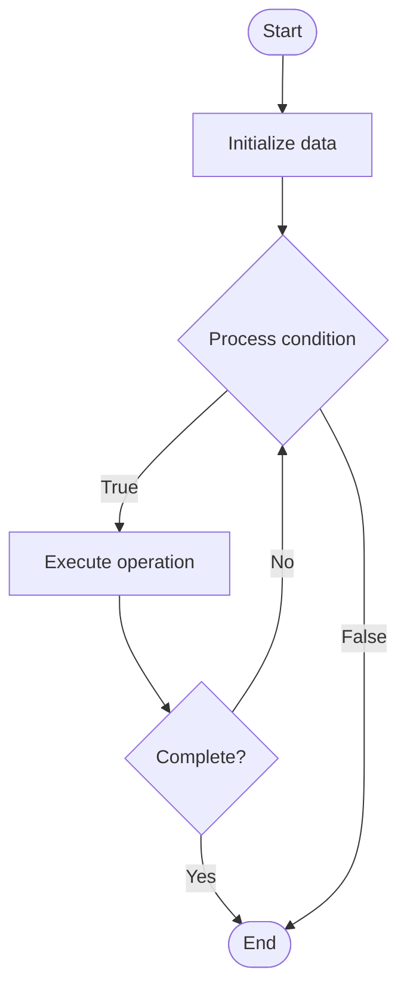

# Database Replication

1. **Name of Algorithm**  

## Code Files


## Algorithm Visualization

### Flowchart (ASCII)


```
Database Replication Flowchart:

┌─────────────┐
│   Start     │
└──────┬──────┘
       │
       ▼
┌─────────────┐
│  Initialize │
│   data      │
└──────┬──────┘
       │
       ▼
┌─────────────┐      Yes
│  Process   ├──────┐
│  condition?│      │
└──────┬──────┘      │
       │ No          │
       ▼             │
┌─────────────┐      │
│  Execute   │      │
│  operation │      │
└──────┬──────┘      │
       │             │
       └─────────────┘
       │
       ▼
┌─────────────┐
│    End      │
└─────────────┘
```


### Step-by-Step Execution


```
Database Replication Step-by-Step Execution:

Input: [example data]

Step 1: Initialize
State: [initial state]

Step 2: Process
State: [intermediate state]

Step 3: Finalize
State: [final state]

Result: [output]
```


### Interactive Flowchart (Mermaid)





> **Note**: Mermaid diagrams are rendered automatically on GitHub. For local viewing, use a Mermaid-compatible Markdown viewer.
- [Python Implementation](semester_08/lecture_50_sql_advanced/replication/algorithm.py)
- [Java Implementation](semester_08/lecture_50_sql_advanced/replication/Algorithm.java)
- [Python Tests](semester_08/lecture_50_sql_advanced/replication/test_algorithm.py)


   Database Replication

2. **What problem does it solve? (1 sentence)**  
   Maintains multiple copies of database across different servers, enabling high availability, load distribution, and disaster recovery.

3. **Intuition (plain-language explanation)**  
Like making backup copies: database replication is like photocopying important documents and storing them in different locations - if one copy is lost or unavailable, you have others. It also lets multiple people read from different copies simultaneously (like multiple people reading different copies of the same book), distributing the load.

4. **Inputs & Outputs**  
   - Input: Primary database, replication configuration, network connection, replication method.  
   - Output: Replicated database copies, high availability, load distribution, backup copies.

5. **Step-by-step description (5–10 lines max)**  
1. Configure primary: set up primary (master) database server.
2. Configure replicas: set up replica (slave) database servers.
3. Enable replication: configure replication method (master-slave, master-master, etc.).
4. Initial sync: copy existing data from primary to replicas.
5. Monitor changes: primary database logs all changes (transaction log, binary log).
6. Replicate changes: transfer logged changes to replica servers.
7. Apply changes: replicas apply changes to maintain consistency.
8. Verify: monitor replication lag and ensure replicas stay synchronized.
9. Failover: if primary fails, promote replica to primary (high availability).

6. **Tiny example (hand-simulated)**  
   Primary database in New York → replicate to London and Tokyo → writes go to primary → changes logged → replicated to London and Tokyo → reads can go to any replica → if New York fails → London becomes primary → zero downtime → high availability achieved.

7. **Time & Space Complexity**  
   - Time: O(1) for replication setup, O(n) for initial sync where n is data size, O(1) for ongoing replication per transaction.  
   - Space: O(d·r) where d is database size, r is number of replicas (each replica stores full copy).

8. **Strengths**  
- High availability: system continues operating if primary fails.
- Load distribution: read queries can be distributed across replicas.
- Disaster recovery: replicas serve as backups in different locations.

9. **Weaknesses / limitations**  
- Replication lag: replicas may be slightly behind primary.
- Storage cost: requires multiple copies of data.
- Complexity: requires careful configuration and monitoring.

10. **Compare with alternatives**  
    Alternatives: Single Database, Backup and Restore, Clustering, Sharding

11. **30-second explanation (your own words)**  

*Sources: Adapted from standard university textbooks and Wikipedia summaries.*
