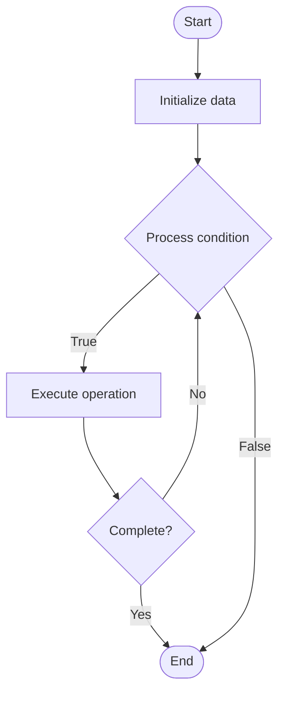

# Column Family Stores

## Учебные материалы

- [Школьный уровень](school.ru.md)
- [Университетский уровень](univer.ru.md)

## Algorithm Visualization

### Flowchart (ASCII)

```
Column Family Stores Flowchart:

┌─────────────┐
│   Start     │
└──────┬──────┘
       │
       ▼
┌─────────────┐
│  Initialize │
│   data      │
└──────┬──────┘
       │
       ▼
┌─────────────┐      Yes
│  Process   ├──────┐
│  condition?│      │
└──────┬──────┘      │
       │ No          │
       ▼             │
┌─────────────┐      │
│  Execute   │      │
│  operation │      │
└──────┬──────┘      │
       │             │
       └─────────────┘
       │
       ▼
┌─────────────┐
│    End      │
└─────────────┘
```

### Step-by-Step Execution

```
Column Family Stores Step-by-Step Execution:

Input: [example data]

Step 1: Initialize
State: [initial state]

Step 2: Process
State: [intermediate state]

Step 3: Finalize
State: [final state]

Result: [output]
```

### Interactive Flowchart (Mermaid)



> **Note**: Mermaid diagrams are rendered automatically on GitHub. For local viewing, use a Mermaid-compatible Markdown viewer.

- [Python Implementation](/code/semester_08/lecture_51_nosql_fundamentals/column_family/algorithm.py)
- [Java Implementation](/code/semester_08/lecture_51_nosql_fundamentals/column_family/Algorithm.java)
- [Python Tests](/code/semester_08/lecture_51_nosql_fundamentals/column_family/test_algorithm.py)

What problem does it solve? (1 sentence)  
Organizes data into column families (groups of related columns), enabling efficient storage and retrieval of wide, sparse tables with billions of rows, optimized for write-heavy workloads.

Intuition (plain-language explanation)  
Like a spreadsheet with flexible columns: column family stores are like spreadsheets where each row can have different columns (like flexible spreadsheets) - data is organized by column families (like grouping related columns together), making it efficient to store and query wide tables with many columns, especially when most rows only use a few columns.

Inputs & Outputs  

  - Input: Row key, column family, column qualifiers, values, timestamps.  
- Output: Stored column families, retrieved rows, efficient wide-table storage.

Step-by-step description (5–10 lines max)  
Define column family: group related columns into column family.
Create row: generate row key (unique identifier for row).
Store columns: store column qualifiers and values within column family.
Organize: data organized by row key, then column family, then column qualifier.
Retrieve row: fetch all columns for a row key (efficient row access).
Query columns: query specific columns or column families.
Update: add or update columns within column family.
Delete: remove columns or entire rows.

Tiny example (hand-simulated)  
   Row key: 'user:123' → column family: 'profile' → columns: name='John', email='john@example.com' → column family: 'orders' → columns: order1='...', order2='...' → retrieve: get row 'user:123' → returns all column families → efficient for wide, sparse data.

Time & Space Complexity  

  - Time: O(1) for row lookup by key, O(c) for column access where c is number of columns, O(log n) with indexes.  
  - Space: O(r·c) where r is number of rows, c is average columns per row (sparse storage).

Strengths  

- Wide tables: efficiently handles tables with many columns.
- Sparse data: efficient storage when rows have few columns.
- Write performance: optimized for high write throughput.

Weaknesses / limitations  

- Complexity: more complex data model than key-value or document stores.
- Query limitations: limited query capabilities compared to relational databases.
- Learning curve: requires understanding of column family concepts.

Compare with alternatives  
    Alternatives: Relational Databases, Document Databases, Key-Value Stores, Time-Series Databases

30-second explanation (your own words)  
Organizes data into column families (groups of related columns), enabling efficient storage and retrieval of wide, sparse tables with billions of rows, optimized for write-heavy workloads.

*Sources: Adapted from standard university textbooks and Wikipedia summaries.*


## References

- [Column family](https://en.wikipedia.org/wiki/Column_family) - Wikipedia
