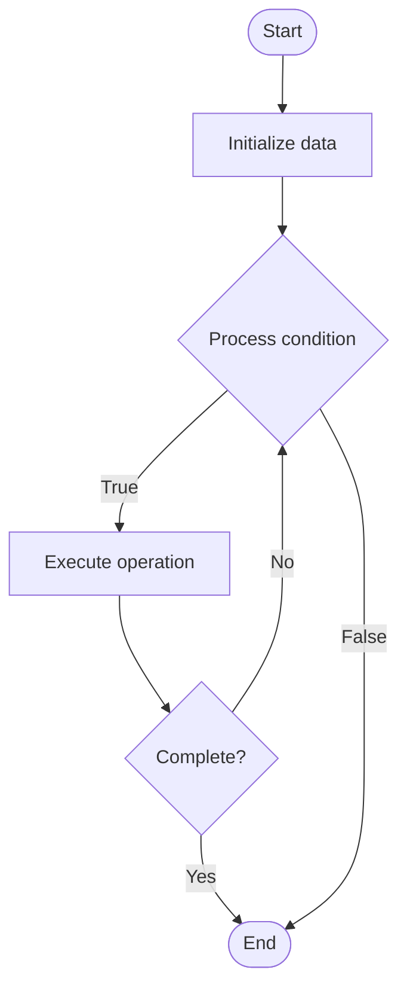

# Document Databases

Name of Algorithm  

## Code Files


## Algorithm Visualization

### Flowchart (ASCII)


```
Document Databases Flowchart:

┌─────────────┐
│   Start     │
└──────┬──────┘
       │
       ▼
┌─────────────┐
│  Initialize │
│   data      │
└──────┬──────┘
       │
       ▼
┌─────────────┐      Yes
│  Process   ├──────┐
│  condition?│      │
└──────┬──────┘      │
       │ No          │
       ▼             │
┌─────────────┐      │
│  Execute   │      │
│  operation │      │
└──────┬──────┘      │
       │             │
       └─────────────┘
       │
       ▼
┌─────────────┐
│    End      │
└─────────────┘
```


### Step-by-Step Execution


```
Document Databases Step-by-Step Execution:

Input: [example data]

Step 1: Initialize
State: [initial state]

Step 2: Process
State: [intermediate state]

Step 3: Finalize
State: [final state]

Result: [output]
```


### Interactive Flowchart (Mermaid)





> **Note**: Mermaid diagrams are rendered automatically on GitHub. For local viewing, use a Mermaid-compatible Markdown viewer.
- [Python Implementation](/code/semester_08/lecture_51_nosql_fundamentals/document_databases/algorithm.py)
- [Java Implementation](/code/semester_08/lecture_51_nosql_fundamentals/document_databases/Algorithm.java)
- [Python Tests](/code/semester_08/lecture_51_nosql_fundamentals/document_databases/test_algorithm.py)


   Document Databases

What problem does it solve? (1 sentence)  
Stores data as semi-structured documents (JSON, BSON, XML), enabling flexible schemas and efficient storage of hierarchical data without rigid table structures.

Intuition (plain-language explanation)  
   Like filing cabinets with flexible folders: document databases store data as documents (like folders) that can contain different information (like flexible folder contents) - unlike relational databases with fixed tables (like rigid forms), document databases let each document have different fields (like custom folder contents), making them flexible for varying data structures.

Inputs & Outputs  
   - Input: Documents (JSON/BSON), document ID, collections, query criteria.  
   - Output: Stored documents, retrieved documents, query results, flexible schema.

Step-by-step description (5–10 lines max)  
Create document: structure data as document (JSON object with fields).
Assign ID: generate or assign unique document identifier.
Store: save document in collection (like a table, but schema-less).
Index: optionally create indexes on document fields for faster queries.
Query: search documents by field values, nested fields, or conditions.
Retrieve: return matching documents based on query criteria.
Update: modify document fields (add, update, delete fields).
Delete: remove document from collection.

Tiny example (hand-simulated)  
   Document: {"_id": 123, "name": "John", "email": "john@example.com", "orders": [{"id": 1, "total": 100}]} → store in 'users' collection → query: find users where email = 'john@example.com' → returns document → flexible: can add new fields without schema changes.

Time & Space Complexity  
   - Time: O(1) for document lookup by ID, O(n) for collection scans, O(log n) with indexes where n is number of documents.  
   - Space: O(d) where d is total document size across all collections.

Strengths  
- Flexible schema: documents can have different structures.
- Hierarchical data: naturally stores nested and complex data.
- Developer-friendly: maps well to object-oriented programming models.

Weaknesses / limitations  
- No joins: cannot join documents like relational tables.
- Data duplication: may store redundant data across documents.
- Query limitations: complex queries may be less efficient than SQL.

Compare with alternatives  
    Alternatives: Relational Databases, Key-Value Stores, Graph Databases, Column Family Stores

30-second explanation (your own words)  
Stores data as semi-structured documents (JSON, BSON, XML), enabling flexible schemas and efficient storage of hierarchical data without rigid table structures.

*Sources: Adapted from standard university textbooks and Wikipedia summaries.*
