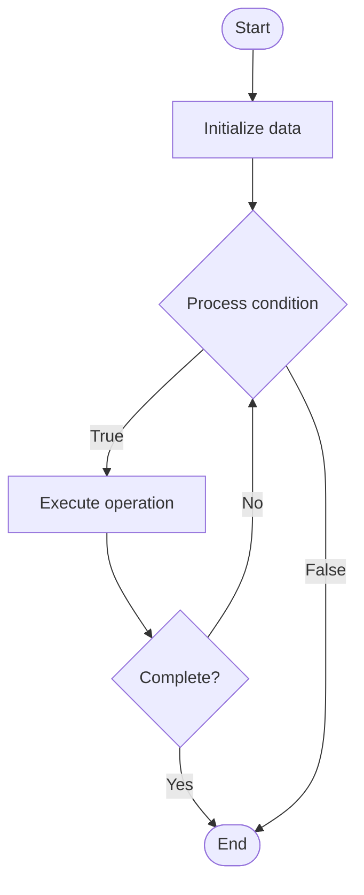

# Graph Databases

## Учебные материалы

- [Школьный уровень](school.ru.md)
- [Университетский уровень](univer.ru.md)

## Algorithm Visualization

### Flowchart (ASCII)

```
Graph Databases Flowchart:

┌─────────────┐
│   Start     │
└──────┬──────┘
       │
       ▼
┌─────────────┐
│  Initialize │
│   data      │
└──────┬──────┘
       │
       ▼
┌─────────────┐      Yes
│  Process   ├──────┐
│  condition?│      │
└──────┬──────┘      │
       │ No          │
       ▼             │
┌─────────────┐      │
│  Execute   │      │
│  operation │      │
└──────┬──────┘      │
       │             │
       └─────────────┘
       │
       ▼
┌─────────────┐
│    End      │
└─────────────┘
```

### Step-by-Step Execution

```
Graph Databases Step-by-Step Execution:

Input: [example data]

Step 1: Initialize
State: [initial state]

Step 2: Process
State: [intermediate state]

Step 3: Finalize
State: [final state]

Result: [output]
```

### Interactive Flowchart (Mermaid)



> **Note**: Mermaid diagrams are rendered automatically on GitHub. For local viewing, use a Mermaid-compatible Markdown viewer.

- [Python Implementation](/code/semester_08/lecture_51_nosql_fundamentals/graph_databases/algorithm.py)
- [Java Implementation](/code/semester_08/lecture_51_nosql_fundamentals/graph_databases/Algorithm.java)
- [Python Tests](/code/semester_08/lecture_51_nosql_fundamentals/graph_databases/test_algorithm.py)

What problem does it solve? (1 sentence)  
Stores data as nodes (entities) and edges (relationships), enabling efficient traversal and querying of complex relationships and network structures.

Intuition (plain-language explanation)  
   Like a social network: graph databases store data like a social network where people are nodes (entities) and friendships are edges (relationships) - you can easily find 'friends of friends' by following edges (relationships), making it perfect for modeling and querying complex relationships like social networks, recommendation systems, or knowledge graphs.

Inputs & Outputs  

  - Input: Nodes (entities), edges (relationships), properties, graph queries.  
  - Output: Graph structure, traversed paths, relationship queries, network analysis.

Step-by-step description (5–10 lines max)  
Create nodes: define entities as nodes with properties (e.g., Person, Product).
Create edges: define relationships as edges with properties (e.g., FRIENDS_WITH, PURCHASED).
Store graph: save nodes and edges in graph database.
Index: create indexes on node properties and edge types.
Traverse: navigate graph by following edges from node to node.
Query: use graph query language (Cypher, Gremlin) to find paths, patterns, or relationships.
Analyze: perform graph algorithms (shortest path, centrality, community detection).
Update: add/remove nodes and edges as relationships change.

Tiny example (hand-simulated)  
   Nodes: Person(id=1, name='Alice'), Person(id=2, name='Bob') → Edge: FRIENDS_WITH(from=1, to=2) → query: find friends of Alice → traverse: start at Alice → follow FRIENDS_WITH edges → return Bob → efficient relationship traversal.

Time & Space Complexity  

  - Time: O(1) for node/edge lookup, O(d) for traversal where d is depth, O(n+m) for graph algorithms where n is nodes, m is edges.  
  - Space: O(n+m) where n is number of nodes, m is number of edges.

Strengths  

- Relationship queries: excels at querying complex relationships.
- Traversal performance: fast graph traversal and path finding.
- Flexible schema: easily add new node types and relationship types.

Weaknesses / limitations  

- Scalability: may face challenges scaling to very large graphs.
- Query complexity: graph queries can be complex to write.
- Use case specific: best suited for relationship-heavy data.

Compare with alternatives  
    Alternatives: Relational Databases, Document Databases, Triple Stores, Network Databases

30-second explanation (your own words)  

*Sources: Adapted from standard university textbooks and Wikipedia summaries.*


## References

- [Graph database](https://en.wikipedia.org/wiki/Graph_database) - Wikipedia


## Real-World Applications

- Social network analysis
- Route planning and navigation

- Social network analysis
- Route planning and navigation