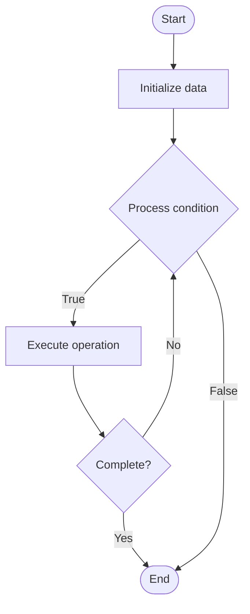

# Key-Value Stores

1. **Name of Algorithm**  

## Code Files


## Algorithm Visualization

### Flowchart (ASCII)


```
Key-Value Stores Flowchart:

┌─────────────┐
│   Start     │
└──────┬──────┘
       │
       ▼
┌─────────────┐
│  Initialize │
│   data      │
└──────┬──────┘
       │
       ▼
┌─────────────┐      Yes
│  Process   ├──────┐
│  condition?│      │
└──────┬──────┘      │
       │ No          │
       ▼             │
┌─────────────┐      │
│  Execute   │      │
│  operation │      │
└──────┬──────┘      │
       │             │
       └─────────────┘
       │
       ▼
┌─────────────┐
│    End      │
└─────────────┘
```


### Step-by-Step Execution


```
Key-Value Stores Step-by-Step Execution:

Input: [example data]

Step 1: Initialize
State: [initial state]

Step 2: Process
State: [intermediate state]

Step 3: Finalize
State: [final state]

Result: [output]
```


### Interactive Flowchart (Mermaid)





> **Note**: Mermaid diagrams are rendered automatically on GitHub. For local viewing, use a Mermaid-compatible Markdown viewer.
- [Python Implementation](semester_08/lecture_51_nosql_fundamentals/key_value_stores/algorithm.py)
- [Java Implementation](semester_08/lecture_51_nosql_fundamentals/key_value_stores/Algorithm.java)
- [Python Tests](semester_08/lecture_51_nosql_fundamentals/key_value_stores/test_algorithm.py)


   Key-Value Stores

2. **What problem does it solve? (1 sentence)**  
   Stores data as simple key-value pairs, providing fast, scalable storage for simple data models where each key maps to a single value, enabling high-performance read/write operations.

3. **Intuition (plain-language explanation)**  
   Like a dictionary or phone book: key-value stores are like a simple lookup table where you have a key (like a name) and a value (like a phone number) - you look up the key and get the value instantly. It's the simplest database model: just keys and values, no complex relationships or queries.

4. **Inputs & Outputs**  
   - Input: Key-value pairs, key (unique identifier), value (data to store), operations (get, put, delete).  
   - Output: Stored key-value pairs, retrieved values, fast lookups, scalable storage.

5. **Step-by-step description (5–10 lines max)**  
1. Store value: associate value with unique key (put operation).
2. Hash key: compute hash of key to determine storage location.
3. Store: save key-value pair in storage (memory, disk, distributed nodes).
4. Retrieve: look up value by key (get operation).
5. Hash lookup: compute hash of key to find storage location.
6. Return value: retrieve and return value associated with key.
7. Delete: remove key-value pair by key (delete operation).
8. Scale: distribute key-value pairs across multiple nodes for scalability.

6. **Tiny example (hand-simulated)**  
   Store: put('user:123', '{"name": "John", "email": "john@example.com"}') → hash key → store in node → retrieve: get('user:123') → hash key → find node → return value → fast lookup: O(1) average time.

7. **Time & Space Complexity**  
   - Time: O(1) average for get/put/delete operations (hash-based lookup), O(n) worst case for hash collisions.  
   - Space: O(n) where n is number of key-value pairs.

8. **Strengths**  
- Simplicity: simple data model, easy to understand and use.
- Performance: extremely fast read/write operations.
- Scalability: easily scales horizontally across multiple nodes.

9. **Weaknesses / limitations**  
- Limited queries: no complex queries, only key-based lookups.
- No relationships: cannot model relationships between data.
- Value limitations: values are opaque (no querying within values).

10. **Compare with alternatives**  
    Alternatives: Document Databases, Relational Databases, Column Family Stores, In-Memory Caches

11. **30-second explanation (your own words)**  
    Stores data as simple key-value pairs, providing fast, scalable storage for simple data models where each key maps to a single value, enabling high-performance read/write operations.

*Sources: Adapted from standard university textbooks and Wikipedia summaries.*
