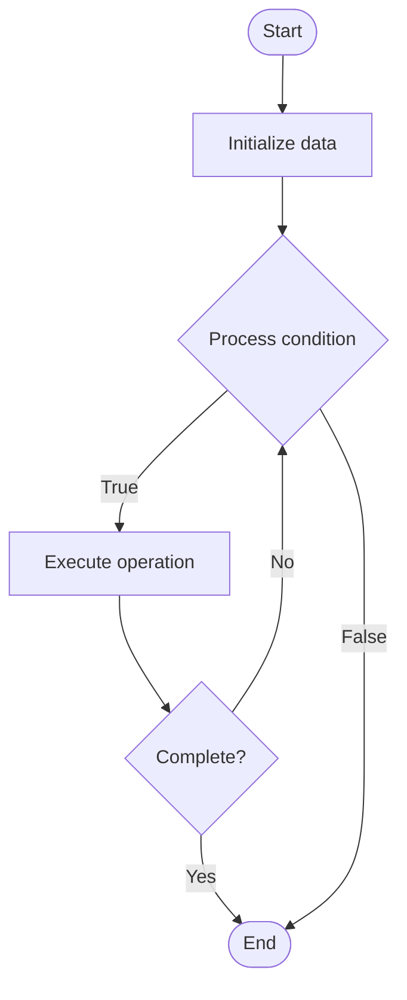

# NoSQL Indexing

## Учебные материалы

- [Школьный уровень](school.ru.md)
- [Университетский уровень](univer.ru.md)

## Algorithm Visualization

### Flowchart (ASCII)

```
NoSQL Indexing Flowchart:

┌─────────────┐
│   Start     │
└──────┬──────┘
       │
       ▼
┌─────────────┐
│  Initialize │
│   data      │
└──────┬──────┘
       │
       ▼
┌─────────────┐      Yes
│  Process   ├──────┐
│  condition?│      │
└──────┬──────┘      │
       │ No          │
       ▼             │
┌─────────────┐      │
│  Execute   │      │
│  operation │      │
└──────┬──────┘      │
       │             │
       └─────────────┘
       │
       ▼
┌─────────────┐
│    End      │
└─────────────┘
```

### Step-by-Step Execution

```
NoSQL Indexing Step-by-Step Execution:

Input: [example data]

Step 1: Initialize
State: [initial state]

Step 2: Process
State: [intermediate state]

Step 3: Finalize
State: [final state]

Result: [output]
```

### Interactive Flowchart (Mermaid)



> **Note**: Mermaid diagrams are rendered automatically on GitHub. For local viewing, use a Mermaid-compatible Markdown viewer.

- [Python Implementation](/code/semester_08/lecture_51_nosql_fundamentals/nosql_indexing/algorithm.py)
- [Java Implementation](/code/semester_08/lecture_51_nosql_fundamentals/nosql_indexing/Algorithm.java)
- [Python Tests](/code/semester_08/lecture_51_nosql_fundamentals/nosql_indexing/test_algorithm.py)

   NoSQL Indexing

What problem does it solve? (1 sentence)  
   Creates indexes on NoSQL database fields to accelerate queries and searches, enabling fast data retrieval without scanning entire collections or tables.

Intuition (plain-language explanation)  
   Like an index in a book, but for NoSQL: NoSQL indexing creates lookup structures (like book indexes) that map field values to document/row locations - instead of scanning every document (like reading every page), you look up the value in the index (like using a book index) and jump directly to the right documents (like jumping to the right pages), making queries much faster.

Inputs & Outputs  

  - Input: Field names, index type, collection/table, index configuration.  
  - Output: Index structures, faster queries, improved search performance.

Step-by-step description (5–10 lines max)  
Identify fields: determine which fields are frequently queried.
Choose index type: select appropriate index type (B-tree, hash, text, geospatial, etc.).
Create index: build index structure mapping field values to document/row locations.
Store index: save index alongside data (in-memory or on-disk).
Update index: maintain index when data is inserted, updated, or deleted.
Use in queries: query engine uses index to speed up searches.
Monitor: track index usage and performance impact.
Optimize: adjust indexes based on query patterns and performance.

Tiny example (hand-simulated)  
   MongoDB collection: users (1M documents) → query: find users where age = 25 → without index: scans 1M documents (slow) → create index on age → with index: lookup age=25 in index → find document locations → retrieve documents → query time: 0.01s vs 1s (100x faster).

Time & Space Complexity  

  - Time: O(log n) for B-tree indexes, O(1) for hash indexes, O(n) for collection scans without index.  
  - Space: O(n) where n is number of indexed documents/rows (additional storage for index).

Strengths  

- Query performance: dramatically speeds up queries on indexed fields.
- Flexible: supports various index types (single field, compound, text, geospatial).
- Scalable: indexes can be distributed across nodes in distributed systems.

Weaknesses / limitations  

- Storage overhead: indexes require additional storage space.
- Write overhead: INSERT/UPDATE/DELETE operations must update indexes.
- Index maintenance: requires monitoring and optimization.

Compare with alternatives  
    Alternatives: Full Collection Scans, Materialized Views, Caching, Denormalization

30-second explanation (your own words)  
    Creates indexes on NoSQL database fields to accelerate queries and searches, enabling fast data retrieval without scanning entire collections or tables.

*Sources: Adapted from standard university textbooks and Wikipedia summaries.*
