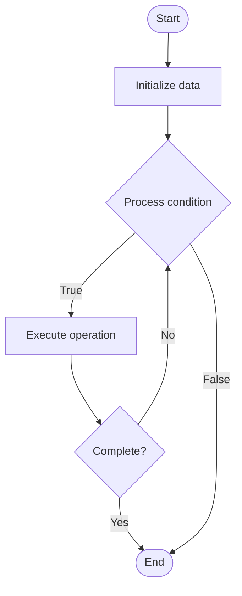

# NoSQL Querying

1. **Name of Algorithm**  

## Code Files


## Algorithm Visualization

### Flowchart (ASCII)


```
NoSQL Querying Flowchart:

┌─────────────┐
│   Start     │
└──────┬──────┘
       │
       ▼
┌─────────────┐
│  Initialize │
│   data      │
└──────┬──────┘
       │
       ▼
┌─────────────┐      Yes
│  Process   ├──────┐
│  condition?│      │
└──────┬──────┘      │
       │ No          │
       ▼             │
┌─────────────┐      │
│  Execute   │      │
│  operation │      │
└──────┬──────┘      │
       │             │
       └─────────────┘
       │
       ▼
┌─────────────┐
│    End      │
└─────────────┘
```


### Step-by-Step Execution


```
NoSQL Querying Step-by-Step Execution:

Input: [example data]

Step 1: Initialize
State: [initial state]

Step 2: Process
State: [intermediate state]

Step 3: Finalize
State: [final state]

Result: [output]
```


### Interactive Flowchart (Mermaid)





> **Note**: Mermaid diagrams are rendered automatically on GitHub. For local viewing, use a Mermaid-compatible Markdown viewer.
- [Python Implementation](semester_08/lecture_51_nosql_fundamentals/nosql_querying/algorithm.py)
- [Java Implementation](semester_08/lecture_51_nosql_fundamentals/nosql_querying/Algorithm.java)
- [Python Tests](semester_08/lecture_51_nosql_fundamentals/nosql_querying/test_algorithm.py)


   NoSQL Querying

2. **What problem does it solve? (1 sentence)**  
   Retrieves and manipulates data from NoSQL databases using query languages and APIs, enabling flexible data access patterns adapted to different NoSQL data models.

3. **Intuition (plain-language explanation)**  
   Like different ways to search different types of storage: NoSQL querying is like having different search methods for different storage types - key-value stores use simple key lookups (like looking up a word in a dictionary), document databases use field-based queries (like searching a filing cabinet by document properties), and graph databases use traversal queries (like following connections in a network) - each NoSQL type has query methods suited to its data model.

4. **Inputs & Outputs**  
   - Input: Query criteria, data model type, query language/API, database connection.  
   - Output: Query results, retrieved data, filtered documents/rows, aggregated data.

5. **Step-by-step description (5–10 lines max)**  
1. Choose query method: select appropriate query method based on NoSQL type.
2. Specify criteria: define search criteria (field values, conditions, patterns).
3. Execute query: send query to NoSQL database using query language or API.
4. Process: database processes query using indexes, scans, or traversals.
5. Filter: apply filters to match query criteria.
6. Return results: retrieve and return matching documents/rows/nodes.
7. Aggregate (optional): perform aggregations (count, sum, average, etc.).
8. Format: format results for application use.

6. **Tiny example (hand-simulated)**  
   MongoDB: db.users.find({age: {$gt: 25}, city: 'New York'}) → document database query → uses index on age and city → filters documents → returns matching users → flexible: can query nested fields, arrays, and use complex conditions.

7. **Time & Space Complexity**  
   - Time: Varies by query type: O(1) for key lookups, O(log n) with indexes, O(n) for full scans, O(d) for graph traversals where d is depth.  
   - Space: O(r) where r is result set size (memory for query results).

8. **Strengths**  
- Flexibility: supports various query patterns adapted to data model.
- Performance: can be very fast with proper indexes and data model fit.
- Scalability: queries can be distributed across nodes in distributed systems.

9. **Weaknesses / limitations**  
- Limited joins: most NoSQL databases don't support SQL-style joins.
- Query complexity: complex queries may require application-level processing.
- Consistency: eventual consistency may affect query results.

10. **Compare with alternatives**  
    Alternatives: SQL Queries, MapReduce, Application-Level Filtering, Search Engines

11. **30-second explanation (your own words)**  
    Retrieves and manipulates data from NoSQL databases using query languages and APIs, enabling flexible data access patterns adapted to different NoSQL data models.

*Sources: Adapted from standard university textbooks and Wikipedia summaries.*
