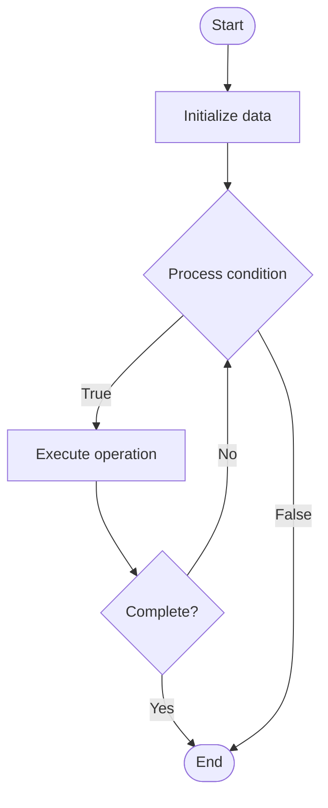

# Hybrid Databases

## Учебные материалы

- [Школьный уровень](school.ru.md)
- [Университетский уровень](univer.ru.md)

## Algorithm Visualization

### Flowchart (ASCII)

```
Hybrid Databases Flowchart:

┌─────────────┐
│   Start     │
└──────┬──────┘
       │
       ▼
┌─────────────┐
│  Initialize │
│   data      │
└──────┬──────┘
       │
       ▼
┌─────────────┐      Yes
│  Process   ├──────┐
│  condition?│      │
└──────┬──────┘      │
       │ No          │
       ▼             │
┌─────────────┐      │
│  Execute   │      │
│  operation │      │
└──────┬──────┘      │
       │             │
       └─────────────┘
       │
       ▼
┌─────────────┐
│    End      │
└─────────────┘
```

### Step-by-Step Execution

```
Hybrid Databases Step-by-Step Execution:

Input: [example data]

Step 1: Initialize
State: [initial state]

Step 2: Process
State: [intermediate state]

Step 3: Finalize
State: [final state]

Result: [output]
```

### Interactive Flowchart (Mermaid)



> **Note**: Mermaid diagrams are rendered automatically on GitHub. For local viewing, use a Mermaid-compatible Markdown viewer.

- [Python Implementation](/code/semester_08/lecture_52_nosql_advanced/hybrid_databases/algorithm.py)
- [Java Implementation](/code/semester_08/lecture_52_nosql_advanced/hybrid_databases/Algorithm.java)
- [Python Tests](/code/semester_08/lecture_52_nosql_advanced/hybrid_databases/test_algorithm.py)

What problem does it solve? (1 sentence)  
   Combines multiple database models (relational, document, graph, key-value) in a single system, enabling applications to use the best database type for each use case while maintaining unified access.

Intuition (plain-language explanation)  
   Like a multi-tool: hybrid databases are like Swiss Army knives that combine different tools (relational, document, graph databases) in one system - you can use SQL for structured data (like a knife), document storage for flexible data (like scissors), and graph queries for relationships (like a screwdriver), all in one database system.

Inputs & Outputs  

  - Input: Multiple data models, unified query interface, data type requirements, access patterns.  
  - Output: Hybrid database system, unified access, optimized storage for each data type.

Step-by-step description (5–10 lines max)  
Identify use cases: determine which data models are needed (relational, document, graph, etc.).
Select hybrid system: choose database system supporting multiple models (e.g., PostgreSQL with JSON, graph extensions).
Design schema: design schemas for each data model within hybrid system.
Store data: store data in appropriate model based on structure and access patterns.
Query: use appropriate query language for each model (SQL, document queries, graph queries).
Integrate: enable cross-model queries and data integration.
Optimize: optimize each model independently for its use case.
Manage: manage unified system with single administration interface.

Tiny example (hand-simulated)  
   Hybrid database: use PostgreSQL → relational tables for structured data (users, orders) → JSON columns for flexible data (product metadata) → graph extension for relationships (social network) → query: SQL for structured, JSON queries for documents, Cypher for graphs → all in one database → unified access.

Time & Space Complexity  

  - Time: Varies by model: O(log n) for relational with indexes, O(1) for key-value, O(d) for graph traversals.  
  - Space: O(Σ(d_i)) where d_i is data size for each model type.

Strengths  

- Flexibility: supports multiple data models in one system.
- Unified access: single database system for diverse use cases.
- Optimization: can optimize each model for its specific use case.

Weaknesses / limitations  

- Complexity: more complex than single-model databases.
- Learning curve: requires understanding multiple data models.
- Performance: may not be optimal for all models compared to specialized databases.

Compare with alternatives  
    Alternatives: Multi-Database Systems, Polyglot Persistence, Specialized Databases, Unified Query Layers

30-second explanation (your own words)  
    Combines multiple database models (relational, document, graph, key-value) in a single system, enabling applications to use the best database type for each use case while maintaining unified access.

*Sources: Adapted from standard university textbooks and Wikipedia summaries.*
