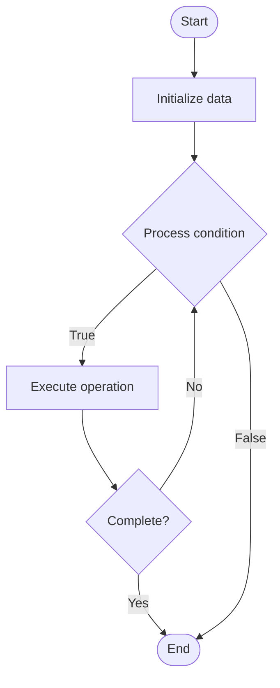

# NoSQL Consistency Models

## Учебные материалы

- [Школьный уровень](school.ru.md)
- [Университетский уровень](univer.ru.md)

## Algorithm Visualization

### Flowchart (ASCII)

```
NoSQL Consistency Models Flowchart:

┌─────────────┐
│   Start     │
└──────┬──────┘
       │
       ▼
┌─────────────┐
│  Initialize │
│   data      │
└──────┬──────┘
       │
       ▼
┌─────────────┐      Yes
│  Process   ├──────┐
│  condition?│      │
└──────┬──────┘      │
       │ No          │
       ▼             │
┌─────────────┐      │
│  Execute   │      │
│  operation │      │
└──────┬──────┘      │
       │             │
       └─────────────┘
       │
       ▼
┌─────────────┐
│    End      │
└─────────────┘
```

### Step-by-Step Execution

```
NoSQL Consistency Models Step-by-Step Execution:

Input: [example data]

Step 1: Initialize
State: [initial state]

Step 2: Process
State: [intermediate state]

Step 3: Finalize
State: [final state]

Result: [output]
```

### Interactive Flowchart (Mermaid)



> **Note**: Mermaid diagrams are rendered automatically on GitHub. For local viewing, use a Mermaid-compatible Markdown viewer.

- [Python Implementation](/code/semester_08/lecture_52_nosql_advanced/nosql_consistency/algorithm.py)
- [Java Implementation](/code/semester_08/lecture_52_nosql_advanced/nosql_consistency/Algorithm.java)
- [Python Tests](/code/semester_08/lecture_52_nosql_advanced/nosql_consistency/test_algorithm.py)

   NoSQL Consistency Models

What problem does it solve? (1 sentence)  
   Defines data consistency guarantees in distributed NoSQL systems, balancing between strong consistency (ACID) and eventual consistency (BASE) based on application requirements.

Intuition (plain-language explanation)  
   Like different levels of synchronization: NoSQL consistency models are like different ways to keep multiple copies in sync - strong consistency is like everyone reading the same book at the same time (always up-to-date, but slower), while eventual consistency is like everyone having their own copy that eventually syncs (faster, but may have temporary differences) - you choose based on whether you need immediate accuracy or can tolerate temporary inconsistencies.

Inputs & Outputs  

  - Input: Consistency model type, replication configuration, application requirements, CAP theorem trade-offs.  
  - Output: Consistency guarantees, data synchronization behavior, performance characteristics.

Step-by-step description (5–10 lines max)  
Choose model: select consistency model (strong, eventual, causal, session, etc.).
Configure replication: set up replication with chosen consistency guarantees.
Define rules: establish rules for read/write consistency (read-your-writes, monotonic reads, etc.).
Implement: implement consistency mechanisms (vector clocks, version vectors, etc.).
Monitor: track consistency violations and synchronization lag.
Tune: adjust consistency levels based on performance and accuracy requirements.
Handle conflicts: implement conflict resolution for eventual consistency.
Document: document consistency guarantees for application developers.

Tiny example (hand-simulated)  
   NoSQL database with eventual consistency → write to node A → replicate to nodes B, C → read from node B (may see old data temporarily) → eventually all nodes sync → all reads see same data → trade-off: faster writes, eventual accuracy vs strong consistency: slower writes, immediate accuracy.

Time & Space Complexity  

  - Time: O(1) for eventual consistency (fast), O(n) for strong consistency where n is number of replicas (slower due to coordination).  
  - Space: O(r) where r is replication overhead (vector clocks, version vectors).

Strengths  

- Performance: eventual consistency enables high performance and availability.
- Scalability: allows distributed systems to scale horizontally.
- Flexibility: can choose consistency level based on use case.

Weaknesses / limitations  

- Complexity: managing consistency in distributed systems is complex.
- Conflict resolution: eventual consistency requires conflict resolution strategies.
- Application complexity: developers must handle potential inconsistencies.

Compare with alternatives  
    Alternatives: Strong Consistency (ACID), Eventual Consistency (BASE), Causal Consistency, Session Consistency

30-second explanation (your own words)  
    Defines data consistency guarantees in distributed NoSQL systems, balancing between strong consistency (ACID) and eventual consistency (BASE) based on application requirements.

*Sources: Adapted from standard university textbooks and Wikipedia summaries.*


## References

- [Nosql Consistency - Wikipedia](https://en.wikipedia.org/wiki/Nosql%20Consistency)
