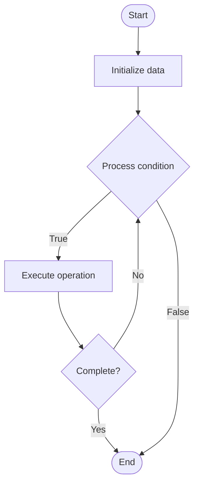

# NoSQL Migration

## Учебные материалы

- [Школьный уровень](school.ru.md)
- [Университетский уровень](univer.ru.md)

## Algorithm Visualization

### Flowchart (ASCII)

```
NoSQL Migration Flowchart:

┌─────────────┐
│   Start     │
└──────┬──────┘
       │
       ▼
┌─────────────┐
│  Initialize │
│   data      │
└──────┬──────┘
       │
       ▼
┌─────────────┐      Yes
│  Process   ├──────┐
│  condition?│      │
└──────┬──────┘      │
       │ No          │
       ▼             │
┌─────────────┐      │
│  Execute   │      │
│  operation │      │
└──────┬──────┘      │
       │             │
       └─────────────┘
       │
       ▼
┌─────────────┐
│    End      │
└─────────────┘
```

### Step-by-Step Execution

```
NoSQL Migration Step-by-Step Execution:

Input: [example data]

Step 1: Initialize
State: [initial state]

Step 2: Process
State: [intermediate state]

Step 3: Finalize
State: [final state]

Result: [output]
```

### Interactive Flowchart (Mermaid)



> **Note**: Mermaid diagrams are rendered automatically on GitHub. For local viewing, use a Mermaid-compatible Markdown viewer.

- [Python Implementation](/code/semester_08/lecture_52_nosql_advanced/nosql_migration/algorithm.py)
- [Java Implementation](/code/semester_08/lecture_52_nosql_advanced/nosql_migration/Algorithm.java)
- [Python Tests](/code/semester_08/lecture_52_nosql_advanced/nosql_migration/test_algorithm.py)

   NoSQL Migration

What problem does it solve? (1 sentence)  
   Transfers data and applications from one NoSQL database system to another, or from relational databases to NoSQL, ensuring data integrity, minimal downtime, and application compatibility.

Intuition (plain-language explanation)  
   Like moving to a new house: NoSQL migration is like moving all your belongings from one house to another - you need to pack everything (extract data), transport it safely (transform and load), set it up in the new house (configure new database), and make sure everything works (validate) - the goal is to move everything without losing anything and with minimal disruption to your daily life (application downtime).

Inputs & Outputs  

  - Input: Source database, target database, data schema, migration strategy, application code.  
  - Output: Migrated data, updated applications, new database system, migration validation.

Step-by-step description (5–10 lines max)  
Assess: analyze source database structure, data volume, and application dependencies.
Plan: design migration strategy (big bang, phased, parallel run).
Prepare target: set up target NoSQL database with appropriate schema/model.
Extract: export data from source database.
Transform: convert data format to match target database model.
Load: import transformed data into target database.
Validate: verify data integrity and completeness.
Update applications: modify application code to work with new database.
Test: thoroughly test applications with new database.
Cutover: switch applications to use new database.
Monitor: monitor performance and data integrity after migration.
Decommission: retire old database after successful migration.

Tiny example (hand-simulated)  
   MongoDB migration: source: PostgreSQL (relational) → target: MongoDB (document) → extract: export PostgreSQL tables → transform: convert rows to JSON documents → load: import into MongoDB collections → update: modify application queries from SQL to MongoDB queries → test: validate all functionality → cutover: switch production → migration complete.

Time & Space Complexity  

  - Time: O(d) where d is data size (extraction, transformation, loading).  
  - Space: O(d) where d is data size (temporary storage during migration).

Strengths  

- Flexibility: enables moving to better-suited database systems.
- Modernization: allows adopting modern NoSQL technologies.
- Scalability: can migrate to more scalable database solutions.

Weaknesses / limitations  

- Complexity: migration can be complex and time-consuming.
- Downtime: may require application downtime during cutover.
- Risk: data loss or corruption if migration fails.

Compare with alternatives  
    Alternatives: Database Replication, ETL Processes, Data Synchronization, Gradual Migration

30-second explanation (your own words)  
    Transfers data and applications from one NoSQL database system to another, or from relational databases to NoSQL, ensuring data integrity, minimal downtime, and application compatibility.

*Sources: Adapted from standard university textbooks and Wikipedia summaries.*
