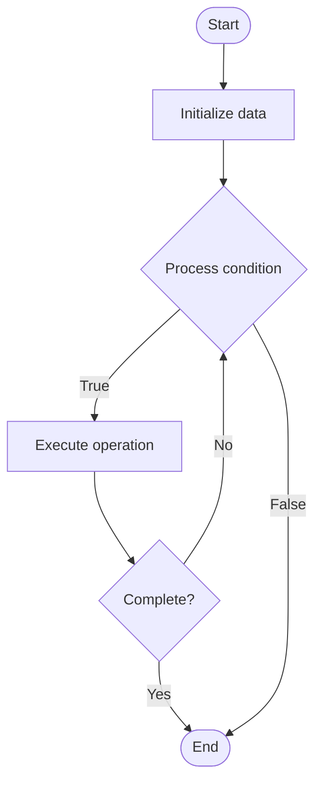

# NoSQL Replication

Name of Algorithm  

## Code Files


## Algorithm Visualization

### Flowchart (ASCII)


```
NoSQL Replication Flowchart:

┌─────────────┐
│   Start     │
└──────┬──────┘
       │
       ▼
┌─────────────┐
│  Initialize │
│   data      │
└──────┬──────┘
       │
       ▼
┌─────────────┐      Yes
│  Process   ├──────┐
│  condition?│      │
└──────┬──────┘      │
       │ No          │
       ▼             │
┌─────────────┐      │
│  Execute   │      │
│  operation │      │
└──────┬──────┘      │
       │             │
       └─────────────┘
       │
       ▼
┌─────────────┐
│    End      │
└─────────────┘
```


### Step-by-Step Execution


```
NoSQL Replication Step-by-Step Execution:

Input: [example data]

Step 1: Initialize
State: [initial state]

Step 2: Process
State: [intermediate state]

Step 3: Finalize
State: [final state]

Result: [output]
```


### Interactive Flowchart (Mermaid)





> **Note**: Mermaid diagrams are rendered automatically on GitHub. For local viewing, use a Mermaid-compatible Markdown viewer.
- [Python Implementation](/code/semester_08/lecture_52_nosql_advanced/nosql_replication/algorithm.py)
- [Java Implementation](/code/semester_08/lecture_52_nosql_advanced/nosql_replication/Algorithm.java)
- [Python Tests](/code/semester_08/lecture_52_nosql_advanced/nosql_replication/test_algorithm.py)


   NoSQL Replication

What problem does it solve? (1 sentence)  
   Maintains multiple copies of NoSQL data across distributed nodes, enabling high availability, fault tolerance, and load distribution in distributed NoSQL systems.

Intuition (plain-language explanation)  
   Like backup copies for NoSQL: NoSQL replication creates multiple copies of data across different servers (like making photocopies and storing them in different locations) - if one server fails, others continue serving data (like having backup copies), and read requests can be distributed across copies (like multiple people reading different copies), improving performance and reliability.

Inputs & Outputs  
   - Input: Primary data, replication configuration, replication strategy (master-slave, master-master, etc.), network topology.  
   - Output: Replicated data copies, high availability, fault tolerance, load distribution.

Step-by-step description (5–10 lines max)  
Configure replication: set up replication strategy (master-slave, peer-to-peer, etc.).
Select nodes: choose nodes to participate in replication.
Initial sync: copy existing data from primary to replica nodes.
Monitor changes: track data changes (writes, updates, deletes) on primary.
Replicate changes: propagate changes to replica nodes (synchronously or asynchronously).
Apply changes: replicas apply changes to maintain consistency.
Handle conflicts: resolve conflicts in multi-master replication.
Failover: automatically promote replica to primary if primary fails.
Monitor: track replication lag and ensure replicas stay synchronized.

Tiny example (hand-simulated)  
   MongoDB replica set: primary node in New York → replicate to secondary nodes in London and Tokyo → writes go to primary → changes replicated to secondaries → reads can go to any node → if primary fails → automatic election → London becomes primary → zero downtime → high availability.

Time & Space Complexity  
   - Time: O(1) for replication setup, O(n) for initial sync where n is data size, O(1) per operation for ongoing replication.  
   - Space: O(d·r) where d is data size, r is replication factor (each replica stores full copy).

Strengths  
- High availability: system continues operating if nodes fail.
- Load distribution: read queries distributed across replicas.
- Fault tolerance: data survives node failures.

Weaknesses / limitations  
- Replication lag: replicas may be slightly behind primary.
- Storage cost: requires multiple copies of data.
- Complexity: managing replication across distributed nodes is complex.

Compare with alternatives  
    Alternatives: Single Node, Sharding, Backup and Restore, Clustering

30-second explanation (your own words)  
    Maintains multiple copies of NoSQL data across distributed nodes, enabling high availability, fault tolerance, and load distribution in distributed NoSQL systems.

*Sources: Adapted from standard university textbooks and Wikipedia summaries.*
