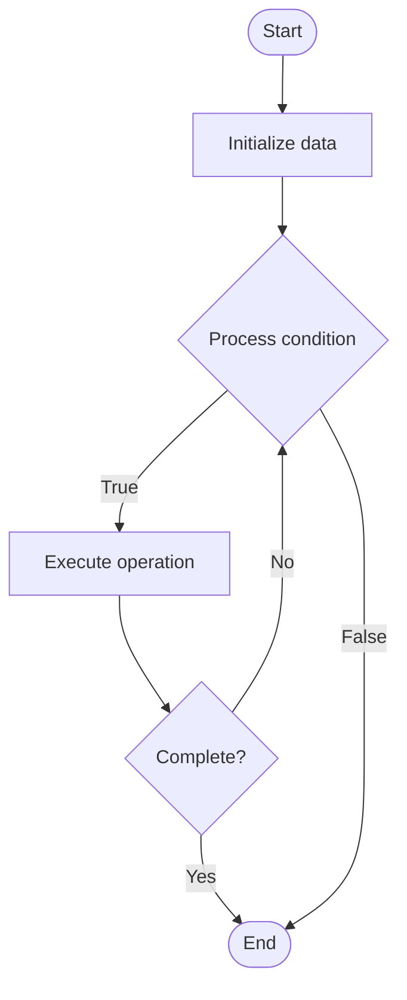

# NoSQL Scalability

1. **Name of Algorithm**  

## Code Files


## Algorithm Visualization

### Flowchart (ASCII)


```
NoSQL Scalability Flowchart:

┌─────────────┐
│   Start     │
└──────┬──────┘
       │
       ▼
┌─────────────┐
│  Initialize │
│   data      │
└──────┬──────┘
       │
       ▼
┌─────────────┐      Yes
│  Process   ├──────┐
│  condition?│      │
└──────┬──────┘      │
       │ No          │
       ▼             │
┌─────────────┐      │
│  Execute   │      │
│  operation │      │
└──────┬──────┘      │
       │             │
       └─────────────┘
       │
       ▼
┌─────────────┐
│    End      │
└─────────────┘
```


### Step-by-Step Execution


```
NoSQL Scalability Step-by-Step Execution:

Input: [example data]

Step 1: Initialize
State: [initial state]

Step 2: Process
State: [intermediate state]

Step 3: Finalize
State: [final state]

Result: [output]
```


### Interactive Flowchart (Mermaid)





> **Note**: Mermaid diagrams are rendered automatically on GitHub. For local viewing, use a Mermaid-compatible Markdown viewer.
- [Python Implementation](semester_08/lecture_52_nosql_advanced/nosql_scalability/algorithm.py)
- [Java Implementation](semester_08/lecture_52_nosql_advanced/nosql_scalability/Algorithm.java)
- [Python Tests](semester_08/lecture_52_nosql_advanced/nosql_scalability/test_algorithm.py)


   NoSQL Scalability

2. **What problem does it solve? (1 sentence)**  
   Enables NoSQL databases to handle increasing data volumes and traffic by scaling horizontally across multiple nodes, providing linear scalability and high throughput.

3. **Intuition (plain-language explanation)**  
   Like adding more workers: NoSQL scalability is like hiring more workers to handle more work - instead of making one worker stronger (vertical scaling, like a bigger server), you add more workers (horizontal scaling, like more servers) - each worker handles part of the work, so total capacity increases linearly with number of workers (servers).

4. **Inputs & Outputs**  
   - Input: Data volume, traffic load, scalability requirements, cluster configuration.  
   - Output: Scalable NoSQL cluster, distributed data, increased throughput, linear scalability.

5. **Step-by-step description (5–10 lines max)**  
1. Assess requirements: determine data volume, traffic, and scalability needs.
2. Design cluster: plan cluster architecture (number of nodes, data distribution).
3. Add nodes: add new nodes to cluster as data/traffic grows.
4. Distribute data: partition data across nodes (sharding, consistent hashing).
5. Balance load: distribute read/write operations across nodes.
6. Monitor: track cluster performance, node utilization, and bottlenecks.
7. Scale out: add more nodes when capacity is reached.
8. Optimize: tune cluster configuration for optimal performance.

6. **Tiny example (hand-simulated)**  
   NoSQL cluster: start with 3 nodes → data grows → add 3 more nodes → data redistributed across 6 nodes → each node handles 1/6 of load → throughput doubles → linear scalability → can add more nodes as needed → scales to petabytes of data.

7. **Time & Space Complexity**  
   - Time: O(1) per operation on single node, O(n/k) where n is data size, k is number of nodes (distributed processing).  
   - Space: O(d/k) per node where d is total data, k is number of nodes (data distributed).

8. **Strengths**  
- Horizontal scaling: scales by adding more nodes (linear scalability).
- High throughput: distributes load across multiple nodes.
- Cost-effective: can use commodity hardware instead of expensive servers.

9. **Weaknesses / limitations**  
- Complexity: managing distributed cluster is complex.
- Network overhead: requires network communication between nodes.
- Data distribution: requires careful data partitioning strategy.

10. **Compare with alternatives**  
    Alternatives: Vertical Scaling, Sharding, Caching, Read Replicas

11. **30-second explanation (your own words)**  
    Enables NoSQL databases to handle increasing data volumes and traffic by scaling horizontally across multiple nodes, providing linear scalability and high throughput.

*Sources: Adapted from standard university textbooks and Wikipedia summaries.*
