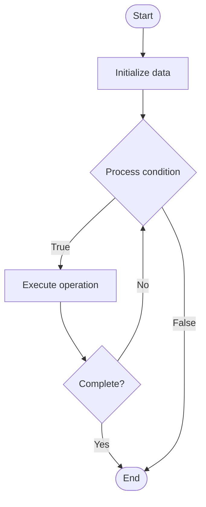

# NoSQL Sharding

## Учебные материалы

- [Школьный уровень](school.ru.md)
- [Университетский уровень](univer.ru.md)

## Algorithm Visualization

### Flowchart (ASCII)

```
NoSQL Sharding Flowchart:

┌─────────────┐
│   Start     │
└──────┬──────┘
       │
       ▼
┌─────────────┐
│  Initialize │
│   data      │
└──────┬──────┘
       │
       ▼
┌─────────────┐      Yes
│  Process   ├──────┐
│  condition?│      │
└──────┬──────┘      │
       │ No          │
       ▼             │
┌─────────────┐      │
│  Execute   │      │
│  operation │      │
└──────┬──────┘      │
       │             │
       └─────────────┘
       │
       ▼
┌─────────────┐
│    End      │
└─────────────┘
```

### Step-by-Step Execution

```
NoSQL Sharding Step-by-Step Execution:

Input: [example data]

Step 1: Initialize
State: [initial state]

Step 2: Process
State: [intermediate state]

Step 3: Finalize
State: [final state]

Result: [output]
```

### Interactive Flowchart (Mermaid)



> **Note**: Mermaid diagrams are rendered automatically on GitHub. For local viewing, use a Mermaid-compatible Markdown viewer.

- [Python Implementation](/code/semester_08/lecture_52_nosql_advanced/nosql_sharding/algorithm.py)
- [Java Implementation](/code/semester_08/lecture_52_nosql_advanced/nosql_sharding/Algorithm.java)
- [Python Tests](/code/semester_08/lecture_52_nosql_advanced/nosql_sharding/test_algorithm.py)

   NoSQL Sharding

What problem does it solve? (1 sentence)  
   Partitions large datasets across multiple database nodes (shards) based on shard key, enabling horizontal scaling and distributing data and load across cluster.

Intuition (plain-language explanation)  
   Like dividing a large library into sections: NoSQL sharding is like splitting a huge library into smaller sections (shards) - instead of one massive library (single database), you have multiple smaller libraries (shards) organized by topic (shard key) - when you need a book, you know which section to go to (which shard), making it faster and allowing the library to grow by adding more sections.

Inputs & Outputs  

  - Input: Dataset, shard key, number of shards, sharding strategy, cluster nodes.  
  - Output: Sharded database, distributed data, balanced load, scalable system.

Step-by-step description (5–10 lines max)  
Choose shard key: select field(s) to partition data (e.g., user_id, region).
Determine shards: decide number of shards and shard boundaries.
Assign nodes: assign each shard to a database node.
Partition data: distribute data across shards based on shard key.
Route queries: route queries to appropriate shard(s) based on shard key.
Balance: ensure data and load are evenly distributed across shards.
Monitor: track shard sizes, query distribution, and performance.
Reshard: redistribute data if shards become unbalanced or cluster grows.

Tiny example (hand-simulated)  
   MongoDB sharding: shard key = user_id → 3 shards → shard 1: user_id 0-999, shard 2: user_id 1000-1999, shard 3: user_id 2000-2999 → query for user_id=1500 → routed to shard 2 → fast lookup → data distributed → can add more shards as data grows.

Time & Space Complexity  

  - Time: O(1) for shard routing, O(n/k) for queries where n is data size, k is number of shards (parallel processing).  
  - Space: O(d/k) per shard where d is total data, k is number of shards (data partitioned).

Strengths  

- Horizontal scaling: enables scaling by adding more shards.
- Performance: queries only access relevant shard(s), improving speed.
- Load distribution: distributes read/write load across multiple nodes.

Weaknesses / limitations  

- Shard key selection: poor shard key can cause uneven distribution.
- Cross-shard queries: queries spanning multiple shards are complex.
- Resharding: moving data between shards can be expensive.

Compare with alternatives  
    Alternatives: Single Database, Replication, Partitioning, Vertical Scaling

30-second explanation (your own words)  
    Partitions large datasets across multiple database nodes (shards) based on shard key, enabling horizontal scaling and distributing data and load across cluster.

*Sources: Adapted from standard university textbooks and Wikipedia summaries.*
