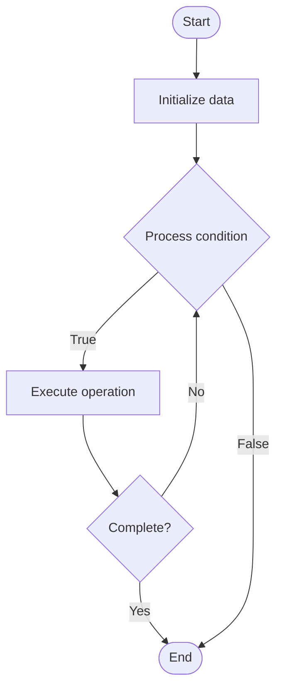

# Database Backup Strategies

## Учебные материалы

- [Школьный уровень](school.ru.md)
- [Университетский уровень](univer.ru.md)

## Algorithm Visualization

### Flowchart (ASCII)

```
Database Backup Strategies Flowchart:

┌─────────────┐
│   Start     │
└──────┬──────┘
       │
       ▼
┌─────────────┐
│  Initialize │
│   data      │
└──────┬──────┘
       │
       ▼
┌─────────────┐      Yes
│  Process   ├──────┐
│  condition?│      │
└──────┬──────┘      │
       │ No          │
       ▼             │
┌─────────────┐      │
│  Execute   │      │
│  operation │      │
└──────┬──────┘      │
       │             │
       └─────────────┘
       │
       ▼
┌─────────────┐
│    End      │
└─────────────┘
```

### Step-by-Step Execution

```
Database Backup Strategies Step-by-Step Execution:

Input: [example data]

Step 1: Initialize
State: [initial state]

Step 2: Process
State: [intermediate state]

Step 3: Finalize
State: [final state]

Result: [output]
```

### Interactive Flowchart (Mermaid)



> **Note**: Mermaid diagrams are rendered automatically on GitHub. For local viewing, use a Mermaid-compatible Markdown viewer.

- [Python Implementation](/code/semester_08/lecture_53_database_operations/backup_strategies/algorithm.py)
- [Java Implementation](/code/semester_08/lecture_53_database_operations/backup_strategies/Algorithm.java)
- [Python Tests](/code/semester_08/lecture_53_database_operations/backup_strategies/test_algorithm.py)

What problem does it solve? (1 sentence)  
   Creates and manages copies of database data to enable recovery from data loss, corruption, or disasters, ensuring business continuity and data protection.

Intuition (plain-language explanation)  
Like insurance for data: backup strategies are like having insurance for your data - you regularly make copies (like taking photos of important documents) and store them safely (like keeping photos in a fireproof safe) - if something happens to your original data (like a fire), you can restore from backups (like reprinting photos), ensuring you don't lose everything.

Inputs & Outputs  

  - Input: Database data, backup configuration, storage location, retention policy, backup schedule.  
  - Output: Backup copies, recovery capability, data protection, business continuity.

Step-by-step description (5–10 lines max)  
Define strategy: choose backup strategy (full, incremental, differential, continuous).
Schedule backups: set up backup schedule (daily, hourly, real-time).
Perform backup: execute backup operation (full database copy or incremental changes).
Store backups: save backups to secure storage (local, remote, cloud).
Verify: validate backup integrity and completeness.
Test restore: periodically test restoring from backups to ensure they work.
Retain: maintain backup retention policy (keep backups for specified period).
Monitor: track backup success, storage usage, and restore times.
Document: document backup procedures and recovery processes.

Tiny example (hand-simulated)  
   Database backup strategy: full backup daily at 2 AM → incremental backups every 6 hours → backups stored on local disk and cloud → retention: 30 days daily, 12 months monthly → test restore monthly → disaster recovery: restore from cloud backup → data recovered → business continuity maintained.

Time & Space Complexity  

  - Time: O(d) for full backup where d is database size, O(c) for incremental where c is changed data size.  
  - Space: O(d·r) where d is database size, r is retention factor (multiple backup copies).

Strengths  

- Data protection: enables recovery from data loss or corruption.
- Business continuity: ensures business can continue after disasters.
- Compliance: meets regulatory requirements for data retention.

Weaknesses / limitations  

- Storage cost: requires significant storage for backup copies.
- Time overhead: backup operations consume resources and time.
- Complexity: managing backup schedules and retention can be complex.

Compare with alternatives  
    Alternatives: Replication, Snapshots, Continuous Backup, Point-in-Time Recovery

30-second explanation (your own words)  

*Sources: Adapted from standard university textbooks and Wikipedia summaries.*


## References

- [Backup Strategies - Wikipedia](https://en.wikipedia.org/wiki/Backup%20Strategies)
