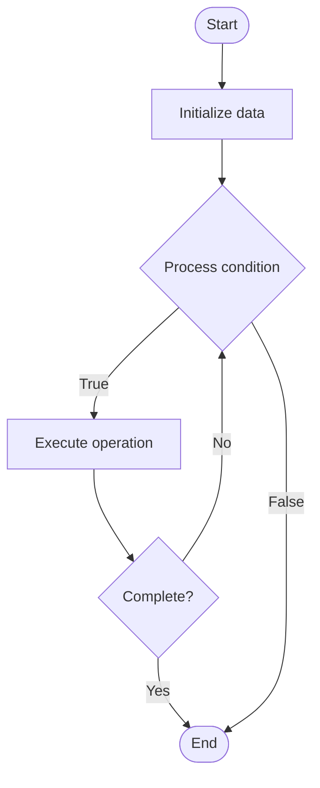

# Database Capacity Planning

## Учебные материалы

- [Школьный уровень](school.ru.md)
- [Университетский уровень](univer.ru.md)

## Algorithm Visualization

### Flowchart (ASCII)

```
Database Capacity Planning Flowchart:

┌─────────────┐
│   Start     │
└──────┬──────┘
       │
       ▼
┌─────────────┐
│  Initialize │
│   data      │
└──────┬──────┘
       │
       ▼
┌─────────────┐      Yes
│  Process   ├──────┐
│  condition?│      │
└──────┬──────┘      │
       │ No          │
       ▼             │
┌─────────────┐      │
│  Execute   │      │
│  operation │      │
└──────┬──────┘      │
       │             │
       └─────────────┘
       │
       ▼
┌─────────────┐
│    End      │
└─────────────┘
```

### Step-by-Step Execution

```
Database Capacity Planning Step-by-Step Execution:

Input: [example data]

Step 1: Initialize
State: [initial state]

Step 2: Process
State: [intermediate state]

Step 3: Finalize
State: [final state]

Result: [output]
```

### Interactive Flowchart (Mermaid)



> **Note**: Mermaid diagrams are rendered automatically on GitHub. For local viewing, use a Mermaid-compatible Markdown viewer.

- [Python Implementation](/code/semester_08/lecture_53_database_operations/capacity_planning/algorithm.py)
- [Java Implementation](/code/semester_08/lecture_53_database_operations/capacity_planning/Algorithm.java)
- [Python Tests](/code/semester_08/lecture_53_database_operations/capacity_planning/test_algorithm.py)

What problem does it solve? (1 sentence)  
   Forecasts future database resource requirements (storage, compute, memory) based on growth trends and usage patterns, ensuring adequate capacity to meet future needs.

Intuition (plain-language explanation)  
Like planning for a growing family: capacity planning is like planning house size for a growing family - you analyze current usage (how much space you use now), growth trends (how fast the family is growing), and forecast future needs (how much space you'll need in 2 years) - then you plan resources (buy bigger house, add rooms) to ensure you have enough capacity before you run out.

Inputs & Outputs  

  - Input: Current usage metrics, growth trends, business projections, performance requirements, resource constraints.  
  - Output: Capacity forecasts, resource requirements, scaling plans, budget estimates.

Step-by-step description (5–10 lines max)  
Collect metrics: gather current usage data (storage, CPU, memory, I/O, connections).
Analyze trends: identify growth patterns and trends over time.
Project growth: forecast future growth based on historical data and business projections.
Calculate requirements: estimate future resource needs (storage, compute, memory).
Plan scaling: determine when and how to scale (add storage, upgrade hardware, add nodes).
Estimate costs: calculate costs for required resources.
Create timeline: establish timeline for capacity additions.
Monitor: continuously monitor usage and adjust forecasts.
Review: periodically review and update capacity plans.

Tiny example (hand-simulated)  
   Database capacity planning: current storage: 500GB, growth: 50GB/month → forecast: 1TB in 10 months → plan: add 1TB storage in 8 months → current CPU: 60% utilization, growth: 5%/month → forecast: 90% in 6 months → plan: upgrade CPU in 5 months → proactive capacity planning → avoid capacity issues.

Time & Space Complexity  

  - Time: O(m) where m is number of metrics to analyze (planning phase).  
  - Space: O(h) where h is historical data size (metrics storage).

Strengths  

- Proactive: prevents capacity issues before they occur.
- Cost optimization: enables budget planning and cost optimization.
- Performance: ensures adequate resources for performance requirements.

Weaknesses / limitations  

- Uncertainty: forecasts may be inaccurate due to unpredictable growth.
- Complexity: requires analysis of multiple metrics and trends.
- Over-provisioning: may lead to over-provisioning if forecasts are too high.

Compare with alternatives  
    Alternatives: Reactive Scaling, Auto-scaling, Cloud Elasticity, Resource Monitoring

30-second explanation (your own words)  
    Forecasts future database resource requirements (storage, compute, memory) based on growth trends and usage patterns, ensuring adequate capacity to meet future needs.

*Sources: Adapted from standard university textbooks and Wikipedia summaries.*
