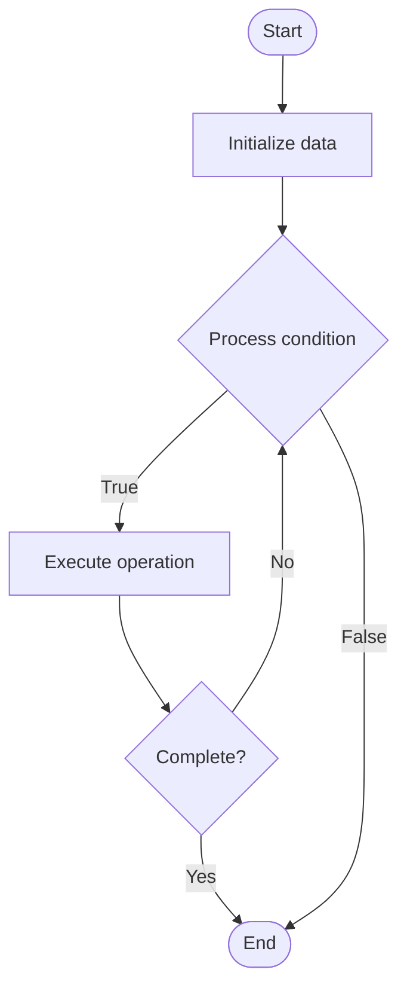

# Database Monitoring

Name of Algorithm  

## Code Files


## Algorithm Visualization

### Flowchart (ASCII)


```
Database Monitoring Flowchart:

┌─────────────┐
│   Start     │
└──────┬──────┘
       │
       ▼
┌─────────────┐
│  Initialize │
│   data      │
└──────┬──────┘
       │
       ▼
┌─────────────┐      Yes
│  Process   ├──────┐
│  condition?│      │
└──────┬──────┘      │
       │ No          │
       ▼             │
┌─────────────┐      │
│  Execute   │      │
│  operation │      │
└──────┬──────┘      │
       │             │
       └─────────────┘
       │
       ▼
┌─────────────┐
│    End      │
└─────────────┘
```


### Step-by-Step Execution


```
Database Monitoring Step-by-Step Execution:

Input: [example data]

Step 1: Initialize
State: [initial state]

Step 2: Process
State: [intermediate state]

Step 3: Finalize
State: [final state]

Result: [output]
```


### Interactive Flowchart (Mermaid)





> **Note**: Mermaid diagrams are rendered automatically on GitHub. For local viewing, use a Mermaid-compatible Markdown viewer.
- [Python Implementation](/code/semester_08/lecture_53_database_operations/database_monitoring/algorithm.py)
- [Java Implementation](/code/semester_08/lecture_53_database_operations/database_monitoring/Algorithm.java)
- [Python Tests](/code/semester_08/lecture_53_database_operations/database_monitoring/test_algorithm.py)


   Database Monitoring

What problem does it solve? (1 sentence)  
   Continuously tracks database performance, health, and resource usage through metrics, logs, and alerts, enabling proactive issue detection and performance optimization.

Intuition (plain-language explanation)  
   Like a health monitor for databases: database monitoring is like a fitness tracker for your database - it continuously measures vital signs (CPU, memory, disk, queries) and alerts you when something's wrong (like a heart rate monitor alerting if heart rate is too high) - you can see trends over time (like fitness progress) and catch problems early before they become critical.

Inputs & Outputs  
   - Input: Database metrics, performance counters, logs, monitoring tools, alert thresholds.  
   - Output: Performance metrics, health status, alerts, dashboards, optimization insights.

Step-by-step description (5–10 lines max)  
Define metrics: identify key metrics to monitor (CPU, memory, disk I/O, query performance, connections).
Set up monitoring: configure monitoring tools to collect metrics.
Collect data: continuously gather metrics from database and system.
Store metrics: save metrics in time-series database for historical analysis.
Create dashboards: build dashboards to visualize metrics and trends.
Set alerts: configure alert thresholds for critical metrics.
Analyze: identify performance bottlenecks, anomalies, and trends.
Alert: notify administrators when metrics exceed thresholds.
Optimize: use insights to optimize database performance and configuration.

Tiny example (hand-simulated)  
   Database monitoring: track CPU (currently 45%), memory (60%), disk I/O (high), slow queries (5 queries > 1s) → alert: disk I/O > 90% → investigate: find I/O-intensive query → optimize: add index → disk I/O drops to 30% → proactive monitoring → prevented performance degradation.

Time & Space Complexity  
   - Time: O(1) per metric collection, O(m) for analysis where m is number of metrics.  
   - Space: O(m·t) where m is metrics count, t is time period (time-series data storage).

Strengths  
- Proactive: detects issues before they impact users.
- Visibility: provides clear view of database health and performance.
- Optimization: enables data-driven performance optimization.

Weaknesses / limitations  
- Overhead: monitoring adds some overhead to database operations.
- Alert fatigue: too many alerts can desensitize administrators.
- Tool dependency: requires monitoring tools and infrastructure.

Compare with alternatives  
    Alternatives: Manual Monitoring, Log Analysis, Performance Testing, APM Tools

30-second explanation (your own words)  
    Continuously tracks database performance, health, and resource usage through metrics, logs, and alerts, enabling proactive issue detection and performance optimization.

*Sources: Adapted from standard university textbooks and Wikipedia summaries.*
