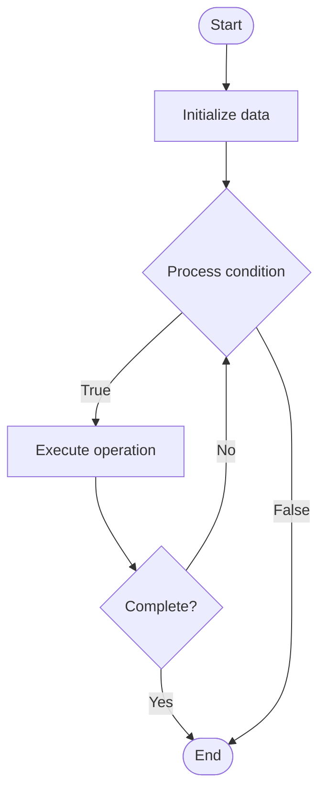

# Database Security

## Учебные материалы

- [Школьный уровень](school.ru.md)
- [Университетский уровень](univer.ru.md)

## Algorithm Visualization

### Flowchart (ASCII)

```
Database Security Flowchart:

┌─────────────┐
│   Start     │
└──────┬──────┘
       │
       ▼
┌─────────────┐
│  Initialize │
│   data      │
└──────┬──────┘
       │
       ▼
┌─────────────┐      Yes
│  Process   ├──────┐
│  condition?│      │
└──────┬──────┘      │
       │ No          │
       ▼             │
┌─────────────┐      │
│  Execute   │      │
│  operation │      │
└──────┬──────┘      │
       │             │
       └─────────────┘
       │
       ▼
┌─────────────┐
│    End      │
└─────────────┘
```

### Step-by-Step Execution

```
Database Security Step-by-Step Execution:

Input: [example data]

Step 1: Initialize
State: [initial state]

Step 2: Process
State: [intermediate state]

Step 3: Finalize
State: [final state]

Result: [output]
```

### Interactive Flowchart (Mermaid)



> **Note**: Mermaid diagrams are rendered automatically on GitHub. For local viewing, use a Mermaid-compatible Markdown viewer.

- [Python Implementation](/code/semester_08/lecture_53_database_operations/database_security/algorithm.py)
- [Java Implementation](/code/semester_08/lecture_53_database_operations/database_security/Algorithm.java)
- [Python Tests](/code/semester_08/lecture_53_database_operations/database_security/test_algorithm.py)

What problem does it solve? (1 sentence)  
   Protects database systems from unauthorized access, data breaches, and attacks through authentication, authorization, encryption, and security best practices.

Intuition (plain-language explanation)  
Like a bank vault for data: database security is like securing a bank vault - you have multiple layers of protection: guards check IDs (authentication), verify access permissions (authorization), encrypt valuables (encryption), monitor for suspicious activity (auditing), and have backup security (firewalls) - all to ensure only authorized people can access the data and it's protected from theft or damage.

Inputs & Outputs  

  - Input: Database system, user credentials, access policies, security requirements, threat models.  
  - Output: Secured database, access controls, encrypted data, audit logs, security compliance.

Step-by-step description (5–10 lines max)  
Authenticate: verify user identity (passwords, certificates, multi-factor authentication).
Authorize: grant appropriate permissions based on user roles (read, write, admin).
Encrypt: encrypt data at rest (disk encryption) and in transit (TLS/SSL).
Audit: log all database access and operations for security monitoring.
Harden: apply security hardening (disable unnecessary features, patch vulnerabilities).
Network security: implement firewalls and network isolation.
Monitor: continuously monitor for suspicious activity and security threats.
Update: regularly update database software and security patches.
Test: perform security audits and penetration testing.

Tiny example (hand-simulated)  
   Database security: user authenticates with password + 2FA → database verifies credentials → checks user role (read-only) → grants access to specific tables → data encrypted at rest (AES-256) → connections encrypted (TLS) → all access logged → security audit: no unauthorized access → database secured.

Time & Space Complexity  

  - Time: O(1) for authentication/authorization checks, O(n) for encryption where n is data size.  
  - Space: O(a) where a is audit log size, O(e) for encryption overhead.

Strengths  

- Data protection: prevents unauthorized access and data breaches.
- Compliance: meets regulatory requirements (GDPR, HIPAA, etc.).
- Trust: builds user and stakeholder trust in data security.

Weaknesses / limitations  

- Complexity: implementing comprehensive security can be complex.
- Performance: encryption and security checks add overhead.
- Maintenance: requires ongoing security updates and monitoring.

Compare with alternatives  
    Alternatives: Basic Authentication, Network Isolation, Application-Level Security, Cloud Security Services

30-second explanation (your own words)  
    Protects database systems from unauthorized access, data breaches, and attacks through authentication, authorization, encryption, and security best practices.

*Sources: Adapted from standard university textbooks and Wikipedia summaries.*
