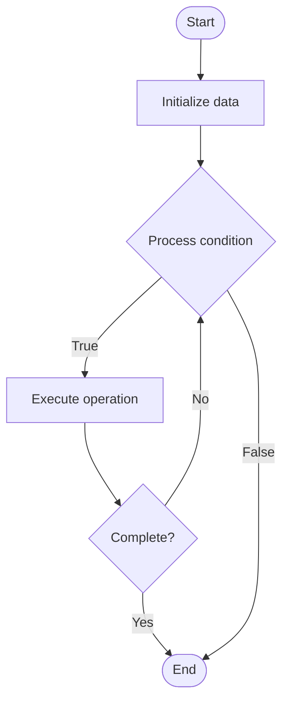

# Disaster Recovery

1. **Name of Algorithm**  

## Code Files


## Algorithm Visualization

### Flowchart (ASCII)


```
Disaster Recovery Flowchart:

┌─────────────┐
│   Start     │
└──────┬──────┘
       │
       ▼
┌─────────────┐
│  Initialize │
│   data      │
└──────┬──────┘
       │
       ▼
┌─────────────┐      Yes
│  Process   ├──────┐
│  condition?│      │
└──────┬──────┘      │
       │ No          │
       ▼             │
┌─────────────┐      │
│  Execute   │      │
│  operation │      │
└──────┬──────┘      │
       │             │
       └─────────────┘
       │
       ▼
┌─────────────┐
│    End      │
└─────────────┘
```


### Step-by-Step Execution


```
Disaster Recovery Step-by-Step Execution:

Input: [example data]

Step 1: Initialize
State: [initial state]

Step 2: Process
State: [intermediate state]

Step 3: Finalize
State: [final state]

Result: [output]
```


### Interactive Flowchart (Mermaid)





> **Note**: Mermaid diagrams are rendered automatically on GitHub. For local viewing, use a Mermaid-compatible Markdown viewer.
- [Python Implementation](semester_08/lecture_53_database_operations/disaster_recovery/algorithm.py)
- [Java Implementation](semester_08/lecture_53_database_operations/disaster_recovery/Algorithm.java)
- [Python Tests](semester_08/lecture_53_database_operations/disaster_recovery/test_algorithm.py)


   Disaster Recovery

2. **What problem does it solve? (1 sentence)**  
   Provides procedures and infrastructure to restore database operations after catastrophic failures, natural disasters, or major outages, minimizing downtime and data loss.

3. **Intuition (plain-language explanation)**  
   Like a disaster evacuation plan: disaster recovery is like having an evacuation plan for a building - you have backup locations (disaster recovery site), procedures to follow (recovery plan), and ways to restore operations (backup systems) - when disaster strikes (fire, earthquake, cyber attack), you follow the plan to quickly restore operations at the backup location, minimizing disruption.

4. **Inputs & Outputs**  
   - Input: Backup systems, disaster recovery site, recovery procedures, RTO/RPO requirements, failover configuration.  
   - Output: Disaster recovery plan, backup infrastructure, recovery procedures, restored operations.

5. **Step-by-step description (5–10 lines max)**  
1. Assess risks: identify potential disasters and their impact (natural, cyber, hardware failures).
2. Define RTO/RPO: establish Recovery Time Objective (RTO) and Recovery Point Objective (RPO).
3. Design DR site: set up disaster recovery site (hot, warm, or cold standby).
4. Replicate data: continuously replicate data to DR site.
5. Document procedures: create detailed recovery procedures and runbooks.
6. Test recovery: regularly test disaster recovery procedures (DR drills).
7. Monitor: continuously monitor primary site health and replication status.
8. Failover: execute failover to DR site when disaster occurs.
9. Restore: restore operations at DR site using backups and replication.
10. Failback: return operations to primary site after disaster is resolved.

6. **Tiny example (hand-simulated)**  
   Disaster recovery: primary database in New York → replicate to DR site in London → RTO: 4 hours, RPO: 1 hour → earthquake hits New York → primary site down → execute failover → switch to London DR site → restore from replication → operations resume in 2 hours → data loss: < 1 hour → business continuity maintained.

7. **Time & Space Complexity**  
   - Time: O(1) for failover trigger, O(r) for recovery where r is recovery steps, O(d) for data restoration where d is data size.  
   - Space: O(d) where d is database size (DR site storage requirements).

8. **Strengths**  
- Business continuity: enables rapid recovery from disasters.
- Data protection: minimizes data loss through replication and backups.
- Risk mitigation: reduces business risk from catastrophic failures.

9. **Weaknesses / limitations**  
- Cost: maintaining DR infrastructure is expensive.
- Complexity: requires careful planning and regular testing.
- RTO/RPO: achieving very low RTO/RPO can be challenging and costly.

10. **Compare with alternatives**  
    Alternatives: Backup and Restore, Replication, Cloud DR Services, Multi-Region Deployment

11. **30-second explanation (your own words)**  
    Provides procedures and infrastructure to restore database operations after catastrophic failures, natural disasters, or major outages, minimizing downtime and data loss.

*Sources: Adapted from standard university textbooks and Wikipedia summaries.*
