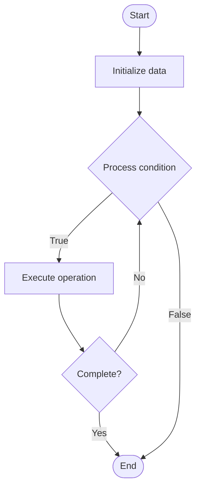

# Database Performance Tuning

## Учебные материалы

- [Школьный уровень](school.ru.md)
- [Университетский уровень](univer.ru.md)

## Algorithm Visualization

### Flowchart (ASCII)

```
Database Performance Tuning Flowchart:

┌─────────────┐
│   Start     │
└──────┬──────┘
       │
       ▼
┌─────────────┐
│  Initialize │
│   data      │
└──────┬──────┘
       │
       ▼
┌─────────────┐      Yes
│  Process   ├──────┐
│  condition?│      │
└──────┬──────┘      │
       │ No          │
       ▼             │
┌─────────────┐      │
│  Execute   │      │
│  operation │      │
└──────┬──────┘      │
       │             │
       └─────────────┘
       │
       ▼
┌─────────────┐
│    End      │
└─────────────┘
```

### Step-by-Step Execution

```
Database Performance Tuning Step-by-Step Execution:

Input: [example data]

Step 1: Initialize
State: [initial state]

Step 2: Process
State: [intermediate state]

Step 3: Finalize
State: [final state]

Result: [output]
```

### Interactive Flowchart (Mermaid)



> **Note**: Mermaid diagrams are rendered automatically on GitHub. For local viewing, use a Mermaid-compatible Markdown viewer.

- [Python Implementation](/code/semester_08/lecture_53_database_operations/performance_tuning/algorithm.py)
- [Java Implementation](/code/semester_08/lecture_53_database_operations/performance_tuning/Algorithm.java)
- [Python Tests](/code/semester_08/lecture_53_database_operations/performance_tuning/test_algorithm.py)

What problem does it solve? (1 sentence)  
   Optimizes database performance by identifying bottlenecks, tuning configuration, optimizing queries, and adjusting resources to improve response times and throughput.

Intuition (plain-language explanation)  
Like tuning a car engine: database performance tuning is like tuning a car for better performance - you identify what's slowing it down (bottlenecks like slow queries, missing indexes), adjust settings (configuration like memory, cache), optimize components (queries, indexes), and test improvements (benchmarking) - the goal is to make the database run faster and more efficiently, like tuning a car to go faster and use less fuel.

Inputs & Outputs  

  - Input: Performance metrics, slow queries, configuration settings, resource usage, workload patterns.  
  - Output: Optimized database, improved performance, tuned configuration, optimized queries.

Step-by-step description (5–10 lines max)  
Measure baseline: establish current performance baseline (response times, throughput).
Identify bottlenecks: find performance bottlenecks (slow queries, missing indexes, resource constraints).
Analyze queries: examine slow queries and execution plans.
Optimize queries: rewrite queries, add indexes, use query hints.
Tune configuration: adjust database configuration (memory, cache, connection pool).
Optimize indexes: create, modify, or remove indexes based on query patterns.
Adjust resources: allocate more CPU, memory, or I/O resources if needed.
Test changes: benchmark performance improvements after each change.
Monitor: continuously monitor performance and iterate on optimizations.

Tiny example (hand-simulated)  
   Performance tuning: database slow (avg query time: 2s) → identify: query scanning 10M rows → optimize: add index on WHERE clause column → query time: 0.01s (200x faster) → identify: memory too low → increase buffer pool → cache hit rate improves → overall performance: 10x improvement → database tuned.

Time & Space Complexity  

  - Time: O(1) for configuration changes, O(q) for query optimization where q is number of queries, O(n) for index creation where n is table size.  
  - Space: O(i) where i is index size, O(m) for memory allocation.

Strengths  

- Performance improvement: can dramatically improve database performance.
- Cost-effective: often improves performance without hardware upgrades.
- User experience: faster queries improve application responsiveness.

Weaknesses / limitations  

- Time-consuming: requires analysis, testing, and iteration.
- Complexity: performance tuning can be complex and requires expertise.
- Diminishing returns: further optimizations may have limited impact.

Compare with alternatives  
    Alternatives: Hardware Upgrades, Query Optimization, Caching, Read Replicas

30-second explanation (your own words)  
    Optimizes database performance by identifying bottlenecks, tuning configuration, optimizing queries, and adjusting resources to improve response times and throughput.

*Sources: Adapted from standard university textbooks and Wikipedia summaries.*
