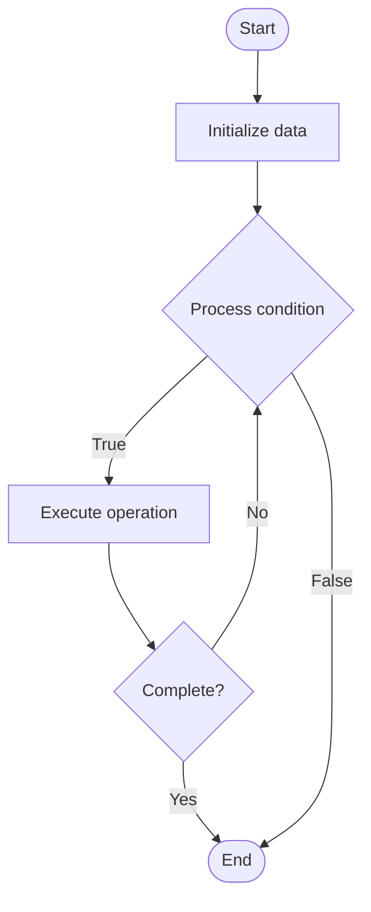

# Data Governance

## Учебные материалы

- [Школьный уровень](school.ru.md)
- [Университетский уровень](univer.ru.md)

## Algorithm Visualization

### Flowchart (ASCII)

```
Data Governance Flowchart:

┌─────────────┐
│   Start     │
└──────┬──────┘
       │
       ▼
┌─────────────┐
│  Initialize │
│   data      │
└──────┬──────┘
       │
       ▼
┌─────────────┐      Yes
│  Process   ├──────┐
│  condition?│      │
└──────┬──────┘      │
       │ No          │
       ▼             │
┌─────────────┐      │
│  Execute   │      │
│  operation │      │
└──────┬──────┘      │
       │             │
       └─────────────┘
       │
       ▼
┌─────────────┐
│    End      │
└─────────────┘
```

### Step-by-Step Execution

```
Data Governance Step-by-Step Execution:

Input: [example data]

Step 1: Initialize
State: [initial state]

Step 2: Process
State: [intermediate state]

Step 3: Finalize
State: [final state]

Result: [output]
```

### Interactive Flowchart (Mermaid)



> **Note**: Mermaid diagrams are rendered automatically on GitHub. For local viewing, use a Mermaid-compatible Markdown viewer.

- [Python Implementation](/code/semester_08/lecture_54_data_modeling/data_governance/algorithm.py)
- [Java Implementation](/code/semester_08/lecture_54_data_modeling/data_governance/Algorithm.java)
- [Python Tests](/code/semester_08/lecture_54_data_modeling/data_governance/test_algorithm.py)

What problem does it solve? (1 sentence)  
   Establishes policies, processes, and standards for managing data assets, ensuring data quality, security, compliance, and proper usage across an organization.

Intuition (plain-language explanation)  
   Like a library's cataloging system: data governance is like a library's system for organizing, cataloging, and managing books - you have rules for how books are organized (data standards), who can access what (data access policies), how to maintain quality (data quality rules), and how to track usage (data lineage) - it ensures the library (organization) can find, use, and trust its books (data) effectively.

Inputs & Outputs  

  - Input: Data assets, business requirements, regulatory requirements, organizational policies, data quality standards.  
  - Output: Data governance framework, policies, standards, data catalog, compliance, data quality.

Step-by-step description (5–10 lines max)  
Define framework: establish data governance structure and roles (data stewards, owners).
Create policies: develop data policies (access, privacy, retention, quality).
Set standards: define data standards (naming, formats, schemas, quality metrics).
Catalog data: create data catalog documenting all data assets and metadata.
Assign ownership: assign data owners and stewards for each data asset.
Implement controls: establish data access controls and security measures.
Monitor quality: implement data quality monitoring and validation.
Track lineage: document data lineage (where data comes from, how it's used).
Ensure compliance: ensure data practices meet regulatory requirements (GDPR, HIPAA).
Review: periodically review and update governance policies and practices.

Tiny example (hand-simulated)  
   Data governance: establish framework → define policies (data retention: 7 years, access: role-based) → create catalog (document all databases, tables, fields) → assign owners (finance data: CFO, customer data: CMO) → implement controls (encryption, access logs) → monitor quality (validate data completeness, accuracy) → track lineage (customer data: CRM → data warehouse → analytics) → compliance: GDPR compliance verified → governance operational.

Time & Space Complexity  

  - Time: O(a) where a is number of data assets (cataloging and governance setup).  
  - Space: O(m) where m is metadata size (governance documentation and catalogs).

Strengths  

- Data quality: improves data quality and consistency across organization.
- Compliance: ensures regulatory compliance and reduces risk.
- Trust: builds trust in data through proper management and documentation.

Weaknesses / limitations  

- Complexity: implementing comprehensive governance can be complex.
- Overhead: governance processes add overhead to data operations.
- Resistance: may face resistance from teams used to less structured approaches.

Compare with alternatives  
    Alternatives: Ad-hoc Data Management, Data Stewardship, Data Cataloging, Compliance Frameworks

30-second explanation (your own words)  
    Establishes policies, processes, and standards for managing data assets, ensuring data quality, security, compliance, and proper usage across an organization.

*Sources: Adapted from standard university textbooks and Wikipedia summaries.*
