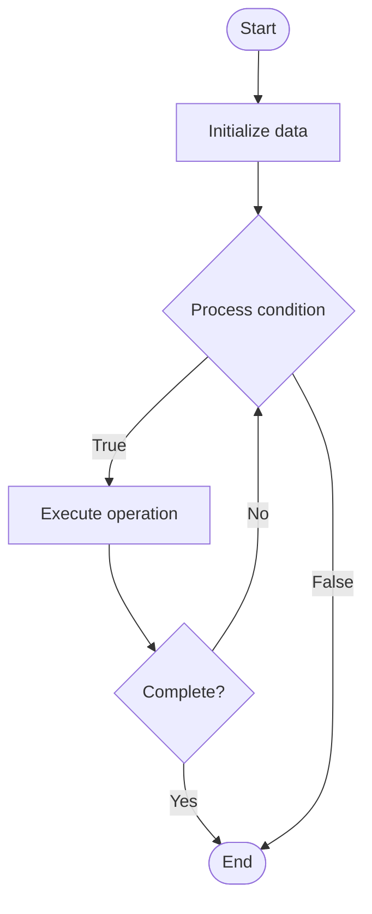

# Data Lakes

Name of Algorithm  

## Code Files


## Algorithm Visualization

### Flowchart (ASCII)


```
Data Lakes Flowchart:

┌─────────────┐
│   Start     │
└──────┬──────┘
       │
       ▼
┌─────────────┐
│  Initialize │
│   data      │
└──────┬──────┘
       │
       ▼
┌─────────────┐      Yes
│  Process   ├──────┐
│  condition?│      │
└──────┬──────┘      │
       │ No          │
       ▼             │
┌─────────────┐      │
│  Execute   │      │
│  operation │      │
└──────┬──────┘      │
       │             │
       └─────────────┘
       │
       ▼
┌─────────────┐
│    End      │
└─────────────┘
```


### Step-by-Step Execution


```
Data Lakes Step-by-Step Execution:

Input: [example data]

Step 1: Initialize
State: [initial state]

Step 2: Process
State: [intermediate state]

Step 3: Finalize
State: [final state]

Result: [output]
```


### Interactive Flowchart (Mermaid)





> **Note**: Mermaid diagrams are rendered automatically on GitHub. For local viewing, use a Mermaid-compatible Markdown viewer.
- [Python Implementation](/code/semester_08/lecture_54_data_modeling/data_lakes/algorithm.py)
- [Java Implementation](/code/semester_08/lecture_54_data_modeling/data_lakes/Algorithm.java)
- [Python Tests](/code/semester_08/lecture_54_data_modeling/data_lakes/test_algorithm.py)


   Data Lakes

What problem does it solve? (1 sentence)  
   Stores vast amounts of raw, unstructured, and structured data in its native format, enabling flexible data exploration, analytics, and machine learning without predefined schema.

Intuition (plain-language explanation)  
   Like a natural lake: data lakes are like natural lakes where water (data) flows in from many sources (rivers, streams) and is stored in its natural state - you can store any type of water (structured, unstructured data) without processing it first, and later you can extract what you need (analytics, ML) - unlike data warehouses (like water treatment plants) that require structured, processed data, data lakes accept everything in its raw form.

Inputs & Outputs  
   - Input: Raw data (structured, unstructured, semi-structured), data sources, storage system, ingestion tools.  
   - Output: Data lake storage, accessible raw data, flexible analytics platform, ML-ready data.

Step-by-step description (5–10 lines max)  
Set up storage: configure scalable storage system (HDFS, S3, Azure Data Lake).
Ingest data: load data from various sources (databases, files, streams, APIs).
Store raw: store data in native format without transformation (schema-on-read).
Catalog: create data catalog to track what data is available.
Organize: organize data into zones (raw, curated, processed) for different use cases.
Access: provide access tools for data exploration and analysis.
Process: process data on-demand for specific analytics or ML use cases.
Govern: implement data governance and security policies.
Analyze: perform analytics, data science, and ML on stored data.

Tiny example (hand-simulated)  
   Data lake: S3 storage → ingest: customer logs (JSON), sales data (CSV), images (binary), social media (text) → store raw: all data stored as-is → catalog: document data sources and formats → organize: raw zone (original data), curated zone (cleaned data), processed zone (aggregated data) → access: analysts query raw data → process: data scientists build ML models → flexible: can analyze any data type → data lake operational.

Time & Space Complexity  
   - Time: O(d) for ingestion where d is data size, O(q) for queries where q is query complexity (varies by processing).  
   - Space: O(d) where d is total data size (stores all raw data).

Strengths  
- Flexibility: accepts any data type without predefined schema.
- Scalability: scales to petabytes of data.
- Cost-effective: cheaper storage for large volumes of data.

Weaknesses / limitations  
- Data swamp: can become unorganized 'data swamp' without governance.
- Query performance: may be slower than data warehouses for structured queries.
- Complexity: requires expertise to manage and extract value.

Compare with alternatives  
    Alternatives: Data Warehouses, Data Marts, Operational Data Stores, Hybrid Architectures

30-second explanation (your own words)  
    Stores vast amounts of raw, unstructured, and structured data in its native format, enabling flexible data exploration, analytics, and machine learning without predefined schema.

*Sources: Adapted from standard university textbooks and Wikipedia summaries.*
