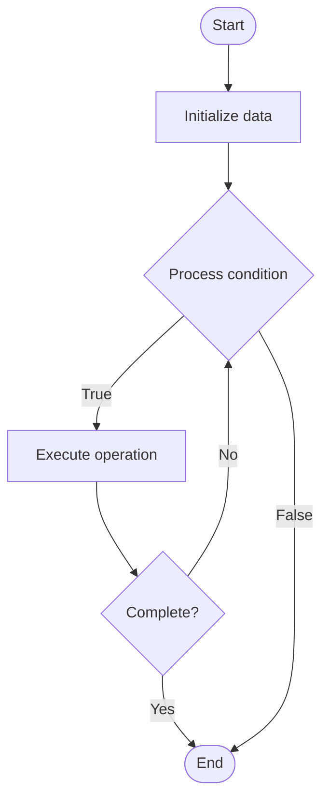

# Data Warehousing

Name of Algorithm  

## Code Files


## Algorithm Visualization

### Flowchart (ASCII)


```
Data Warehousing Flowchart:

┌─────────────┐
│   Start     │
└──────┬──────┘
       │
       ▼
┌─────────────┐
│  Initialize │
│   data      │
└──────┬──────┘
       │
       ▼
┌─────────────┐      Yes
│  Process   ├──────┐
│  condition?│      │
└──────┬──────┘      │
       │ No          │
       ▼             │
┌─────────────┐      │
│  Execute   │      │
│  operation │      │
└──────┬──────┘      │
       │             │
       └─────────────┘
       │
       ▼
┌─────────────┐
│    End      │
└─────────────┘
```


### Step-by-Step Execution


```
Data Warehousing Step-by-Step Execution:

Input: [example data]

Step 1: Initialize
State: [initial state]

Step 2: Process
State: [intermediate state]

Step 3: Finalize
State: [final state]

Result: [output]
```


### Interactive Flowchart (Mermaid)





> **Note**: Mermaid diagrams are rendered automatically on GitHub. For local viewing, use a Mermaid-compatible Markdown viewer.
- [Python Implementation](/code/semester_08/lecture_54_data_modeling/data_warehousing/algorithm.py)
- [Java Implementation](/code/semester_08/lecture_54_data_modeling/data_warehousing/Algorithm.java)
- [Python Tests](/code/semester_08/lecture_54_data_modeling/data_warehousing/test_algorithm.py)


   Data Warehousing

What problem does it solve? (1 sentence)  
   Consolidates data from multiple sources into a centralized, structured repository optimized for analytical queries and business intelligence, enabling historical analysis and reporting.

Intuition (plain-language explanation)  
Like a company's central archive: data warehousing is like a company's central archive where all important documents (data) from different departments (sources) are collected, organized, and stored in a structured way - unlike operational systems (like active filing cabinets) that handle day-to-day transactions, the warehouse (archive) is optimized for finding and analyzing historical information (like 'how did sales change over the past 5 years?') - it's designed for reading and analyzing, not for frequent updates.

Inputs & Outputs  
   - Input: Source data (operational databases, files, APIs), ETL processes, dimensional model, business requirements.  
   - Output: Data warehouse, integrated data, analytical queries, business intelligence, historical data.

Step-by-step description (5–10 lines max)  
Design schema: create dimensional model (star schema, snowflake schema).
Extract: extract data from source systems (databases, files, APIs).
Transform: clean, validate, and transform data to match warehouse schema.
Load: load transformed data into data warehouse tables.
Organize: organize data into facts (measures) and dimensions (descriptors).
Index: create indexes for fast analytical queries.
Aggregate: pre-compute aggregations for common queries.
Update: periodically refresh data from source systems (batch or incremental).
Query: enable analytical queries and business intelligence tools.
Maintain: monitor performance, optimize queries, and manage data lifecycle.

Tiny example (hand-simulated)  
   Data warehouse: star schema → fact table: sales (amount, quantity, date_id, product_id, customer_id) → dimensions: date (date_id, year, quarter, month), product (product_id, name, category), customer (customer_id, name, region) → ETL: extract from CRM, ERP, e-commerce → transform: standardize formats, calculate metrics → load: daily batch load → query: 'sales by region and quarter' → fast analytical queries → business intelligence enabled.

Time & Space Complexity  
   - Time: O(d) for ETL where d is data size, O(log n) for queries with indexes where n is data size.  
   - Space: O(d) where d is data size (stores historical and aggregated data).

Strengths  
- Performance: optimized for analytical queries and reporting.
- Integration: consolidates data from multiple sources.
- Historical analysis: enables analysis of historical trends and patterns.

Weaknesses / limitations  
- Complexity: requires careful design and ETL processes.
- Latency: data may not be real-time (batch updates).
- Cost: can be expensive to build and maintain.

Compare with alternatives  
    Alternatives: Data Lakes, Data Marts, Operational Data Stores, Real-time Analytics

30-second explanation (your own words)  
    Consolidates data from multiple sources into a centralized, structured repository optimized for analytical queries and business intelligence, enabling historical analysis and reporting.

*Sources: Adapted from standard university textbooks and Wikipedia summaries.*
