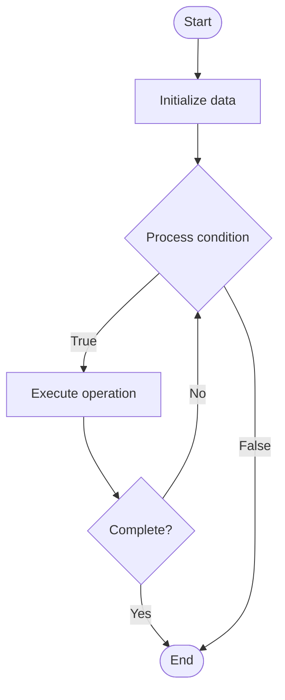

# Dimensional Modeling

## Учебные материалы

- [Школьный уровень](school.ru.md)
- [Университетский уровень](univer.ru.md)

## Algorithm Visualization

### Flowchart (ASCII)

```
Dimensional Modeling Flowchart:

┌─────────────┐
│   Start     │
└──────┬──────┘
       │
       ▼
┌─────────────┐
│  Initialize │
│   data      │
└──────┬──────┘
       │
       ▼
┌─────────────┐      Yes
│  Process   ├──────┐
│  condition?│      │
└──────┬──────┘      │
       │ No          │
       ▼             │
┌─────────────┐      │
│  Execute   │      │
│  operation │      │
└──────┬──────┘      │
       │             │
       └─────────────┘
       │
       ▼
┌─────────────┐
│    End      │
└─────────────┘
```

### Step-by-Step Execution

```
Dimensional Modeling Step-by-Step Execution:

Input: [example data]

Step 1: Initialize
State: [initial state]

Step 2: Process
State: [intermediate state]

Step 3: Finalize
State: [final state]

Result: [output]
```

### Interactive Flowchart (Mermaid)



> **Note**: Mermaid diagrams are rendered automatically on GitHub. For local viewing, use a Mermaid-compatible Markdown viewer.

- [Python Implementation](/code/semester_08/lecture_54_data_modeling/dimensional_modeling/algorithm.py)
- [Java Implementation](/code/semester_08/lecture_54_data_modeling/dimensional_modeling/Algorithm.java)
- [Python Tests](/code/semester_08/lecture_54_data_modeling/dimensional_modeling/test_algorithm.py)

What problem does it solve? (1 sentence)  
   Designs data warehouse schemas using facts (measurable events) and dimensions (descriptive attributes), optimizing for analytical queries and business intelligence reporting.

Intuition (plain-language explanation)  
   Like organizing a store's sales records: dimensional modeling is like organizing a store's sales records - you have facts (what happened: sales transactions with amounts and quantities) and dimensions (descriptors: when it happened - date, what was sold - product, who bought it - customer) - this structure makes it easy to answer questions like 'how much did we sell of product X in region Y last quarter?' by joining facts with dimensions.

Inputs & Outputs  

  - Input: Business requirements, source data, analytical queries, reporting needs.  
  - Output: Dimensional schema (star or snowflake), fact tables, dimension tables, optimized design.

Step-by-step description (5–10 lines max)  
Identify facts: determine measurable business events (sales, orders, clicks).
Identify dimensions: determine descriptive attributes (time, product, customer, location).
Design fact table: create fact table with measures (amounts, quantities) and foreign keys to dimensions.
Design dimension tables: create dimension tables with descriptive attributes and hierarchies.
Choose schema: select star schema (denormalized) or snowflake schema (normalized).
Define hierarchies: establish dimension hierarchies (year → quarter → month → day).
Add attributes: include all relevant attributes for analysis.
Optimize: optimize for common query patterns and reporting needs.
Implement: create tables and relationships in data warehouse.
Validate: verify schema supports required analytical queries.

Tiny example (hand-simulated)  
   Dimensional model: fact table: sales_fact (sale_id, date_id, product_id, customer_id, store_id, amount, quantity) → dimensions: date_dim (date_id, date, year, quarter, month, day), product_dim (product_id, name, category, brand), customer_dim (customer_id, name, age, region), store_dim (store_id, name, city, state) → star schema → query: 'total sales by product category and quarter' → join fact with product and date dimensions → fast analytical query → dimensional model optimized.

Time & Space Complexity  

  - Time: O(f·d) where f is number of facts, d is number of dimensions (design phase).  
  - Space: O(f + Σ(d_i)) where f is fact table size, d_i is dimension table sizes.

Strengths  

- Query performance: optimized for analytical queries and aggregations.
- Intuitive: business users can easily understand and use the model.
- Flexibility: supports various analytical queries and reporting needs.

Weaknesses / limitations  

- Complexity: requires understanding of business processes and requirements.
- Redundancy: star schema may have some data redundancy.
- Updates: dimension updates can be complex (slowly changing dimensions).

Compare with alternatives  
    Alternatives: Normalized Models, Data Vault Modeling, Anchor Modeling, Relational Modeling

30-second explanation (your own words)  
    Designs data warehouse schemas using facts (measurable events) and dimensions (descriptive attributes), optimizing for analytical queries and business intelligence reporting.

*Sources: Adapted from standard university textbooks and Wikipedia summaries.*
