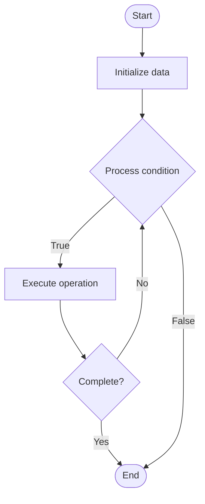

# Entity-Relationship Modeling

Name of Algorithm  

## Code Files


## Algorithm Visualization

### Flowchart (ASCII)


```
Entity-Relationship Modeling Flowchart:

┌─────────────┐
│   Start     │
└──────┬──────┘
       │
       ▼
┌─────────────┐
│  Initialize │
│   data      │
└──────┬──────┘
       │
       ▼
┌─────────────┐      Yes
│  Process   ├──────┐
│  condition?│      │
└──────┬──────┘      │
       │ No          │
       ▼             │
┌─────────────┐      │
│  Execute   │      │
│  operation │      │
└──────┬──────┘      │
       │             │
       └─────────────┘
       │
       ▼
┌─────────────┐
│    End      │
└─────────────┘
```


### Step-by-Step Execution


```
Entity-Relationship Modeling Step-by-Step Execution:

Input: [example data]

Step 1: Initialize
State: [initial state]

Step 2: Process
State: [intermediate state]

Step 3: Finalize
State: [final state]

Result: [output]
```


### Interactive Flowchart (Mermaid)





> **Note**: Mermaid diagrams are rendered automatically on GitHub. For local viewing, use a Mermaid-compatible Markdown viewer.
- [Python Implementation](/code/semester_08/lecture_54_data_modeling/entity_relationship/algorithm.py)
- [Java Implementation](/code/semester_08/lecture_54_data_modeling/entity_relationship/Algorithm.java)
- [Python Tests](/code/semester_08/lecture_54_data_modeling/entity_relationship/test_algorithm.py)


   Entity-Relationship Modeling

What problem does it solve? (1 sentence)  
   Creates conceptual data models using entities (things of interest) and relationships (associations between entities), providing a visual representation of data structure and business rules.

Intuition (plain-language explanation)  
   Like a map of relationships: entity-relationship modeling is like creating a map showing how different things (entities) are connected (relationships) - for example, in a university system, you have entities like 'Student', 'Course', 'Professor' and relationships like 'Student enrolls in Course', 'Professor teaches Course' - the ER diagram (map) shows all these entities and how they relate, helping you understand and design the database structure.

Inputs & Outputs  
   - Input: Business requirements, entities, relationships, attributes, business rules.  
   - Output: ER diagram, conceptual model, entity definitions, relationship definitions, database design.

Step-by-step description (5–10 lines max)  
Identify entities: determine main entities (things of interest: Customer, Order, Product).
Identify attributes: define attributes for each entity (Customer: name, email, address).
Identify relationships: determine relationships between entities (Customer places Order).
Define cardinality: specify relationship cardinality (one-to-many, many-to-many, one-to-one).
Create ER diagram: draw visual representation using ER notation (Chen, Crow's Foot).
Add constraints: define constraints (primary keys, foreign keys, unique constraints).
Normalize: apply normalization rules to eliminate redundancy.
Validate: verify model accurately represents business requirements.
Convert: transform ER model into database schema (tables, columns, relationships).

Tiny example (hand-simulated)  
   ER model: entities: Customer (customer_id, name, email), Order (order_id, date, total), Product (product_id, name, price) → relationships: Customer places Order (1:N), Order contains Product (M:N via OrderItem) → ER diagram: Customer --< places >-- Order --< contains >-- Product → convert to schema: customers table, orders table, products table, order_items table → ER model complete.

Time & Space Complexity  
   - Time: O(e·r) where e is number of entities, r is number of relationships (modeling phase).  
   - Space: O(e + r) where e is entities, r is relationships (model representation).

Strengths  
- Visual clarity: provides clear visual representation of data structure.
- Communication: facilitates communication between stakeholders and developers.
- Foundation: serves as foundation for database design.

Weaknesses / limitations  
- Abstraction: may not capture all implementation details.
- Complexity: can become complex for large systems.
- Maintenance: requires updates as requirements change.

Compare with alternatives  
    Alternatives: UML Class Diagrams, Relational Modeling, Object-Oriented Modeling, NoSQL Modeling

30-second explanation (your own words)  
    Creates conceptual data models using entities (things of interest) and relationships (associations between entities), providing a visual representation of data structure and business rules.

*Sources: Adapted from standard university textbooks and Wikipedia summaries.*
