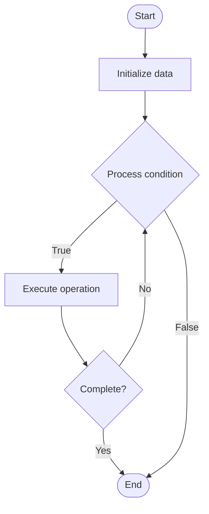

# ETL Processes

## Учебные материалы

- [Школьный уровень](school.ru.md)
- [Университетский уровень](univer.ru.md)

## Algorithm Visualization

### Flowchart (ASCII)

```
ETL Processes Flowchart:

┌─────────────┐
│   Start     │
└──────┬──────┘
       │
       ▼
┌─────────────┐
│  Initialize │
│   data      │
└──────┬──────┘
       │
       ▼
┌─────────────┐      Yes
│  Process   ├──────┐
│  condition?│      │
└──────┬──────┘      │
       │ No          │
       ▼             │
┌─────────────┐      │
│  Execute   │      │
│  operation │      │
└──────┬──────┘      │
       │             │
       └─────────────┘
       │
       ▼
┌─────────────┐
│    End      │
└─────────────┘
```

### Step-by-Step Execution

```
ETL Processes Step-by-Step Execution:

Input: [example data]

Step 1: Initialize
State: [initial state]

Step 2: Process
State: [intermediate state]

Step 3: Finalize
State: [final state]

Result: [output]
```

### Interactive Flowchart (Mermaid)



> **Note**: Mermaid diagrams are rendered automatically on GitHub. For local viewing, use a Mermaid-compatible Markdown viewer.

- [Python Implementation](/code/semester_08/lecture_54_data_modeling/etl_processes/algorithm.py)
- [Java Implementation](/code/semester_08/lecture_54_data_modeling/etl_processes/Algorithm.java)
- [Python Tests](/code/semester_08/lecture_54_data_modeling/etl_processes/test_algorithm.py)

   ETL Processes

What problem does it solve? (1 sentence)  
   Extracts data from source systems, transforms it to meet target requirements, and loads it into destination systems, enabling data integration and migration.

Intuition (plain-language explanation)  
Like a factory assembly line: ETL processes are like a factory assembly line - you extract raw materials (data) from suppliers (source systems), transform them (clean, reshape, calculate) on the assembly line (transformation logic), and load finished products (processed data) into warehouses (destination systems) - the goal is to take data from various sources, make it consistent and useful, and deliver it where it's needed.

Inputs & Outputs  

  - Input: Source data (databases, files, APIs), transformation rules, target schema, business logic.  
  - Output: Transformed data, loaded destination, data integration, data quality improvements.

Step-by-step description (5–10 lines max)  
Extract: read data from source systems (databases, files, APIs, streams).
Validate: check data quality and completeness during extraction.
Transform: apply transformations (clean, filter, aggregate, calculate, join).
Standardize: standardize formats, codes, and values across sources.
Enrich: add derived fields, lookups, and calculated values.
Validate: validate transformed data against business rules.
Load: insert transformed data into target system (data warehouse, database).
Handle errors: manage errors and exceptions during ETL process.
Monitor: track ETL execution, performance, and data quality metrics.
Schedule: automate ETL processes to run on schedule (daily, hourly, real-time).

Tiny example (hand-simulated)  
   ETL process: extract: read customer data from CRM (PostgreSQL), sales data from e-commerce (MongoDB) → transform: clean email addresses, standardize date formats, calculate total sales per customer, join customer and sales data → validate: check for duplicates, missing values, data quality → load: insert into data warehouse (star schema) → schedule: run daily at 2 AM → monitor: track records processed, errors, execution time → ETL complete.

Time & Space Complexity  

  - Time: O(d) where d is data size (extraction, transformation, loading).  
  - Space: O(d) where d is data size (temporary storage during transformation).

Strengths  

- Data integration: enables integration of data from multiple sources.
- Data quality: improves data quality through cleaning and validation.
- Automation: automates data movement and transformation processes.

Weaknesses / limitations  

- Complexity: ETL processes can be complex to design and maintain.
- Latency: batch ETL may introduce latency (not real-time).
- Resource intensive: can consume significant compute and storage resources.

Compare with alternatives  
    Alternatives: ELT Processes, Real-time Streaming, Data Virtualization, API Integration

30-second explanation (your own words)  

*Sources: Adapted from standard university textbooks and Wikipedia summaries.*


## References

- [Etl Processes - Wikipedia](https://en.wikipedia.org/wiki/Etl%20Processes)
