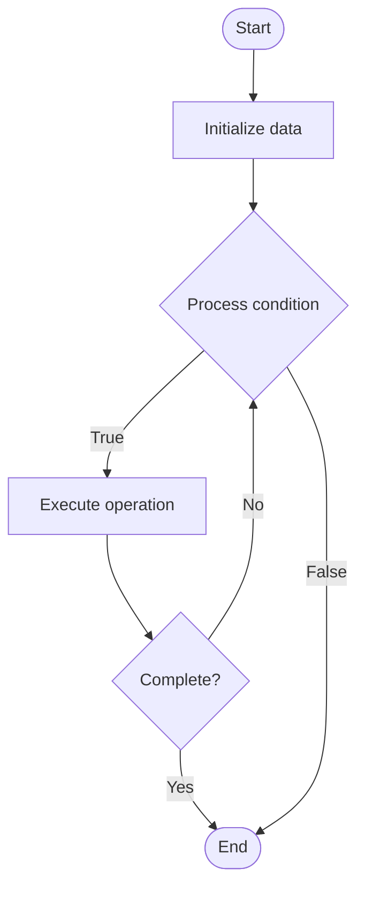

# Container Runtimes

1. **Name of Algorithm**  

## Code Files


## Algorithm Visualization

### Flowchart (ASCII)


```
Container Runtimes Flowchart:

┌─────────────┐
│   Start     │
└──────┬──────┘
       │
       ▼
┌─────────────┐
│  Initialize │
│   data      │
└──────┬──────┘
       │
       ▼
┌─────────────┐      Yes
│  Process   ├──────┐
│  condition?│      │
└──────┬──────┘      │
       │ No          │
       ▼             │
┌─────────────┐      │
│  Execute   │      │
│  operation │      │
└──────┬──────┘      │
       │             │
       └─────────────┘
       │
       ▼
┌─────────────┐
│    End      │
└─────────────┘
```


### Step-by-Step Execution


```
Container Runtimes Step-by-Step Execution:

Input: [example data]

Step 1: Initialize
State: [initial state]

Step 2: Process
State: [intermediate state]

Step 3: Finalize
State: [final state]

Result: [output]
```


### Interactive Flowchart (Mermaid)





> **Note**: Mermaid diagrams are rendered automatically on GitHub. For local viewing, use a Mermaid-compatible Markdown viewer.
- [Python Implementation](semester_09/lecture_55_advanced_os/container_runtimes/algorithm.py)
- [Java Implementation](semester_09/lecture_55_advanced_os/container_runtimes/Algorithm.java)
- [Python Tests](semester_09/lecture_55_advanced_os/container_runtimes/test_algorithm.py)


   Container Runtimes

2. **What problem does it solve? (1 sentence)**  
   Manages the execution and lifecycle of containers, providing isolation, resource management, and low-level container operations for containerized applications.

3. **Intuition (plain-language explanation)**  
   Like a container ship's engine room: container runtimes are like the engine room that powers container ships (containers) - they handle the low-level operations like starting containers (starting engines), managing resources (fuel allocation), providing isolation (separate engine rooms), and stopping containers (shutting down engines) - they're the foundation that makes containers work, similar to how an engine room makes a ship move.

4. **Inputs & Outputs**  
   - Input: Container images, runtime configuration, resource limits, network settings, storage mounts.  
   - Output: Running containers, isolated processes, managed resources, container lifecycle.

5. **Step-by-step description (5–10 lines max)**  
1. Pull image: download container image from registry.
2. Create container: create container instance from image.
3. Configure: set up container configuration (resources, network, storage).
4. Start: launch container process with isolation.
5. Manage: monitor container state, resource usage, and health.
6. Isolate: provide process, network, and filesystem isolation.
7. Execute: run application processes inside container.
8. Stop: gracefully stop container processes.
9. Remove: clean up container resources after termination.
10. Monitor: track container metrics and logs.

6. **Tiny example (hand-simulated)**  
   Container runtime: Docker → pull image: docker pull nginx:latest → create container: docker create --name web --memory 512m nginx → start: docker start web → container running with isolation → manage: monitor CPU, memory usage → stop: docker stop web → remove: docker rm web → container lifecycle managed.

7. **Time & Space Complexity**  
   - Time: O(1) for container operations (start, stop), O(i) for image operations where i is image size.  
   - Space: O(i + r) where i is image size, r is runtime overhead per container.

8. **Strengths**  
- Isolation: provides strong process and resource isolation.
- Portability: containers run consistently across different environments.
- Efficiency: lightweight compared to virtual machines.

9. **Weaknesses / limitations**  
- Security: containers share host kernel (less isolation than VMs).
- Complexity: managing container runtimes and orchestration can be complex.
- Resource limits: requires careful resource management to prevent resource exhaustion.

10. **Compare with alternatives**  
    Alternatives: Virtual Machines, Bare Metal, Serverless, Process Isolation

11. **30-second explanation (your own words)**  
    Manages the execution and lifecycle of containers, providing isolation, resource management, and low-level container operations for containerized applications.

*Sources: Adapted from standard university textbooks and Wikipedia summaries.*
