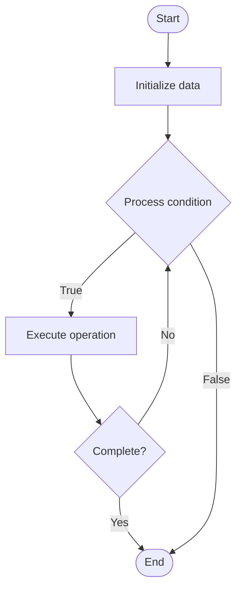

# Distributed Operating Systems

## Учебные материалы

- [Школьный уровень](school.ru.md)
- [Университетский уровень](univer.ru.md)

## Algorithm Visualization

### Flowchart (ASCII)

```
Distributed Operating Systems Flowchart:

┌─────────────┐
│   Start     │
└──────┬──────┘
       │
       ▼
┌─────────────┐
│  Initialize │
│   data      │
└──────┬──────┘
       │
       ▼
┌─────────────┐      Yes
│  Process   ├──────┐
│  condition?│      │
└──────┬──────┘      │
       │ No          │
       ▼             │
┌─────────────┐      │
│  Execute   │      │
│  operation │      │
└──────┬──────┘      │
       │             │
       └─────────────┘
       │
       ▼
┌─────────────┐
│    End      │
└─────────────┘
```

### Step-by-Step Execution

```
Distributed Operating Systems Step-by-Step Execution:

Input: [example data]

Step 1: Initialize
State: [initial state]

Step 2: Process
State: [intermediate state]

Step 3: Finalize
State: [final state]

Result: [output]
```

### Interactive Flowchart (Mermaid)



> **Note**: Mermaid diagrams are rendered automatically on GitHub. For local viewing, use a Mermaid-compatible Markdown viewer.

- [Python Implementation](/code/semester_09/lecture_55_advanced_os/distributed_os/algorithm.py)
- [Java Implementation](/code/semester_09/lecture_55_advanced_os/distributed_os/Algorithm.java)
- [Python Tests](/code/semester_09/lecture_55_advanced_os/distributed_os/test_algorithm.py)

What problem does it solve? (1 sentence)  
   Manages resources and provides services across multiple networked computers, presenting them as a single unified system to users and applications.

Intuition (plain-language explanation)  
   Like a distributed company: distributed operating systems are like a company with offices in multiple cities - each office (computer) has its own resources (employees, equipment), but they all work together as one company (unified system) - you can access resources from any office (any computer), and the system handles coordination behind the scenes (like company-wide communication) - to users, it looks like one big system, even though it's actually many computers working together.

Inputs & Outputs  

  - Input: Networked computers, distributed resources, user requests, application processes.  
  - Output: Unified system view, distributed services, resource sharing, fault tolerance.

Step-by-step description (5–10 lines max)  
Network nodes: connect multiple computers via network.
Resource discovery: discover and catalog resources across nodes.
Distribute services: distribute OS services (file system, process management) across nodes.
Provide transparency: present distributed system as single unified system.
Handle communication: manage inter-node communication and coordination.
Manage resources: allocate and manage resources across distributed nodes.
Handle failures: detect and recover from node failures.
Load balance: distribute workload across available nodes.
Maintain consistency: ensure data consistency across distributed nodes.
Provide APIs: offer unified APIs for applications to access distributed resources.

Tiny example (hand-simulated)  
   Distributed OS: 5 computers connected → unified file system: files stored across nodes, accessed transparently → process migration: move processes between nodes for load balancing → resource sharing: CPU, memory, storage shared across network → fault tolerance: if node fails, services continue on other nodes → transparency: user sees single system → distributed OS operational.

Time & Space Complexity  

  - Time: O(n) for coordination where n is number of nodes, O(log n) for resource lookup with distributed algorithms.  
  - Space: O(n) where n is number of nodes (distributed state management).

Strengths  

- Scalability: can scale by adding more nodes.
- Fault tolerance: system continues operating if nodes fail.
- Resource sharing: enables efficient resource utilization across nodes.

Weaknesses / limitations  

- Complexity: managing distributed systems is complex.
- Network latency: communication between nodes introduces latency.
- Consistency: maintaining consistency across nodes is challenging.

Compare with alternatives  
    Alternatives: Centralized OS, Network OS, Cluster Computing, Cloud Computing

30-second explanation (your own words)  
    Manages resources and provides services across multiple networked computers, presenting them as a single unified system to users and applications.

*Sources: Adapted from standard university textbooks and Wikipedia summaries.*


## References

- [Distributed Os - Wikipedia](https://en.wikipedia.org/wiki/Distributed%20Os)
