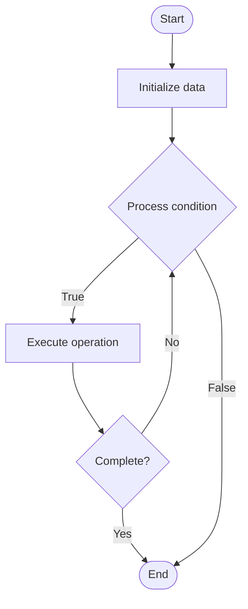

# Exokernel Design

1. **Name of Algorithm**  

## Code Files


## Algorithm Visualization

### Flowchart (ASCII)


```
Exokernel Design Flowchart:

┌─────────────┐
│   Start     │
└──────┬──────┘
       │
       ▼
┌─────────────┐
│  Initialize │
│   data      │
└──────┬──────┘
       │
       ▼
┌─────────────┐      Yes
│  Process   ├──────┐
│  condition?│      │
└──────┬──────┘      │
       │ No          │
       ▼             │
┌─────────────┐      │
│  Execute   │      │
│  operation │      │
└──────┬──────┘      │
       │             │
       └─────────────┘
       │
       ▼
┌─────────────┐
│    End      │
└─────────────┘
```


### Step-by-Step Execution


```
Exokernel Design Step-by-Step Execution:

Input: [example data]

Step 1: Initialize
State: [initial state]

Step 2: Process
State: [intermediate state]

Step 3: Finalize
State: [final state]

Result: [output]
```


### Interactive Flowchart (Mermaid)





> **Note**: Mermaid diagrams are rendered automatically on GitHub. For local viewing, use a Mermaid-compatible Markdown viewer.
- [Python Implementation](semester_09/lecture_55_advanced_os/exokernel_design/algorithm.py)
- [Java Implementation](semester_09/lecture_55_advanced_os/exokernel_design/Algorithm.java)
- [Python Tests](semester_09/lecture_55_advanced_os/exokernel_design/test_algorithm.py)


   Exokernel Design

2. **What problem does it solve? (1 sentence)**  
Minimizes kernel functionality to provide only hardware abstraction and resource protection, allowing applications to implement their own OS abstractions for maximum performance and flexibility.

3. **Intuition (plain-language explanation)**  
   Like a bare-bones apartment building: exokernel design is like a minimal apartment building that only provides the essentials (structure, utilities, security) - instead of the building management dictating how you organize your apartment (like traditional OS), you get a basic space (hardware abstraction) and organize it however you want (application-level OS abstractions) - this gives you maximum control and performance, but requires you to do more work yourself.

4. **Inputs & Outputs**  
   - Input: Hardware resources, application requests, resource allocation policies.  
   - Output: Minimal kernel, hardware abstraction, resource protection, application-level abstractions.

5. **Step-by-step description (5–10 lines max)**  
1. Minimize kernel: implement only essential kernel functions (hardware abstraction, protection).
2. Expose hardware: provide low-level access to hardware resources.
3. Protect resources: implement secure multiplexing of hardware resources.
4. Library OS: applications use library OS for higher-level abstractions.
5. Application control: applications have fine-grained control over resource management.
6. Optimize: applications can optimize resource usage for their specific needs.
7. Secure: kernel ensures security and isolation between applications.
8. Performance: minimize kernel overhead for maximum performance.

6. **Tiny example (hand-simulated)**  
   Exokernel: minimal kernel → provides: hardware abstraction (CPU, memory, disk), resource protection (secure multiplexing) → application: implements own file system, network stack, scheduler using library OS → control: application optimizes file system for its workload → performance: minimal kernel overhead → flexibility: application has full control → exokernel design.

7. **Time & Space Complexity**  
   - Time: O(1) for kernel operations (minimal overhead), O(a) for application-level abstractions where a is application complexity.  
   - Space: O(k) where k is minimal kernel size (much smaller than monolithic kernel).

8. **Strengths**  
- Performance: minimal kernel overhead enables maximum performance.
- Flexibility: applications can implement custom OS abstractions.
- Control: applications have fine-grained control over resources.

9. **Weaknesses / limitations**  
- Complexity: applications must implement more functionality themselves.
- Portability: less portable due to application-specific abstractions.
- Security: requires careful design to maintain security with minimal kernel.

10. **Compare with alternatives**  
    Alternatives: Monolithic Kernel, Microkernel, Hybrid Kernel, Library OS

11. **30-second explanation (your own words)**  
Minimizes kernel functionality to provide only hardware abstraction and resource protection, allowing applications to implement their own OS abstractions for maximum performance and flexibility.

*Sources: Adapted from standard university textbooks and Wikipedia summaries.*
