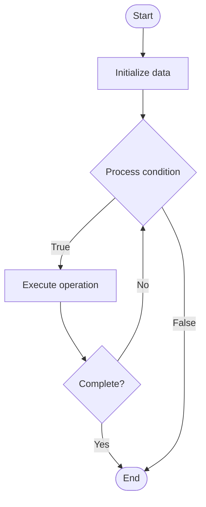

# Microkernel Architecture

Name of Algorithm  

## Code Files


## Algorithm Visualization

### Flowchart (ASCII)


```
Microkernel Architecture Flowchart:

┌─────────────┐
│   Start     │
└──────┬──────┘
       │
       ▼
┌─────────────┐
│  Initialize │
│   data      │
└──────┬──────┘
       │
       ▼
┌─────────────┐      Yes
│  Process   ├──────┐
│  condition?│      │
└──────┬──────┘      │
       │ No          │
       ▼             │
┌─────────────┐      │
│  Execute   │      │
│  operation │      │
└──────┬──────┘      │
       │             │
       └─────────────┘
       │
       ▼
┌─────────────┐
│    End      │
└─────────────┘
```


### Step-by-Step Execution


```
Microkernel Architecture Step-by-Step Execution:

Input: [example data]

Step 1: Initialize
State: [initial state]

Step 2: Process
State: [intermediate state]

Step 3: Finalize
State: [final state]

Result: [output]
```


### Interactive Flowchart (Mermaid)





> **Note**: Mermaid diagrams are rendered automatically on GitHub. For local viewing, use a Mermaid-compatible Markdown viewer.
- [Python Implementation](/code/semester_09/lecture_55_advanced_os/microkernel_architecture/algorithm.py)
- [Java Implementation](/code/semester_09/lecture_55_advanced_os/microkernel_architecture/Algorithm.java)
- [Python Tests](/code/semester_09/lecture_55_advanced_os/microkernel_architecture/test_algorithm.py)


   Microkernel Architecture

What problem does it solve? (1 sentence)  
   Minimizes kernel to essential functions (IPC, scheduling, memory management), moving most OS services to user-space servers, improving modularity, security, and maintainability.

Intuition (plain-language explanation)  
   Like a minimal government with specialized agencies: microkernel architecture is like a minimal central government (kernel) that only handles essential functions (like basic laws and coordination), while specialized agencies (user-space servers) handle specific services (like file systems, network stacks) - if an agency (server) crashes, it doesn't bring down the whole government (system), and you can update or replace agencies (servers) without changing the core government (kernel).

Inputs & Outputs  
   - Input: System calls, IPC messages, hardware interrupts, resource requests.  
   - Output: Minimal kernel, user-space servers, modular OS services, improved reliability.

Step-by-step description (5–10 lines max)  
Minimize kernel: implement only essential functions in kernel (IPC, scheduling, memory).
Create servers: implement OS services as user-space servers (file system, network, device drivers).
IPC mechanism: provide inter-process communication for kernel-server and server-server communication.
Message passing: use message passing for all communication (no shared memory in kernel).
Isolate servers: run servers in separate address spaces for isolation.
Handle failures: if server crashes, only that service fails (system continues).
Update servers: update or replace servers without kernel changes.
Secure: kernel enforces security and isolation between servers.
Optimize: optimize IPC performance for efficient communication.

Tiny example (hand-simulated)  
   Microkernel: minimal kernel (IPC, scheduling, memory) → user-space servers: file system server, network server, device driver servers → IPC: kernel and servers communicate via messages → isolation: file server crash doesn't crash system → update: replace file server without kernel changes → modularity: add new services as new servers → microkernel architecture.

Time & Space Complexity  
   - Time: O(1) for kernel operations, O(m) for IPC where m is message size (may be slower than monolithic).  
   - Space: O(k + s) where k is kernel size, s is total server size (smaller kernel, distributed services).

Strengths  
- Modularity: services can be updated or replaced independently.
- Reliability: server failures don't crash entire system.
- Security: better isolation between OS components.

Weaknesses / limitations  
- Performance: IPC overhead may be higher than monolithic kernel.
- Complexity: managing multiple servers adds complexity.
- Coordination: requires careful coordination between servers.

Compare with alternatives  
    Alternatives: Monolithic Kernel, Hybrid Kernel, Exokernel, Modular Kernel

30-second explanation (your own words)  
    Minimizes kernel to essential functions (IPC, scheduling, memory management), moving most OS services to user-space servers, improving modularity, security, and maintainability.

*Sources: Adapted from standard university textbooks and Wikipedia summaries.*
