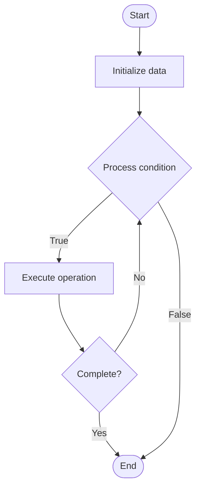

# OS Security Models

## Учебные материалы

- [Школьный уровень](school.ru.md)
- [Университетский уровень](univer.ru.md)

## Algorithm Visualization

### Flowchart (ASCII)

```
OS Security Models Flowchart:

┌─────────────┐
│   Start     │
└──────┬──────┘
       │
       ▼
┌─────────────┐
│  Initialize │
│   data      │
└──────┬──────┘
       │
       ▼
┌─────────────┐      Yes
│  Process   ├──────┐
│  condition?│      │
└──────┬──────┘      │
       │ No          │
       ▼             │
┌─────────────┐      │
│  Execute   │      │
│  operation │      │
└──────┬──────┘      │
       │             │
       └─────────────┘
       │
       ▼
┌─────────────┐
│    End      │
└─────────────┘
```

### Step-by-Step Execution

```
OS Security Models Step-by-Step Execution:

Input: [example data]

Step 1: Initialize
State: [initial state]

Step 2: Process
State: [intermediate state]

Step 3: Finalize
State: [final state]

Result: [output]
```

### Interactive Flowchart (Mermaid)



> **Note**: Mermaid diagrams are rendered automatically on GitHub. For local viewing, use a Mermaid-compatible Markdown viewer.

- [Python Implementation](/code/semester_09/lecture_55_advanced_os/os_security_models/algorithm.py)
- [Java Implementation](/code/semester_09/lecture_55_advanced_os/os_security_models/Algorithm.java)
- [Python Tests](/code/semester_09/lecture_55_advanced_os/os_security_models/test_algorithm.py)

   OS Security Models

What problem does it solve? (1 sentence)  
   Defines security policies and mechanisms for controlling access to system resources, protecting against unauthorized access, and ensuring system integrity and confidentiality.

Intuition (plain-language explanation)  
   Like a building's security system: OS security models are like a building's comprehensive security system - you have access control (who can enter which rooms), authentication (checking IDs at the entrance), authorization (what each person is allowed to do), and monitoring (security cameras) - the security model defines the rules (like 'only employees can access the server room') and the mechanisms (like keycards and cameras) that enforce those rules to protect the building (operating system).

Inputs & Outputs  

  - Input: User credentials, access requests, security policies, system resources, audit logs.  
  - Output: Access control decisions, security enforcement, audit trails, protected system.

Step-by-step description (5–10 lines max)  
Define model: choose security model (DAC, MAC, RBAC, etc.).
Authenticate: verify user identity (passwords, certificates, biometrics).
Authorize: determine user permissions based on security model.
Enforce: enforce access control on resource access requests.
Audit: log security events and access attempts.
Monitor: continuously monitor for security violations and threats.
Update: update security policies and permissions as needed.
Protect: protect system integrity and prevent unauthorized modifications.
Isolate: isolate processes and users to prevent interference.
Encrypt: encrypt sensitive data at rest and in transit.

Tiny example (hand-simulated)  
   OS security model: RBAC (Role-Based Access Control) → roles: admin, user, guest → permissions: admin (full access), user (read/write own files), guest (read only) → authenticate: user logs in → authorize: check user role → enforce: user tries to delete system file → denied (not admin) → audit: log access attempt → security enforced.

Time & Space Complexity  

  - Time: O(1) for access control checks, O(u) for authentication where u is user database size.  
  - Space: O(p + a) where p is policy size, a is audit log size.

Strengths  

- Protection: protects system from unauthorized access and attacks.
- Flexibility: supports various security models (DAC, MAC, RBAC).
- Auditability: provides audit trails for security monitoring.

Weaknesses / limitations  

- Complexity: implementing comprehensive security can be complex.
- Performance: security checks add overhead to system operations.
- Usability: strict security may impact user experience.

Compare with alternatives  
    Alternatives: Discretionary Access Control (DAC), Mandatory Access Control (MAC), Role-Based Access Control (RBAC), Capability-Based Security

30-second explanation (your own words)  
    Defines security policies and mechanisms for controlling access to system resources, protecting against unauthorized access, and ensuring system integrity and confidentiality.

*Sources: Adapted from standard university textbooks and Wikipedia summaries.*
