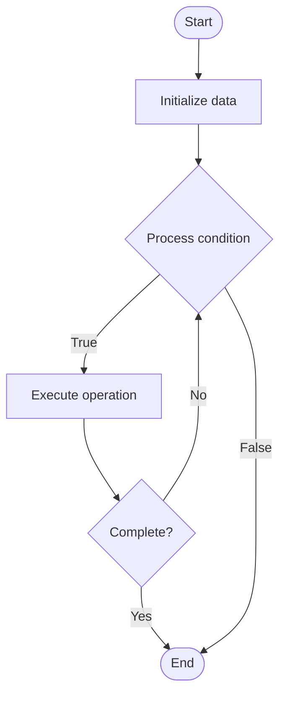

# Real-Time Systems

## Учебные материалы

- [Школьный уровень](school.ru.md)
- [Университетский уровень](univer.ru.md)

## Algorithm Visualization

### Flowchart (ASCII)

```
Real-Time Systems Flowchart:

┌─────────────┐
│   Start     │
└──────┬──────┘
       │
       ▼
┌─────────────┐
│  Initialize │
│   data      │
└──────┬──────┘
       │
       ▼
┌─────────────┐      Yes
│  Process   ├──────┐
│  condition?│      │
└──────┬──────┘      │
       │ No          │
       ▼             │
┌─────────────┐      │
│  Execute   │      │
│  operation │      │
└──────┬──────┘      │
       │             │
       └─────────────┘
       │
       ▼
┌─────────────┐
│    End      │
└─────────────┘
```

### Step-by-Step Execution

```
Real-Time Systems Step-by-Step Execution:

Input: [example data]

Step 1: Initialize
State: [initial state]

Step 2: Process
State: [intermediate state]

Step 3: Finalize
State: [final state]

Result: [output]
```

### Interactive Flowchart (Mermaid)



> **Note**: Mermaid diagrams are rendered automatically on GitHub. For local viewing, use a Mermaid-compatible Markdown viewer.

- [Python Implementation](/code/semester_09/lecture_55_advanced_os/real_time_systems/algorithm.py)
- [Java Implementation](/code/semester_09/lecture_55_advanced_os/real_time_systems/Algorithm.java)
- [Python Tests](/code/semester_09/lecture_55_advanced_os/real_time_systems/test_algorithm.py)

   Real-Time Systems

What problem does it solve? (1 sentence)  
   Processes tasks and responds to events within strict timing constraints, ensuring predictable and deterministic behavior for time-critical applications.

Intuition (plain-language explanation)  
   Like a traffic light controller: real-time systems are like traffic light controllers that must respond within strict time limits - if a car approaches (event), the system must change the light (response) within a guaranteed time (deadline) - missing the deadline (like a light not changing) can have serious consequences (accidents) - the system must be predictable and always meet timing requirements, unlike regular systems that prioritize average performance.

Inputs & Outputs  

  - Input: Real-time events, tasks with deadlines, timing constraints, sensor data, control signals.  
  - Output: Timely responses, deterministic behavior, guaranteed deadlines, real-time control.

Step-by-step description (5–10 lines max)  
Define requirements: specify timing constraints and deadlines for tasks.
Choose scheduler: select real-time scheduler (rate monotonic, earliest deadline first).
Analyze schedulability: verify all tasks can meet deadlines (schedulability analysis).
Prioritize: assign priorities based on deadlines (shorter deadline = higher priority).
Schedule: schedule tasks to meet all deadlines.
Monitor: continuously monitor task execution and timing.
Handle interrupts: process real-time interrupts with minimal latency.
Guarantee: ensure all tasks complete before deadlines.
Optimize: optimize for predictability over average performance.
Test: thoroughly test timing behavior under various conditions.

Tiny example (hand-simulated)  
   Real-time system: flight control → task: update control surfaces every 10ms (deadline) → scheduler: rate monotonic → priority: highest → guarantee: always completes within 8ms → interrupt: sensor reading → process within 1ms → deterministic: predictable timing → safety: critical system → real-time guarantees met.

Time & Space Complexity  

  - Time: O(n log n) for scheduling where n is number of tasks, O(1) for interrupt handling.  
  - Space: O(n) where n is number of tasks (task control blocks and scheduling data).

Strengths  

- Predictability: guarantees timing behavior and deadline compliance.
- Safety: critical for safety-critical applications (avionics, medical devices).
- Determinism: provides deterministic and repeatable behavior.

Weaknesses / limitations  

- Complexity: real-time scheduling and analysis is complex.
- Resource constraints: requires careful resource management.
- Flexibility: less flexible than general-purpose systems.

Compare with alternatives  
    Alternatives: General-Purpose OS, Soft Real-Time Systems, Event-Driven Systems, Time-Triggered Systems

30-second explanation (your own words)  

*Sources: Adapted from standard university textbooks and Wikipedia summaries.*
