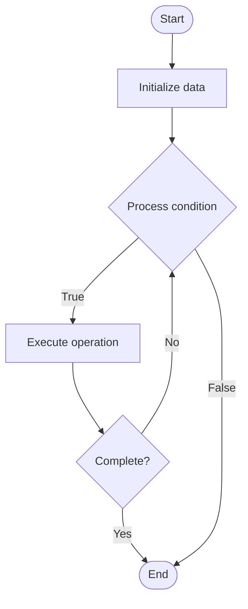

# Cache Optimization

1. **Name of Algorithm**  

## Code Files


## Algorithm Visualization

### Flowchart (ASCII)


```
Cache Optimization Flowchart:

┌─────────────┐
│   Start     │
└──────┬──────┘
       │
       ▼
┌─────────────┐
│  Initialize │
│   data      │
└──────┬──────┘
       │
       ▼
┌─────────────┐      Yes
│  Process   ├──────┐
│  condition?│      │
└──────┬──────┘      │
       │ No          │
       ▼             │
┌─────────────┐      │
│  Execute   │      │
│  operation │      │
└──────┬──────┘      │
       │             │
       └─────────────┘
       │
       ▼
┌─────────────┐
│    End      │
└─────────────┘
```


### Step-by-Step Execution


```
Cache Optimization Step-by-Step Execution:

Input: [example data]

Step 1: Initialize
State: [initial state]

Step 2: Process
State: [intermediate state]

Step 3: Finalize
State: [final state]

Result: [output]
```


### Interactive Flowchart (Mermaid)





> **Note**: Mermaid diagrams are rendered automatically on GitHub. For local viewing, use a Mermaid-compatible Markdown viewer.
- [Python Implementation](semester_09/lecture_56_os_performance/cache_optimization/algorithm.py)
- [Java Implementation](semester_09/lecture_56_os_performance/cache_optimization/Algorithm.java)
- [Python Tests](semester_09/lecture_56_os_performance/cache_optimization/test_algorithm.py)


   Cache Optimization

2. **What problem does it solve? (1 sentence)**  
   Optimizes cache usage and performance through techniques like cache-aware algorithms, prefetching, cache replacement policies, and memory layout optimization, improving system performance by reducing cache misses.

3. **Intuition (plain-language explanation)**  
   Like organizing a workspace: Cache Optimization is like organizing your workspace for efficiency - you keep frequently used items (hot data) close at hand (in cache), organize items logically (memory layout), and predict what you'll need next (prefetching) - just as an organized workspace makes work faster, cache optimization makes programs faster by reducing memory access time.

4. **Inputs & Outputs**  
   - Input: Memory access patterns, cache parameters, data structures, algorithms, prefetch hints, cache policies.  
   - Output: Optimized cache usage, reduced cache misses, improved performance, better memory layout, optimized algorithms.

5. **Step-by-step description (5–10 lines max)**  
1. Analyze: analyze memory access patterns.
2. Identify: identify hot and cold data.
3. Layout: optimize memory layout (cache-line alignment).
4. Prefetch: implement prefetching strategies.
5. Replace: optimize cache replacement policy.
6. Block: use cache-blocking for algorithms.
7. Tune: tune cache parameters.
8. Measure: measure cache performance.
9. Iterate: iterate optimizations.
10. Validate: validate performance improvements.

6. **Tiny example (hand-simulated)**  
   Cache Optimization: pattern: matrix multiplication → analyze: access patterns → layout: optimize memory layout → block: cache-blocking → prefetch: prefetch next block → result: 3x speedup, 50% cache miss reduction → Cache Optimization successful.

7. **Time & Space Complexity**  
   - Time: O(n) where n is data size (optimization overhead, but reduces actual access time).  
   - Space: O(c) where c is cache size (cache storage).

8. **Strengths**  
- Performance: significantly improves performance through cache efficiency.
- Scalability: improves scalability by reducing memory bottlenecks.
- Energy: reduces energy consumption through fewer memory accesses.

9. **Weaknesses / limitations**  
- Complexity: cache optimization can be complex.
- Platform: optimizations may be platform-specific.
- Trade-offs: may require trade-offs with other optimizations.

10. **Compare with alternatives**  
    Alternatives: No Optimization, Basic Caching, Hardware Prefetching, Memory Pooling

11. **30-second explanation (your own words)**  
    Optimizes cache usage and performance through techniques like cache-aware algorithms, prefetching, cache replacement policies, and memory layout optimization, improving system performance by reducing cache misses.

*Sources: Adapted from standard university textbooks and Wikipedia summaries.*
