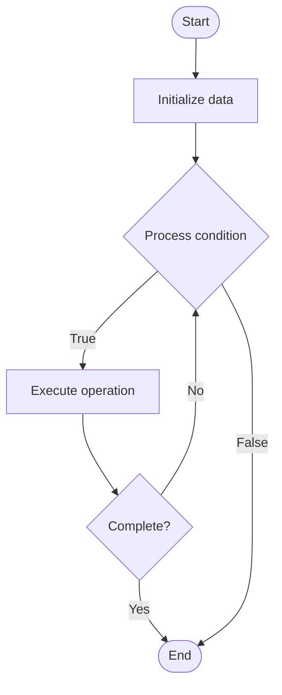

# Advanced CPU Scheduling

Name of Algorithm  

## Code Files


## Algorithm Visualization

### Flowchart (ASCII)


```
Advanced CPU Scheduling Flowchart:

┌─────────────┐
│   Start     │
└──────┬──────┘
       │
       ▼
┌─────────────┐
│  Initialize │
│   data      │
└──────┬──────┘
       │
       ▼
┌─────────────┐      Yes
│  Process   ├──────┐
│  condition?│      │
└──────┬──────┘      │
       │ No          │
       ▼             │
┌─────────────┐      │
│  Execute   │      │
│  operation │      │
└──────┬──────┘      │
       │             │
       └─────────────┘
       │
       ▼
┌─────────────┐
│    End      │
└─────────────┘
```


### Step-by-Step Execution


```
Advanced CPU Scheduling Step-by-Step Execution:

Input: [example data]

Step 1: Initialize
State: [initial state]

Step 2: Process
State: [intermediate state]

Step 3: Finalize
State: [final state]

Result: [output]
```


### Interactive Flowchart (Mermaid)





> **Note**: Mermaid diagrams are rendered automatically on GitHub. For local viewing, use a Mermaid-compatible Markdown viewer.
- [Python Implementation](/code/semester_09/lecture_56_os_performance/cpu_scheduling_advanced/algorithm.py)
- [Java Implementation](/code/semester_09/lecture_56_os_performance/cpu_scheduling_advanced/Algorithm.java)
- [Python Tests](/code/semester_09/lecture_56_os_performance/cpu_scheduling_advanced/test_algorithm.py)


   Advanced CPU Scheduling

What problem does it solve? (1 sentence)  
Implements sophisticated CPU scheduling algorithms that optimize for multiple objectives (throughput, latency, fairness, energy efficiency) using multi-level queues, priority inheritance, and dynamic priority adjustment.

Intuition (plain-language explanation)  
   Like a smart traffic management system: advanced CPU scheduling is like a sophisticated traffic management system that doesn't just use simple rules (like first-come-first-served) but adapts dynamically - it has multiple lanes (priority queues) for different types of traffic (process types), adjusts priorities based on behavior (interactive processes get priority boost), prevents starvation (aging), and optimizes for multiple goals (fast response for users, high throughput for batch jobs, energy efficiency for mobile devices).

Inputs & Outputs  
   - Input: Processes with priorities, scheduling policies, CPU cores, workload characteristics, performance goals.  
   - Output: Scheduled processes, optimized CPU utilization, balanced load, improved performance metrics.

Step-by-step description (5–10 lines max)  
Classify processes: categorize processes by type (interactive, batch, real-time).
Create queues: set up multi-level priority queues for different process types.
Assign priorities: assign initial priorities based on process characteristics.
Schedule: select next process to run using scheduling algorithm (CFS, O(1), etc.).
Adjust priorities: dynamically adjust priorities based on behavior (interactive boost, aging).
Handle preemption: preempt running process when higher priority process arrives.
Balance load: distribute processes across multiple CPU cores (load balancing).
Prevent starvation: ensure all processes eventually get CPU time (aging, fairness).
Optimize: tune scheduling parameters for specific workload and goals.
Monitor: track scheduling metrics (wait time, turnaround time, throughput).

Tiny example (hand-simulated)  
   Advanced CPU scheduling: CFS (Completely Fair Scheduler) → processes in red-black tree by virtual runtime → interactive process (browser) gets priority boost → batch process (compiler) runs in background → real-time process (audio) gets guaranteed CPU → load balancing: distribute across 8 CPU cores → fairness: all processes get fair share → performance: low latency for interactive, high throughput for batch → advanced scheduling operational.

Time & Space Complexity  
   - Time: O(log n) for CFS where n is number of processes, O(1) for O(1) scheduler.  
   - Space: O(n) where n is number of processes (scheduling data structures).

Strengths  
- Optimization: optimizes for multiple objectives (latency, throughput, fairness).
- Adaptability: adapts to different workload characteristics.
- Scalability: handles large numbers of processes efficiently.

Weaknesses / limitations  
- Complexity: more complex than simple scheduling algorithms.
- Tuning: requires careful tuning for optimal performance.
- Overhead: scheduling overhead may be higher than simple algorithms.

Compare with alternatives  
    Alternatives: Round Robin, Priority Scheduling, Multilevel Queue, Lottery Scheduling

30-second explanation (your own words)  
Implements sophisticated CPU scheduling algorithms that optimize for multiple objectives (throughput, latency, fairness, energy efficiency) using multi-level queues, priority inheritance, and dynamic priority adjustment.

*Sources: Adapted from standard university textbooks and Wikipedia summaries.*
