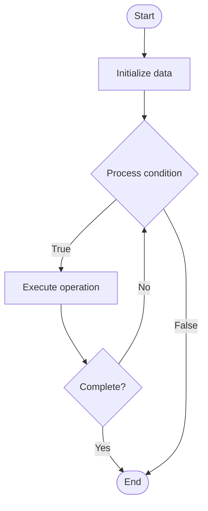

# I/O Scheduling

## Учебные материалы

- [Школьный уровень](school.ru.md)
- [Университетский уровень](univer.ru.md)

## Algorithm Visualization

### Flowchart (ASCII)

```
I/O Scheduling Flowchart:

┌─────────────┐
│   Start     │
└──────┬──────┘
       │
       ▼
┌─────────────┐
│  Initialize │
│   data      │
└──────┬──────┘
       │
       ▼
┌─────────────┐      Yes
│  Process   ├──────┐
│  condition?│      │
└──────┬──────┘      │
       │ No          │
       ▼             │
┌─────────────┐      │
│  Execute   │      │
│  operation │      │
└──────┬──────┘      │
       │             │
       └─────────────┘
       │
       ▼
┌─────────────┐
│    End      │
└─────────────┘
```

### Step-by-Step Execution

```
I/O Scheduling Step-by-Step Execution:

Input: [example data]

Step 1: Initialize
State: [initial state]

Step 2: Process
State: [intermediate state]

Step 3: Finalize
State: [final state]

Result: [output]
```

### Interactive Flowchart (Mermaid)



> **Note**: Mermaid diagrams are rendered automatically on GitHub. For local viewing, use a Mermaid-compatible Markdown viewer.

- [Python Implementation](/code/semester_09/lecture_56_os_performance/io_scheduling/algorithm.py)
- [Java Implementation](/code/semester_09/lecture_56_os_performance/io_scheduling/Algorithm.java)
- [Python Tests](/code/semester_09/lecture_56_os_performance/io_scheduling/test_algorithm.py)

   I/O Scheduling

What problem does it solve? (1 sentence)  
   Optimizes the order of I/O requests to storage devices, reducing seek time, improving throughput, and ensuring fair access to I/O resources for multiple processes.

Intuition (plain-language explanation)  
Like organizing errands efficiently: I/O scheduling is like planning your errands to minimize travel time - instead of going to stores in random order (random I/O), you group nearby stores together (elevator algorithm - serve requests in one direction), or prioritize urgent errands (deadline scheduling), or ensure everyone gets their turn fairly (fair queuing) - the goal is to minimize disk head movement (travel time) and maximize throughput (errands completed per hour).

Inputs & Outputs  

  - Input: I/O requests, disk geometry, request priorities, deadlines, I/O patterns.  
  - Output: Optimized I/O order, reduced seek time, improved throughput, fair I/O access.

Step-by-step description (5–10 lines max)  
Queue requests: collect I/O requests from processes in I/O queue.
Analyze requests: examine request locations, priorities, and deadlines.
Choose algorithm: select scheduling algorithm (FCFS, SSTF, SCAN, C-SCAN, deadline, etc.).
Reorder: reorder requests to optimize for seek time or fairness.
Serve requests: execute I/O requests in optimized order.
Update queue: add new requests and remove completed ones.
Balance: balance between throughput optimization and fairness.
Handle priorities: prioritize requests based on process priorities or deadlines.
Optimize: tune scheduling parameters for specific storage device characteristics.
Monitor: track I/O performance metrics (throughput, latency, queue depth).

Tiny example (hand-simulated)  
   I/O scheduling: 10 I/O requests to disk → requests at sectors: 100, 50, 200, 150, 25 → FCFS: serve in order (100→50→200→150→25) → seek time: high → SSTF: serve nearest first (100→150→200→50→25) → seek time: lower → SCAN: elevator algorithm (100→150→200→end→50→25) → seek time: lowest → throughput: 2x improvement → I/O scheduling optimized.

Time & Space Complexity  

  - Time: O(n log n) for sorting requests where n is queue size, O(1) for simple algorithms.  
  - Space: O(n) where n is number of queued I/O requests.

Strengths  

- Performance: significantly improves I/O throughput and reduces latency.
- Efficiency: minimizes disk head movement and seek time.
- Fairness: ensures fair access to I/O resources.

Weaknesses / limitations  

- Complexity: more complex algorithms add overhead.
- Starvation: some algorithms may cause request starvation.
- Device-specific: optimal algorithm depends on storage device type.

Compare with alternatives  
    Alternatives: First-Come-First-Served (FCFS), Shortest Seek Time First (SSTF), SCAN (Elevator), Deadline Scheduling

30-second explanation (your own words)  
    Optimizes the order of I/O requests to storage devices, reducing seek time, improving throughput, and ensuring fair access to I/O resources for multiple processes.

*Sources: Adapted from standard university textbooks and Wikipedia summaries.*


## References

- [Io Scheduling - Wikipedia](https://en.wikipedia.org/wiki/Io%20Scheduling)
