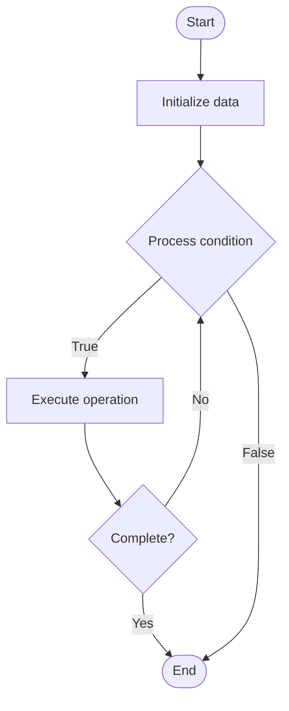

# Kernel Tuning

1. **Name of Algorithm**  

## Code Files


## Algorithm Visualization

### Flowchart (ASCII)


```
Kernel Tuning Flowchart:

┌─────────────┐
│   Start     │
└──────┬──────┘
       │
       ▼
┌─────────────┐
│  Initialize │
│   data      │
└──────┬──────┘
       │
       ▼
┌─────────────┐      Yes
│  Process   ├──────┐
│  condition?│      │
└──────┬──────┘      │
       │ No          │
       ▼             │
┌─────────────┐      │
│  Execute   │      │
│  operation │      │
└──────┬──────┘      │
       │             │
       └─────────────┘
       │
       ▼
┌─────────────┐
│    End      │
└─────────────┘
```


### Step-by-Step Execution


```
Kernel Tuning Step-by-Step Execution:

Input: [example data]

Step 1: Initialize
State: [initial state]

Step 2: Process
State: [intermediate state]

Step 3: Finalize
State: [final state]

Result: [output]
```


### Interactive Flowchart (Mermaid)





> **Note**: Mermaid diagrams are rendered automatically on GitHub. For local viewing, use a Mermaid-compatible Markdown viewer.
- [Python Implementation](semester_09/lecture_56_os_performance/kernel_tuning/algorithm.py)
- [Java Implementation](semester_09/lecture_56_os_performance/kernel_tuning/Algorithm.java)
- [Python Tests](semester_09/lecture_56_os_performance/kernel_tuning/test_algorithm.py)


   Kernel Tuning

2. **What problem does it solve? (1 sentence)**  
   Optimizes operating system kernel parameters and configuration to improve performance, resource utilization, and system behavior for specific workloads and hardware.

3. **Intuition (plain-language explanation)**  
   Like tuning a car's engine: kernel tuning is like adjusting a car's engine settings for optimal performance - you adjust various parameters (like fuel mixture, timing, idle speed) to match your driving style (workload) and conditions (hardware) - the default settings work for most cases, but fine-tuning can significantly improve performance for specific scenarios (like racing vs fuel economy).

4. **Inputs & Outputs**  
   - Input: Kernel parameters, system configuration, workload characteristics, hardware specifications, performance requirements.  
   - Output: Tuned kernel, optimized performance, improved resource utilization, better system behavior.

5. **Step-by-step description (5–10 lines max)**  
1. Analyze workload: understand system workload and performance requirements.
2. Identify bottlenecks: identify performance bottlenecks and resource constraints.
3. Review parameters: examine current kernel parameters and their values.
4. Research: research optimal parameter values for specific workload and hardware.
5. Adjust parameters: modify kernel parameters (sysctl, /proc, /sys).
6. Test changes: test system behavior and performance with new parameters.
7. Measure: measure performance improvements and side effects.
8. Iterate: fine-tune parameters based on measurements.
9. Document: document changes and their effects.
10. Monitor: continuously monitor system performance and adjust as needed.

6. **Tiny example (hand-simulated)**  
   Kernel tuning: web server workload → identify: network connections bottleneck → adjust: net.core.somaxconn = 4096 (increase connection queue) → adjust: net.ipv4.tcp_tw_reuse = 1 (reuse TIME_WAIT sockets) → adjust: vm.swappiness = 10 (reduce swapping) → test: load test server → measure: connections handled: 10K → 50K → performance: 5x improvement → kernel tuned.

7. **Time & Space Complexity**  
   - Time: O(1) for parameter changes, O(t) for testing where t is test duration.  
   - Space: O(1) (parameter storage is minimal).

8. **Strengths**  
- Performance: can significantly improve system performance.
- Customization: allows customization for specific workloads.
- Flexibility: can adjust system behavior without recompiling kernel.

9. **Weaknesses / limitations**  
- Complexity: requires deep understanding of kernel internals.
- Risk: incorrect tuning can degrade performance or cause instability.
- Maintenance: requires ongoing monitoring and adjustment.

10. **Compare with alternatives**  
    Alternatives: Default Configuration, Kernel Recompilation, Hardware Upgrades, Application Optimization

11. **30-second explanation (your own words)**  
    Optimizes operating system kernel parameters and configuration to improve performance, resource utilization, and system behavior for specific workloads and hardware.

*Sources: Adapted from standard university textbooks and Wikipedia summaries.*
