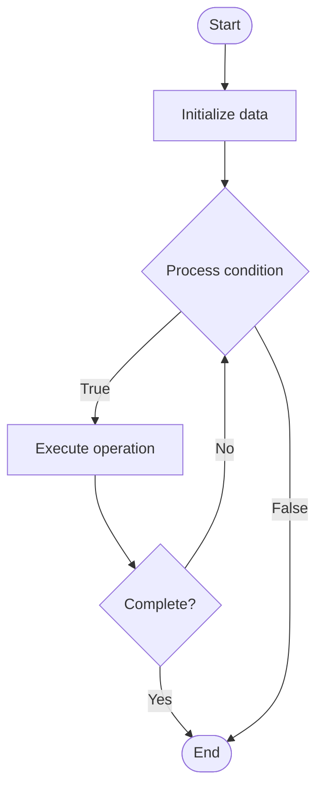

# Memory Optimization

## Учебные материалы

- [Школьный уровень](school.ru.md)
- [Университетский уровень](univer.ru.md)

## Algorithm Visualization

### Flowchart (ASCII)

```
Memory Optimization Flowchart:

┌─────────────┐
│   Start     │
└──────┬──────┘
       │
       ▼
┌─────────────┐
│  Initialize │
│   data      │
└──────┬──────┘
       │
       ▼
┌─────────────┐      Yes
│  Process   ├──────┐
│  condition?│      │
└──────┬──────┘      │
       │ No          │
       ▼             │
┌─────────────┐      │
│  Execute   │      │
│  operation │      │
└──────┬──────┘      │
       │             │
       └─────────────┘
       │
       ▼
┌─────────────┐
│    End      │
└─────────────┘
```

### Step-by-Step Execution

```
Memory Optimization Step-by-Step Execution:

Input: [example data]

Step 1: Initialize
State: [initial state]

Step 2: Process
State: [intermediate state]

Step 3: Finalize
State: [final state]

Result: [output]
```

### Interactive Flowchart (Mermaid)



> **Note**: Mermaid diagrams are rendered automatically on GitHub. For local viewing, use a Mermaid-compatible Markdown viewer.

- [Python Implementation](/code/semester_09/lecture_56_os_performance/memory_optimization/algorithm.py)
- [Java Implementation](/code/semester_09/lecture_56_os_performance/memory_optimization/Algorithm.java)
- [Python Tests](/code/semester_09/lecture_56_os_performance/memory_optimization/test_algorithm.py)

What problem does it solve? (1 sentence)  
   Optimizes memory usage and allocation strategies to reduce memory footprint, improve cache performance, minimize fragmentation, and enhance overall system performance.

Intuition (plain-language explanation)  
   Like organizing a warehouse efficiently: memory optimization is like organizing a warehouse to maximize space usage and minimize waste - you use compact storage (memory pooling), organize items by size (slab allocator), reuse space efficiently (garbage collection), and minimize empty gaps (fragmentation reduction) - the goal is to store more in less space and access it faster.

Inputs & Outputs  

  - Input: Memory allocation requests, memory usage patterns, cache characteristics, fragmentation data, performance requirements.  
  - Output: Optimized memory usage, reduced fragmentation, improved cache performance, better allocation efficiency.

Step-by-step description (5–10 lines max)  
Analyze usage: study memory allocation patterns and usage characteristics.
Identify issues: identify memory leaks, fragmentation, and inefficient allocations.
Choose allocator: select appropriate memory allocator (glibc malloc, jemalloc, tcmalloc).
Optimize allocation: use memory pools, object pools, or custom allocators for frequent allocations.
Reduce fragmentation: minimize memory fragmentation through allocation strategies.
Improve locality: optimize data layout for cache locality.
Implement pooling: use memory pools for objects of same size.
Garbage collect: implement or tune garbage collection for managed languages.
Monitor: track memory usage, fragmentation, and allocation patterns.
Tune: adjust allocation strategies based on measurements.

Tiny example (hand-simulated)  
   Memory optimization: application with frequent small allocations → problem: fragmentation, slow allocation → solution: memory pool for 64-byte objects → allocate from pool: O(1) → reduce fragmentation: objects same size → improve cache: objects close together → result: allocation time: 100ns → 10ns (10x faster) → fragmentation: 30% → 5% → memory optimized.

Time & Space Complexity  

  - Time: O(1) for pool allocation, O(log n) for general allocators where n is heap size.  
  - Space: O(m) where m is memory usage (optimization reduces overhead, not total usage).

Strengths  

- Performance: improves allocation speed and reduces memory overhead.
- Efficiency: reduces fragmentation and improves memory utilization.
- Cache performance: better data locality improves cache hit rates.

Weaknesses / limitations  

- Complexity: custom allocators add complexity to codebase.
- Trade-offs: some optimizations may increase code complexity.
- Workload-dependent: optimal strategies vary by workload.

Compare with alternatives  
    Alternatives: Default Allocators, Garbage Collection, Memory Mapping, Compression

30-second explanation (your own words)  
    Optimizes memory usage and allocation strategies to reduce memory footprint, improve cache performance, minimize fragmentation, and enhance overall system performance.

*Sources: Adapted from standard university textbooks and Wikipedia summaries.*
