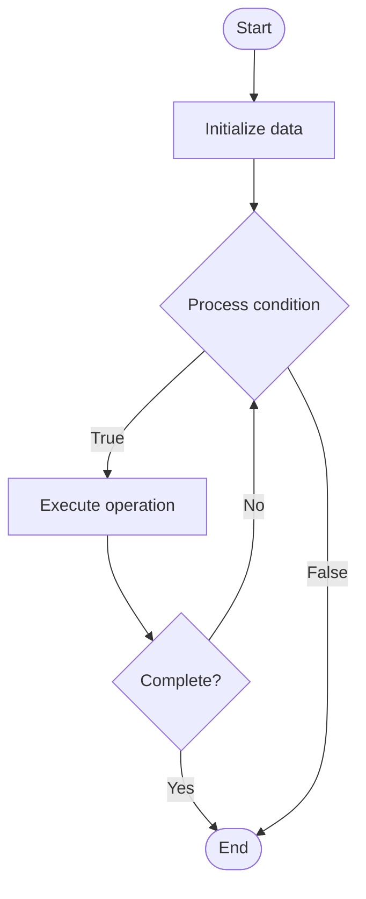

# Performance Profiling

Name of Algorithm  

## Code Files


## Algorithm Visualization

### Flowchart (ASCII)


```
Performance Profiling Flowchart:

┌─────────────┐
│   Start     │
└──────┬──────┘
       │
       ▼
┌─────────────┐
│  Initialize │
│   data      │
└──────┬──────┘
       │
       ▼
┌─────────────┐      Yes
│  Process   ├──────┐
│  condition?│      │
└──────┬──────┘      │
       │ No          │
       ▼             │
┌─────────────┐      │
│  Execute   │      │
│  operation │      │
└──────┬──────┘      │
       │             │
       └─────────────┘
       │
       ▼
┌─────────────┐
│    End      │
└─────────────┘
```


### Step-by-Step Execution


```
Performance Profiling Step-by-Step Execution:

Input: [example data]

Step 1: Initialize
State: [initial state]

Step 2: Process
State: [intermediate state]

Step 3: Finalize
State: [final state]

Result: [output]
```


### Interactive Flowchart (Mermaid)





> **Note**: Mermaid diagrams are rendered automatically on GitHub. For local viewing, use a Mermaid-compatible Markdown viewer.
- [Python Implementation](/code/semester_09/lecture_56_os_performance/performance_profiling/algorithm.py)
- [Java Implementation](/code/semester_09/lecture_56_os_performance/performance_profiling/Algorithm.java)
- [Python Tests](/code/semester_09/lecture_56_os_performance/performance_profiling/test_algorithm.py)


   Performance Profiling

What problem does it solve? (1 sentence)  
   Analyzes application and system performance to identify bottlenecks, measure resource usage, and guide optimization efforts through instrumentation and sampling.

Intuition (plain-language explanation)  
Like a fitness tracker for software: performance profiling is like a fitness tracker that monitors your activity (CPU, memory, I/O) throughout the day - it tracks where you spend time (which functions), how much energy you use (CPU cycles), and identifies inefficient activities (bottlenecks) - this data helps you optimize your routine (code) to be more efficient and faster.

Inputs & Outputs  
   - Input: Application code, system processes, profiling tools, sampling rate, instrumentation points.  
   - Output: Performance profiles, bottleneck identification, resource usage metrics, optimization recommendations.

Step-by-step description (5–10 lines max)  
Choose method: select profiling method (sampling, instrumentation, statistical).
Instrument: add profiling hooks or use sampling profiler.
Run application: execute application under profiling.
Collect data: gather performance data (CPU time, memory, I/O, function calls).
Analyze: identify hotspots, bottlenecks, and performance issues.
Visualize: create visualizations (flame graphs, call graphs, timelines).
Measure: quantify performance metrics (execution time, cache misses, allocations).
Identify: pinpoint performance bottlenecks and optimization opportunities.
Optimize: apply optimizations based on profiling insights.
Validate: measure improvements and iterate.

Tiny example (hand-simulated)  
   Performance profiling: web application slow → profile: use sampling profiler → run: process 1000 requests → analyze: 80% time in database queries, 15% in JSON parsing, 5% other → identify: N+1 query problem → optimize: batch queries → profile again: database time: 80% → 20% → overall: 3x speedup → profiling successful.

Time & Space Complexity  
   - Time: O(n) for sampling where n is number of samples, O(m) for instrumentation where m is instrumented points.  
   - Space: O(p) where p is profile data size (call stacks, samples, metrics).

Strengths  
- Insight: provides detailed insights into performance characteristics.
- Bottleneck identification: accurately identifies performance bottlenecks.
- Data-driven: enables data-driven optimization decisions.

Weaknesses / limitations  
- Overhead: profiling adds overhead that may affect measurements.
- Complexity: analyzing profiles can be complex for large applications.
- Representativeness: profiles may not represent all usage scenarios.

Compare with alternatives  
    Alternatives: Manual Timing, Logging, APM Tools, Benchmarking

30-second explanation (your own words)  
    Analyzes application and system performance to identify bottlenecks, measure resource usage, and guide optimization efforts through instrumentation and sampling.

*Sources: Adapted from standard university textbooks and Wikipedia summaries.*
