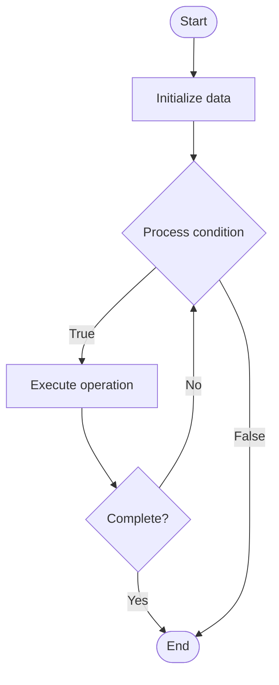

# Actor Model

## Учебные материалы

- [Школьный уровень](school.ru.md)
- [Университетский уровень](univer.ru.md)

## Algorithm Visualization

### Flowchart (ASCII)

```
Actor Model Flowchart:

┌─────────────┐
│   Start     │
└──────┬──────┘
       │
       ▼
┌─────────────┐
│  Initialize │
│   data      │
└──────┬──────┘
       │
       ▼
┌─────────────┐      Yes
│  Process   ├──────┐
│  condition?│      │
└──────┬──────┘      │
       │ No          │
       ▼             │
┌─────────────┐      │
│  Execute   │      │
│  operation │      │
└──────┬──────┘      │
       │             │
       └─────────────┘
       │
       ▼
┌─────────────┐
│    End      │
└─────────────┘
```

### Step-by-Step Execution

```
Actor Model Step-by-Step Execution:

Input: [example data]

Step 1: Initialize
State: [initial state]

Step 2: Process
State: [intermediate state]

Step 3: Finalize
State: [final state]

Result: [output]
```

### Interactive Flowchart (Mermaid)



> **Note**: Mermaid diagrams are rendered automatically on GitHub. For local viewing, use a Mermaid-compatible Markdown viewer.

- [Python Implementation](/code/semester_09/lecture_57_concurrency_advanced/actor_model/algorithm.py)
- [Java Implementation](/code/semester_09/lecture_57_concurrency_advanced/actor_model/Algorithm.java)
- [Python Tests](/code/semester_09/lecture_57_concurrency_advanced/actor_model/test_algorithm.py)

What problem does it solve? (1 sentence)  
   Models concurrent computation using actors (independent computational entities) that communicate through asynchronous message passing, avoiding shared state and locks for better scalability and fault tolerance.

Intuition (plain-language explanation)  
Like a company with independent departments: the actor model is like a company where each department (actor) works independently and communicates with other departments only through messages (like emails) - departments don't share resources directly (no shared state), they send messages and wait for replies (asynchronous communication) - if one department has a problem (actor crashes), it doesn't affect others (fault isolation), and you can easily add more departments (scale horizontally).

Inputs & Outputs  

  - Input: Messages, actor definitions, actor system configuration, supervision strategies.  
  - Output: Concurrent computation, message passing, isolated state, fault-tolerant system.

Step-by-step description (5–10 lines max)  
Define actors: create actor types with message handlers and state.
Create system: initialize actor system and supervision hierarchy.
Spawn actors: create actor instances (mailboxes, state, behavior).
Send messages: actors send asynchronous messages to other actors.
Receive messages: actors process messages from their mailboxes sequentially.
Update state: actors update their internal state based on messages.
Reply: actors send reply messages back to senders if needed.
Supervise: supervisor actors monitor and restart failed actors.
Scale: distribute actors across multiple nodes for scalability.
Monitor: track actor behavior, message flow, and system health.

Tiny example (hand-simulated)  
   Actor model: e-commerce system → actors: UserActor, OrderActor, PaymentActor, InventoryActor → UserActor sends 'place order' message to OrderActor → OrderActor sends 'check inventory' to InventoryActor → InventoryActor replies 'in stock' → OrderActor sends 'process payment' to PaymentActor → PaymentActor replies 'paid' → OrderActor updates state and replies to UserActor → no shared state, no locks → scalable, fault-tolerant → actor model.

Time & Space Complexity  

  - Time: O(1) for message send, O(m) for message processing where m is message complexity.  
  - Space: O(a + m) where a is number of actors, m is total messages in mailboxes.

Strengths  

- Scalability: naturally scales to distributed systems.
- Fault tolerance: actor failures are isolated and can be recovered.
- No locks: avoids deadlocks and race conditions through message passing.

Weaknesses / limitations  

- Message overhead: message passing has overhead compared to shared memory.
- Debugging: debugging distributed actor systems can be challenging.
- Ordering: message ordering guarantees may be complex in distributed systems.

Compare with alternatives  
    Alternatives: Shared Memory Concurrency, CSP Model, Message Queues, Reactive Streams

30-second explanation (your own words)  
    Models concurrent computation using actors (independent computational entities) that communicate through asynchronous message passing, avoiding shared state and locks for better scalability and fault tolerance.

*Sources: Adapted from standard university textbooks and Wikipedia summaries.*


## References

- [Actor model](https://en.wikipedia.org/wiki/Actor_model) - Wikipedia
